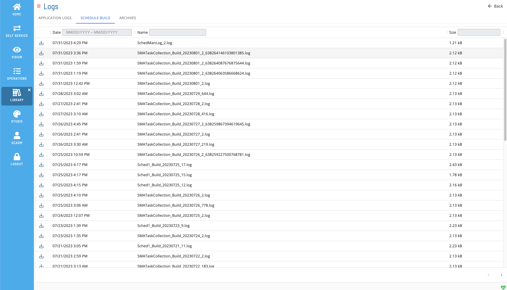

# List Schedule Build Logs

**Theme:** Configure  
**Who Is It For?** System Administrator, Automation Engineer

## What Is It?

The **Schedule Build** tab displays log files for scheduled builds. To view this tab, you must be a member of a role with at least one of the following privileges:

- All Function Privileges
- View Schedule Build Log

### Filtering & Sorting

Filter and sort log files using the column headers. Filter by text in the **Name** or **Size** field (case insensitive), or enter a date range in the **Date** field.

### Log File Details

Select a row to open the Log File Details page.

### Download File

Select the download  button to download a copy of the log file.

## Configuration Options

| Setting | What It Does | Default | Notes |
|---|---|---|---|
## FAQs

**Q: What does List Schedule Build Logs do?**

The **Schedule Build** tab displays log files for scheduled builds. To view this tab, you must be a member of a role with at least one of the following privileges:

**Q: Where can you find List Schedule Build Logs in OpCon?**

Access List Schedule Build Logs through the appropriate section in the Enterprise Manager or Solution Manager navigation.

## Glossary

**Enterprise Manager (EM)**: OpCon's rich client graphical user interface for Windows and Linux, used to define schedules and jobs, manage automation data, and perform operational tasks.

**Solution Manager**: OpCon's browser-based graphical user interface for managing automation data, performing operational actions, and administering the system.

**Resource**: A numeric variable in OpCon representing a finite pool. Jobs can be configured to require a set number of resource units to run, limiting concurrent executions and preventing resource contention.

**Role**: A named security profile in OpCon that groups privileges together. Roles are assigned to user accounts to control which features, schedules, jobs, machines, and administrative functions a user can access.

**Privilege**: A specific permission granted through an OpCon role that controls access to a feature, function, or object type. Privileges are organized into categories such as Function Privileges, Machine Privileges, Schedule Privileges, and Access Codes.

**Schedule**: A named container for jobs in OpCon, built for a specific date to create that day's automation. Schedules define build settings, frequencies, and the jobs that run within them.

**OpCon**: Continuous' workflow automation platform. The OpCon server includes the database, SAM and Supporting Services (SAM-SS), and graphical user interfaces. agents installed on target platforms run jobs and report results.
