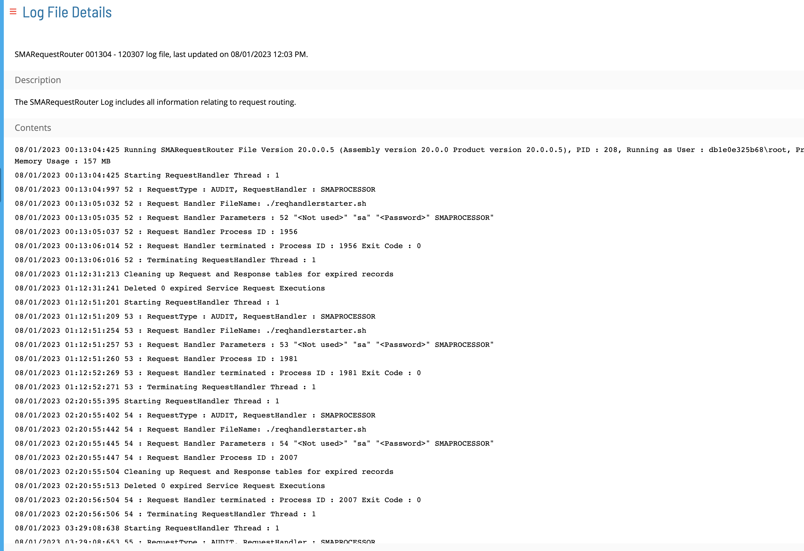

# Log File Details

The **Log File Details** page allows you to view the description and content of the selected log file.

### Search

You can search for text using browser's Find feature. Press `Ctrl+F` to open the Find dialog box. Enter the text you want to search for and press `Enter` to search.

### Download File

Click the download  button to download a copy of the log file.
