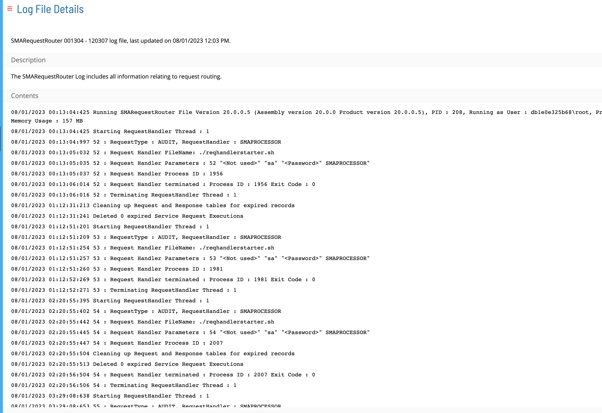

# Log File Details

**Theme:** Configure  
**Who Is It For?** System Administrator, Automation Engineer

## What Is It?

The **Log File Details** page displays the description and content of the selected log file.

### Search

Search for text using the browser's Find feature. Press `Ctrl+F`, enter the search text, and press `Enter`.

### Download File

Select the download  button to download a copy of the log file.

## When Would You Use It?

- The **Log File Details** page displays the description and content of the selected log file

## Why Would You Use It?

- **Log File**: The **Log File Details** page displays the description and content of the selected log file

## Configuration Options

| Setting | What It Does | Default | Notes |
|---|---|---|---|
## FAQs

**Q: What does Log File Details do?**

The **Log File Details** page displays the description and content of the selected log file.

**Q: Where can you find Log File Details in OpCon?**

Access Log File Details through the appropriate section in the Enterprise Manager or Solution Manager navigation.

## Glossary

**Enterprise Manager (EM)**: OpCon's rich client graphical user interface for Windows and Linux, used to define schedules and jobs, manage automation data, and perform operational tasks.

**Solution Manager**: OpCon's browser-based graphical user interface for managing automation data, performing operational actions, and administering the system.

**Resource**: A numeric variable in OpCon representing a finite pool. Jobs can be configured to require a set number of resource units to run, limiting concurrent executions and preventing resource contention.

**OpCon**: Continuous' workflow automation platform. The OpCon server includes the database, SAM and Supporting Services (SAM-SS), and graphical user interfaces. agents installed on target platforms run jobs and report results.
