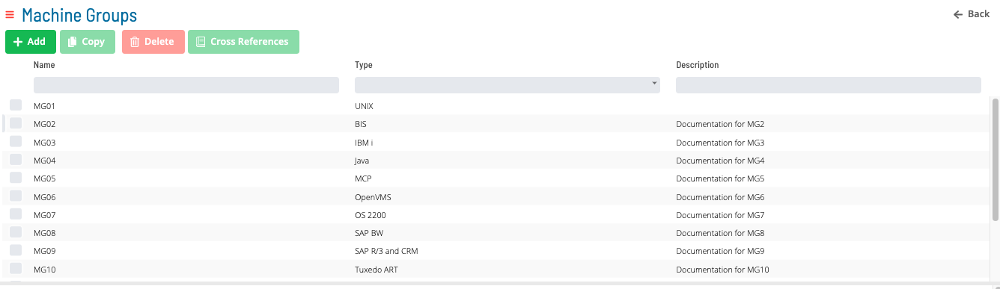
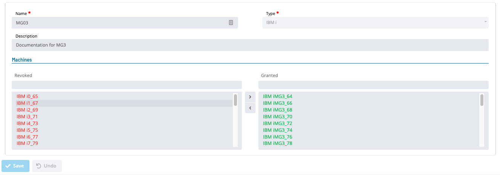
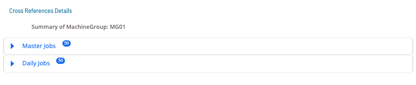
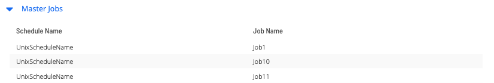
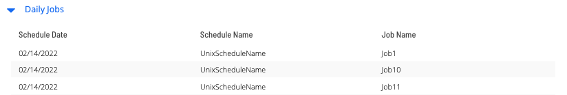

# Machine Groups

**Theme:** Configure  
**Who Is It For?** System Administrator, Automation Engineer

## What Is It?

Available Machine Groups in OpCon are shown in the grid under **Library > Machine Groups**.

Select **Add**, **Copy**, or a record in the grid to enable the bottom panel:

:::note
The **Name** field must be unique when adding or copying a machine group.
:::

Select the **Cross References** button to view master and daily jobs that use a particular Machine Group.

Select the expansion arrow for **Master Job** to view master jobs using the selected machine group.

Select the expansion arrow for **Daily Job** to view daily jobs using the selected machine group.

## When Would You Use It?

- Available Machine Groups in OpCon are shown in the grid under **Library > Machine Groups**

## Why Would You Use It?

- **Operational value**: Enable the bottom panel: Select the Cross References button to view master and daily jo

## Configuration Options

| Setting | What It Does | Default | Notes |
|---|---|---|---|
## FAQs

**Q: What does Machine Groups do?**

title: Machine Groups

**Q: Where can you find Machine Groups in OpCon?**

Access Machine Groups through the appropriate section in the Enterprise Manager or Solution Manager navigation.

## Glossary

**Enterprise Manager (EM)**: OpCon's rich client graphical user interface for Windows and Linux, used to define schedules and jobs, manage automation data, and perform operational tasks.

**Solution Manager**: OpCon's browser-based graphical user interface for managing automation data, performing operational actions, and administering the system.

**Resource**: A numeric variable in OpCon representing a finite pool. Jobs can be configured to require a set number of resource units to run, limiting concurrent executions and preventing resource contention.

**Machine**: A platform defined in the OpCon database that has an agent installed. OpCon routes job execution requests to machines via SMANetCom, and machines report job completion status back to SAM.

**Job**: The fundamental unit of work in OpCon. A job defines what to run, on which machine, when to start, and what conditions must be met. Job results are tracked and can trigger events and notifications.

**OpCon**: Continuous' workflow automation platform. The OpCon server includes the database, SAM and Supporting Services (SAM-SS), and graphical user interfaces. agents installed on target platforms run jobs and report results.
