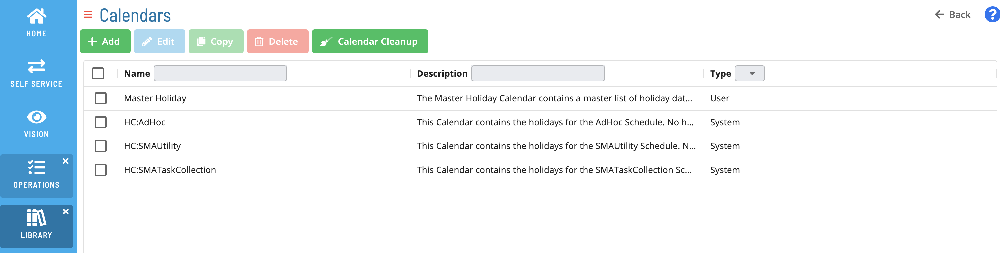

# Managing Calendars

**Theme:** Configure  
**Who Is It For?** System Administrator, Automation Engineer

## What Is It?

A calendar is a named list of dates that schedules, jobs, and frequencies use to determine when automation runs or is excluded. In Solution Manager, you manage calendars from **Administration** > **Calendars**, where you can add, edit, clone, and delete calendar records.

For background on how OpCon uses calendars in scheduling, see [Calendar Concepts](../../../../objects/calendars.md).

The **Calendars** view lists each calendar by **Name** and **Description**. Each calendar record has the following fields:

| Field | What It Does |
|---|---|
| **Name** | The name of the calendar. Required. |
| **Description** | Notes describing the calendar. |
| **Year** | The year shown in the date selector. Changing the year displays that year's months so you can set dates for it. |
| **Dates** | The dates defined for the calendar, selected from the per-month date selector. Required. |

## Required Privileges

To manage calendars, your role must include the **Maintain Calendars** function privilege. If you do not have access, contact your OpCon system administrator.

## Add a Calendar

To add a calendar, complete the following steps:

1. Go to **Administration** > **Calendars**.
2. Select **Add**.
3. In **Name**, enter a name for the calendar.
4. In **Description**, enter notes describing the calendar.
5. In **Year**, select the year you want to define dates for.
6. In the **Dates** selector, select each date to include in the calendar.
7. Save the calendar.

**Result:** The new calendar appears in the **Calendars** list and is available to schedules, jobs, and frequencies.

## Edit a Calendar

To edit a calendar, complete the following steps:

1. Go to **Administration** > **Calendars**.
2. Select the calendar you want to change.
3. Select **Edit**.
4. Update the **Name**, **Description**, **Year**, or **Dates** as needed.
5. Save the calendar.

**Result:** The calendar reflects your changes.

## Clone a Calendar

Cloning creates a copy of an existing calendar that you can modify independently.

To clone a calendar, complete the following steps:

1. Go to **Administration** > **Calendars**.
2. Select the calendar you want to copy.
3. Select **Clone**.

**Result:** A copy of the calendar appears in the **Calendars** list.

## Delete a Calendar

To delete a calendar, complete the following steps:

1. Go to **Administration** > **Calendars**.
2. Select the calendar you want to remove.
3. Select **Delete**.

**Result:** The calendar is removed from the **Calendars** list.

## FAQs

**Q: Where do I manage calendars in Solution Manager?**

Go to **Administration** > **Calendars**. From there you can add, edit, clone, and delete calendars.

**Q: Who can manage calendars?**

Users whose role includes the **Maintain Calendars** function privilege. Contact your OpCon system administrator if you do not have access.

**Q: Can I copy an existing calendar?**

Yes. Select the calendar and select **Clone** to create an independent copy.

## Related Topics

- [Calendar Concepts](../../../../objects/calendars.md)

## Glossary

**Calendar**: A named collection of dates in OpCon used by schedules and frequencies to determine when automation runs or is excluded. Calendars can represent holidays, working days, or any custom date set.

**Frequency**: A set of rules that defines when a job or schedule is eligible to run, based on calendar rules, day-of-week settings, period offsets, and other timing criteria.

**Role**: A named security profile in OpCon that groups privileges together. Roles are assigned to user accounts to control which features, schedules, jobs, machines, and administrative functions a user can access.

**Privilege**: A specific permission granted through an OpCon role that controls access to a feature, function, or object type. Privileges are organized into categories such as Function Privileges, Machine Privileges, Schedule Privileges, and Access Codes.
