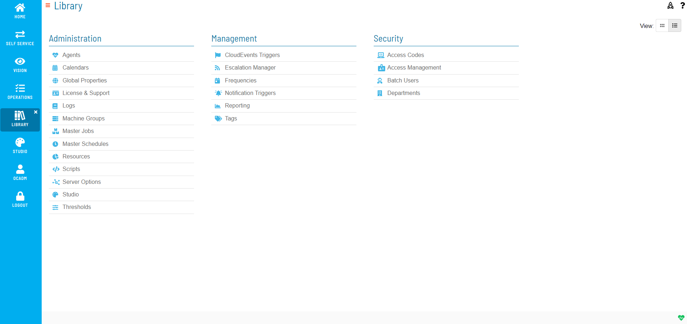

# Library Overview

## What Is It?

The Library in Solution Manager is the section where you define and manage the OpCon objects used to build and maintain automation. From the Library, you work with the master definitions and supporting objects that schedules and jobs depend on, rather than the daily instances that run in the production queue.

Use the selection bar on the left side of the screen to open each area of the Library.

## What Is in the Library?

The Library groups related OpCon objects into areas. Each area has its own page in this section of the documentation.

| Area | What you manage there |
| --- | --- |
| Master Jobs | Add, copy, move, delete, and update master job definitions, including platform-specific job task details. |
| Calendars | Create and maintain the calendars that schedules and frequencies use. |
| Frequencies | Build, edit, and forecast the frequency definitions that determine when schedules and jobs run. |
| Global Properties | Define and manage system-wide properties referenced across schedules and jobs. |
| Scripts | Manage embedded scripts, script types, script runners, and script versions. |
| Tags | Apply and manage tags used to search and filter across schedules. |
| Notification Triggers | Define notification triggers and the notification types they send. |
| Access Management | Manage users, roles, and the privileges assigned to them. |
| Escalation Manager | Manage escalation groups and escalation rules. |
| Server Options | Configure server-level options such as SSO configurations. |
| Logs | Review log files, archive files, schedule builds, and audit history. |
| Reporting | Generate OpCon reports. |

## How It Works

Objects defined in the Library are master definitions. Changes you make in the Library apply to future schedule builds and to schedules that are subsequently added to the daily queue. Changes to master definitions do not affect jobs that are already running in the daily queue. To apply changes to a schedule that is already in the queue, rebuild or re-add the affected schedule.

## FAQs

**Q: Where do you find the Library in OpCon?**

The Library is a section of Solution Manager. Use the selection bar on the left side of the screen to open each area.

**Q: Does editing an object in the Library change jobs that are already running?**

No. Changes to master definitions in the Library do not affect jobs already running in the daily queue. Rebuild or re-add the affected schedule to apply the changes.

## Glossary

| Term | Definition |
| --- | --- |
| Enterprise Manager (EM) | OpCon's Windows and Linux graphical user interface, used to define schedules and jobs, manage automation data, and perform operational tasks. |
| Frequency | A named rule that specifies the recurring days on which a schedule or job runs. OpCon uses frequencies during the Schedule Build process. |
| Job | A task defined in OpCon, such as running a program on a remote machine, transferring files, or running a sub-schedule. |
| Resource | A numeric variable in OpCon that represents a finite pool. Jobs can be configured to require a set number of resource units to run, limiting concurrent runs and preventing resource contention. |
| Schedule | A named group of jobs in OpCon that represents a business process. Schedules are built each day based on their defined frequencies and calendars. |
| Solution Manager (SM) | OpCon's browser-based graphical user interface for managing automation data, performing operational actions, and administering the system. |

## Related Topics

- [Development Overview](../Library/Development-Overview.md)
- [Managing Master Jobs](../Library/MasterJobs/Add-Jobs-Overview.md)
- [Managing Calendars](../Library/Calendars/Managing-Calendars.md)
- [Managing Frequencies](../Library/Frequencies/Managing-Frequencies.md)
- [Managing Scripts](../Library/Scripts/Managing-Scripts.md)
