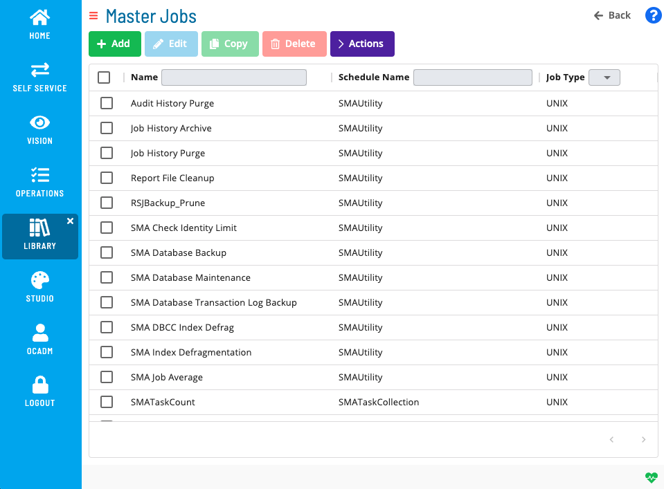

# Managing Master Jobs

## What Is It?

A master job is the stored definition of a job that belongs to a master schedule. OpCon stores master jobs in its master tables. When a master schedule is built for a specific date, OpCon copies the master job definitions into the daily tables to create the daily jobs that run on that date.

Changes you make to a master job apply to future schedule builds. They do not affect daily jobs that are already in the queue.

Use the **Master Jobs** section of the Solution Manager **Library** to add new jobs, copy or move existing jobs, delete jobs you no longer need, and update job settings such as task details, frequencies, dependencies, and notifications.

## Required Privileges

Access to master jobs is controlled by departmental function privileges. To work with master jobs, your role must have the relevant privilege for each action:

| Action | Required privilege |
| --- | --- |
| View master jobs | **View Jobs in Master Schedules** |
| Add a master job | **Add Jobs to Master Schedules** |
| Edit a master job | **Modify Jobs in Master Schedules** |
| Delete a master job | **Delete Jobs from Master Schedules** |

Your role must also have access to the master schedule that contains the job. Contact your OpCon administrator if you cannot see a schedule or job.

## What Is in This Section?

| Page | Description |
| --- | --- |
| [Add Jobs Overview](MasterJobs/Add-Jobs-Overview.md) | Overview of the master job management tasks available in the Library. |
| [Adding Master Jobs](MasterJobs/Adding-Master-Jobs.md) | Add a new job definition to a master schedule. |
| [Copying Master Jobs](MasterJobs/Copying-Master-Jobs.md) | Duplicate an existing job to create a similar definition with minimal rework. |
| [Moving Master Jobs](MasterJobs/Moving-Master-Jobs.md) | Move a job from one master schedule to another. |
| [Deleting Master Jobs](MasterJobs/Deleting-Master-Jobs.md) | Permanently remove a job definition from a master schedule. |
| [Viewing Master Job Cross-References](MasterJobs/Viewing-Master-Jobs-Cross-References.md) | See all schedules and jobs that reference the selected job before deleting it. |
| [Viewing and Updating Master Jobs](MasterJobs/Viewing-And-Updating-Master-Jobs/Viewing-Updating-Overview.md) | Update task details, frequencies, dependencies, events, notifications, tags, and documentation for an existing master job. |

## FAQs

**Q: Where do you find the Master Jobs section?**

In Solution Manager, go to **Library** and select **Master Jobs** from the selection bar on the left.

**Q: Do changes to a master job affect jobs that are already running?**

No. Changes to a master job apply to future schedule builds. Daily jobs already in the queue are not affected. Rebuild or re-add the affected schedule to apply the changes to daily jobs.

**Q: What is the difference between a master job and a daily job?**

A master job is the stored template definition. A daily job is an instance that OpCon creates from the master job during schedule build for a specific date.

## Related Topics

- [Managing the Library](Managing-Library.md)
- [Managing Master Schedules](Managing-Master-Schedules.md)
- [Jobs](../../../../objects/jobs.md)

## Glossary

| Term | Definition |
| --- | --- |
| Daily Job | An instance of a master job that OpCon places in the daily queue during schedule build for a specific date. |
| Departmental Function Privilege | A privilege that controls what actions a role can perform on jobs within a specific department. Master job privileges include View, Add, Modify, and Delete Jobs in Master Schedules. |
| Master Job | The stored template definition of a job that belongs to a master schedule. OpCon copies master job definitions into the daily tables during schedule build. |
| Master Schedule | The stored template definition of a schedule. Changes to a master schedule affect future builds but not daily schedules that are already built. |
| Schedule Build | The process by which OpCon creates daily schedule instances from master schedule definitions, applying frequencies, calendars, and job definitions. |
| Solution Manager | OpCon's browser-based graphical user interface for managing automation data, performing operational actions, and administering the system. |
