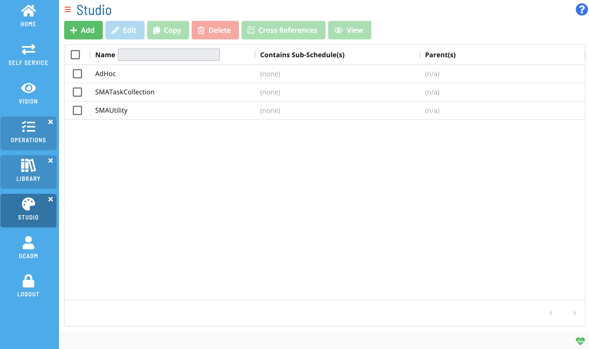

# Overview

**Theme:** Overview  
**Who Is It For?** System Administrator, Automation Engineer

## What Is It?

The Master Schedules screen allows you to manage master schedules.

See-https://help.smatechnologies.com/opcon/core/v22.10/Files/UI/Solution-Manager/Studio/Canvas/Adding-Master-Schedules

Please check back for more content.

## When Would You Use It?

- You need to allows you to manage master schedules using The Master Schedules screen

## Why Would You Use It?

- **Operational value**: Allows you to manage master schedules

## Configuration Options

| Setting | What It Does | Default | Notes |
|---|---|---|---|
## FAQs

**Q: What does Overview do?**

title: Managing Master Schedules

**Q: Where can you find Overview in OpCon?**

Access Overview through the appropriate section in the Enterprise Manager or Solution Manager navigation.

## Glossary

**Enterprise Manager (EM)**: OpCon's rich client graphical user interface for Windows and Linux, used to define schedules and jobs, manage automation data, and perform operational tasks.

**Solution Manager**: OpCon's browser-based graphical user interface for managing automation data, performing operational actions, and administering the system.

**Resource**: A numeric variable in OpCon representing a finite pool. Jobs can be configured to require a set number of resource units to run, limiting concurrent executions and preventing resource contention.

**Schedule**: A named container for jobs in OpCon, built for a specific date to create that day's automation. Schedules define build settings, frequencies, and the jobs that run within them.

**OpCon**: Continuous' workflow automation platform. The OpCon server includes the database, SAM and Supporting Services (SAM-SS), and graphical user interfaces. agents installed on target platforms run jobs and report results.
