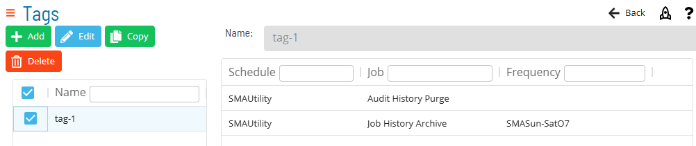
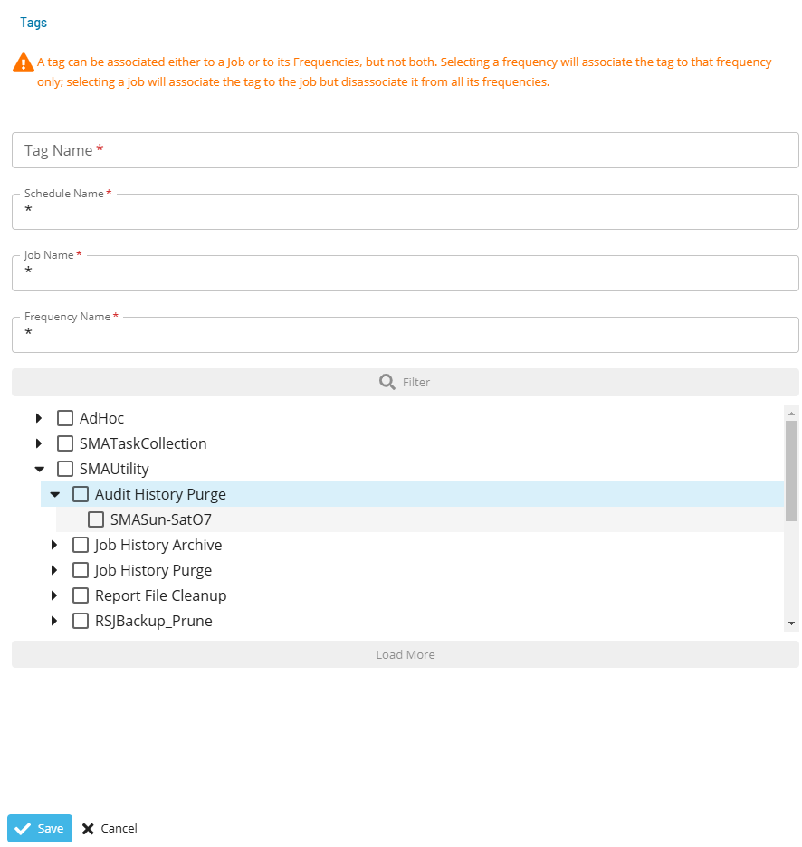

# Managing Tags

**Theme:** Configure  
**Who Is It For?** System Administrator, Automation Engineer

## What Is It?

Available Tags in OpCon are shown in the grid under **Library > Tags**.

Select **Add**, **Copy**, or **Edit** to open the tag dialog:

Select **Filter** to expose the schedule-job-frequency tree for associating items with the tag. A tag can be associated with a job or its frequencies, but not both. Selecting a frequency associates the tag to that frequency only; selecting a job associates the tag to the job and disassociates it from all its frequencies.

:::note
The **Tag Name** field must be unique across all tags.
:::

Select a tag in the list to view the tag associations grid, which displays the schedules, jobs, and frequencies associated with the tag.

See [Tag Concepts](../../../../job-components/tags.md).

## When Would You Use It?

- You need to review or update Tags settings in Solution Manager
- Tags needs to be reviewed as part of routine system maintenance or a compliance audit

## Why Would You Use It?

- **Reduce administrative overhead**: Centralizing Tags management in Solution Manager reduces the time needed to locate and update settings across the environment
- All Tags changes are captured in the OpCon audit system, supporting change management and compliance processes

## FAQs

**Q: What does managing tags involve?**

Managing tags includes adding, editing, and deleting records. Access tags through the Enterprise Manager navigation pane.

**Q: Who can manage tags in OpCon?**

Users with the appropriate privileges assigned through their role can manage tags. Contact your OpCon system administrator if you do not have access.

## Glossary

**Enterprise Manager (EM)**: OpCon's rich client graphical user interface for Windows and Linux, used to define schedules and jobs, manage automation data, and perform operational tasks.

**Frequency**: A set of rules that defines when a job or schedule is eligible to run, based on calendar rules, day-of-week settings, period offsets, and other timing criteria.

**Resource**: A numeric variable in OpCon representing a finite pool. Jobs can be configured to require a set number of resource units to run, limiting concurrent executions and preventing resource contention.

**Role**: A named security profile in OpCon that groups privileges together. Roles are assigned to user accounts to control which features, schedules, jobs, machines, and administrative functions a user can access.

**Privilege**: A specific permission granted through an OpCon role that controls access to a feature, function, or object type. Privileges are organized into categories such as Function Privileges, Machine Privileges, Schedule Privileges, and Access Codes.

**Schedule**: A named container for jobs in OpCon, built for a specific date to create that day's automation. Schedules define build settings, frequencies, and the jobs that run within them.

**Job**: The fundamental unit of work in OpCon. A job defines what to run, on which machine, when to start, and what conditions must be met. Job results are tracked and can trigger events and notifications.

**OpCon**: Continuous' workflow automation platform. The OpCon server includes the database, SAM and Supporting Services (SAM-SS), and graphical user interfaces. agents installed on target platforms run jobs and report results.
