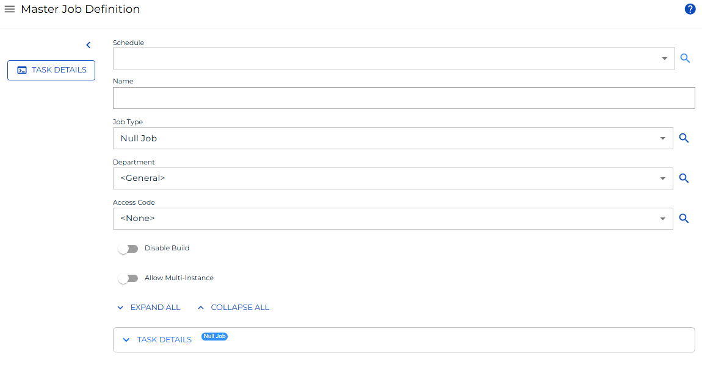

# Adding Master Jobs

**Theme:** Configure  
**Who Is It For?** System Administrator, Automation Engineer

## What Is It?

Use this procedure to add Master Jobs in Solution Manager.

## When Would You Use It?

- You need to add Master Jobs in Solution Manager
- The environment is expanding and requires additional Master Jobs to support new automation workflows

## Why Would You Use It?

- **Extend automation scope**: Adding Master Jobs to OpCon brings additional resources under centralized scheduling, monitoring, and event processing
- All additions are tracked in the OpCon audit log, recording who added the Master Jobs and when

## Administration

### Required Privileges

To add a master job, your role must have at least one of the following privileges:

- **Departmental Function Privilege**: All Function Privileges, Add Jobs To Master Schedules, or All Job Master Functions

---

## Adding a Job

Go to **Library** > **Master Jobs** and select **Add**. The Master Job Details page opens:

1. Select a **Schedule**
1. Enter a **Name**
1. Select a **Job Type**

1. Select a **Department**
1. Select an **Access Code**
1. _(Optional)_ Select the **Disable Build** option. See [Jobs](../../../../../objects/jobs.md)
1. _(Optional)_ Select the **Allow Multi-Instance** option. See [Multi-Instance Jobs](../../../../../operations/job-names.md#multi-instance-jobs)
1. Expand **Task Details** and enter the required information for the selected **Job Type**

1. Select **Save**

---

### Job Types

- [Container Jobs](../../../../../job-types/container.md)
- [File Transfer Jobs](../../../../../job-types/file-transfer.md)
- [Null Jobs](../../../../../job-types/null.md)
- [SAP BW Jobs](../../../../../job-types/sap-bw.md)
- [SAP R/3 and CRM Jobs](../../../../../job-types/sap.md)
- [SQL Jobs](../../../../../job-types/sql.md)
- [Unix Jobs](../../../../../job-types/unix.md)
- [Windows Jobs](../../../../../job-types/windows.md)

---

### Additional Job Information

- [Documentation](../../../../../job-components/documentation.md)
- [Events](../../../../../job-components/events.md)
- [Expression Dependencies](../../../../../job-components/expression-dependencies.md)
- [Frequencies](../../../../../job-components/frequency.md)
- [Instance Properties](../../../../../job-components/instances.md)
- [Job Dependencies](../../../../../job-components/job-dependencies.md)
- [Tags](../../../../../job-components/tags.md)
- [Threshold / Resource Dependencies](../../../../../job-components/threshold-resource-dependencies.md)
- [Threshold / Resource Updates](../../../../../job-components/threshold-resource-updates.md)

## Configuration Options

| Setting | What It Does | Default | Notes |
|---|---|---|---|
| Departmental Function Privilege | All Function Privileges, Add Jobs To Master Schedules, or All Job Master Functions | — | — |

## FAQs

**Q: How do you save a new master jobs record?**

After completing the required fields, select the **Save** button on the toolbar to save the master jobs record.

**Q: Can you add master jobs for multiple platforms?**

Yes. This page covers master jobs for multiple platforms or contexts: Required Privileges, Adding a Job.

## Glossary

**Frequency**: A set of rules that defines when a job or schedule is eligible to run, based on calendar rules, day-of-week settings, period offsets, and other timing criteria.

**Threshold**: A numeric variable stored in the OpCon database used to control job execution. Jobs can be made dependent on threshold values, and OpCon events can update threshold values at runtime.

**Access Code**: A security label applied to jobs and schedules in OpCon. Users must have the matching access code privilege to view or manage items with that label.

**Department**: An organizational grouping in OpCon used to assign jobs to logical divisions. User roles can be scoped to specific departments, controlling which jobs a user can manage.

**Resource**: A numeric variable in OpCon representing a finite pool. Jobs can be configured to require a set number of resource units to run, limiting concurrent executions and preventing resource contention.

**Role**: A named security profile in OpCon that groups privileges together. Roles are assigned to user accounts to control which features, schedules, jobs, machines, and administrative functions a user can access.

**Privilege**: A specific permission granted through an OpCon role that controls access to a feature, function, or object type. Privileges are organized into categories such as Function Privileges, Machine Privileges, Schedule Privileges, and Access Codes.

**Schedule**: A named container for jobs in OpCon, built for a specific date to create that day's automation. Schedules define build settings, frequencies, and the jobs that run within them.
