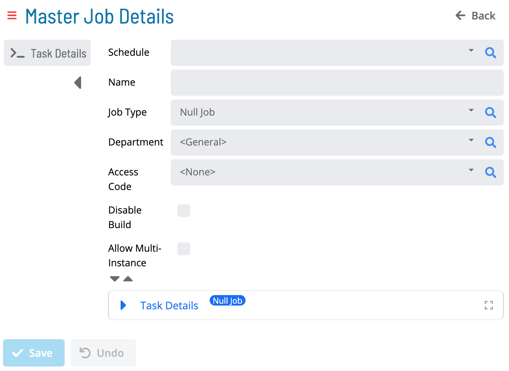

# Adding Master Jobs

## Required Privileges

In order to add a master job, you must have at least all of the following privileges:

- **Departmental Function Privilege**: User must be at least in a role
  that has All Function Privileges, Add Jobs To Master Schedules or All Job Master Functions.

---

## Adding a Job

To add a Master Job, go to **Library** > **Master Jobs**.

Select **Add**. The Master Job Details page is displayed:

1. Select a **Schedule**.

1. Enter a **Name**.

1. Select a **Job Type**.

1. Select a **Department**.

1. Select an **Access Code**.

1. _(Optional)_ Select the **Disable Build** checkbox. For more information, refer to [Jobs](../../../../../objects/jobs.md) in the **Concepts** online help.

1. _(Optional)_ Select the **Allow Multi-Instance** checkbox. For more information, refer to [Multi-Instance Jobs](../../../../../operations/job-names.md#multi-instance-jobs) in the **Concepts** online help.

1. Expand the **Task Details** section and enter the **Task Details** according to the **Job Type**.

1. Select **Save**.

---

### Job Types

Select any of the following links to access instructions for defining platform-specific job information:

- [Container Jobs](../../../../../job-types/container.md)
- [File Transfer Jobs](../../../../../job-types/file-transfer.md)
- [Null Jobs](../../../../../job-types/null.md)
- [SAP BW Jobs](../../../../../job-types/sap-bw.md)
- [SAP R/3 and CRM Jobs](../../../../../job-types/sap.md)
- [SQL Jobs](../../../../../job-types/sql.md)
- [Unix Jobs](../../../../../job-types/unix.md)
- [Windows Jobs](../../../../../job-types/windows.md)

---

### Additional Job Information

Select any of the following links to access instructions for defining additional job information:

- [Documentation](../../../../../job-components/documentation.md)
- [Events](../../../../../job-components/events.md)
- [Expression Dependencies](../../../../../job-components/expression-dependencies.md)
- [Frequencies](../../../../../job-components/frequency.md)
- [Instance Properties](../../../../../job-components/instances.md)
- [Job Dependencies](../../../../../job-components/job-dependencies.md)
- [Tags](../../../../../job-components/tags.md)
- [Threshold / Resource Dependencies](../../../../../job-components/threshold-resource-dependencies.md)
- [Threshold / Resource Updates](../../../../../job-components/threshold-resource-updates.md)
