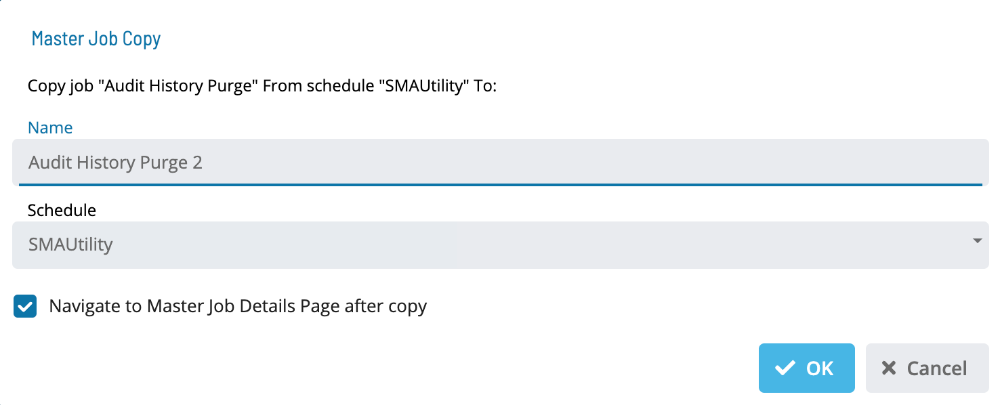

# Copying Master Jobs

To copy a Master Job, go to **Library** > **Master Jobs**.

Select a job and select **Copy**. The Master Job Copy dialog is displayed:

1. Enter a Name.

1. Select a Schedule.

1. Select **OK** to copy the job or **Cancel** to cancel the operation.
