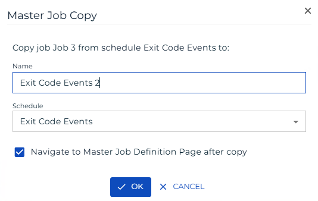

# Copying Master Jobs

**Theme:** Configure  
**Who Is It For?** System Administrator, Automation Engineer

## What Is It?

Use this procedure to copy Master Jobs in Solution Manager.

## Administration

### Required Privileges

To copy a master job, your role must have at least one of the following privileges:

- **Departmental Function Privilege**: All Function Privileges, Add Jobs To Master Schedules, or All Job Master Functions

---

## Copying a Job

Go to **Library** > **Master Jobs**, select a job, and select **Copy**. The Master Job Copy dialog opens:

1. Enter a **Name**
1. Select a **Schedule**
1. Select **OK** to copy the job or **Cancel** to cancel

## Configuration Options

| Setting | What It Does | Default | Notes |
|---|---|---|---|
| Departmental Function Privilege | All Function Privileges, Add Jobs To Master Schedules, or All Job Master Functions | — | — |

## FAQs

**Q: Why would you copy master jobs instead of creating a new one?**

Copying master jobs is useful when you want to reuse an existing configuration as a starting point. All settings from the original are duplicated, and you can then modify the copy as needed.

**Q: Does copying master jobs require a new unique name?**

Yes. The copy must be saved with a new unique name to distinguish it from the original master jobs record.

## Glossary

**Resource**: A numeric variable in OpCon representing a finite pool. Jobs can be configured to require a set number of resource units to run, limiting concurrent executions and preventing resource contention.

**Role**: A named security profile in OpCon that groups privileges together. Roles are assigned to user accounts to control which features, schedules, jobs, machines, and administrative functions a user can access.

**Privilege**: A specific permission granted through an OpCon role that controls access to a feature, function, or object type. Privileges are organized into categories such as Function Privileges, Machine Privileges, Schedule Privileges, and Access Codes.

**Schedule**: A named container for jobs in OpCon, built for a specific date to create that day's automation. Schedules define build settings, frequencies, and the jobs that run within them.

**Job**: The fundamental unit of work in OpCon. A job defines what to run, on which machine, when to start, and what conditions must be met. Job results are tracked and can trigger events and notifications.
