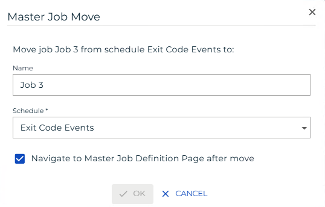

# Moving Master Jobs

**Theme:** Configure  
**Who Is It For?** System Administrator, Automation Engineer

## What Is It?

Use this procedure to move Master Jobs in Solution Manager.

## When Would You Use It?

- You need to configure or manage Moving Master Jobs in OpCon

## Why Would You Use It?

- **Centralized control**: Managing Moving Master Jobs through OpCon provides consistent oversight and a full audit trail for all changes

## Administration

### Required Privileges

To move a master job, your role must have at least one of the following privileges:

- **Departmental Function Privilege**: All Function Privileges, Add Jobs To Master Schedules, or All Job Master Functions

---

## Moving a Job

Go to **Library** > **Master Jobs**, select a job, and select **Move**. The Master Job Move dialog opens:

1. Select a **Schedule**
1. Select **OK** to move the job or **Cancel** to cancel

## Configuration Options

| Setting | What It Does | Default | Notes |
|---|---|---|---|
| Departmental Function Privilege | All Function Privileges, Add Jobs To Master Schedules, or All Job Master Functions | — | — |
## FAQs

**Q: How many steps does the Moving Master Jobs procedure involve?**

The Moving Master Jobs procedure involves 2 steps. Complete all steps in order and save your changes.

**Q: What does Moving Master Jobs cover?**

This page covers Required Privileges, Moving a Job.

## Glossary

**Resource**: A numeric variable in OpCon representing a finite pool. Jobs can be configured to require a set number of resource units to run, limiting concurrent executions and preventing resource contention.

**Role**: A named security profile in OpCon that groups privileges together. Roles are assigned to user accounts to control which features, schedules, jobs, machines, and administrative functions a user can access.

**Privilege**: A specific permission granted through an OpCon role that controls access to a feature, function, or object type. Privileges are organized into categories such as Function Privileges, Machine Privileges, Schedule Privileges, and Access Codes.

**Schedule**: A named container for jobs in OpCon, built for a specific date to create that day's automation. Schedules define build settings, frequencies, and the jobs that run within them.

**Job**: The fundamental unit of work in OpCon. A job defines what to run, on which machine, when to start, and what conditions must be met. Job results are tracked and can trigger events and notifications.
