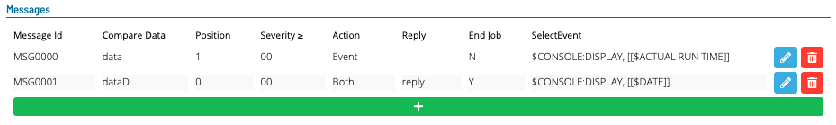
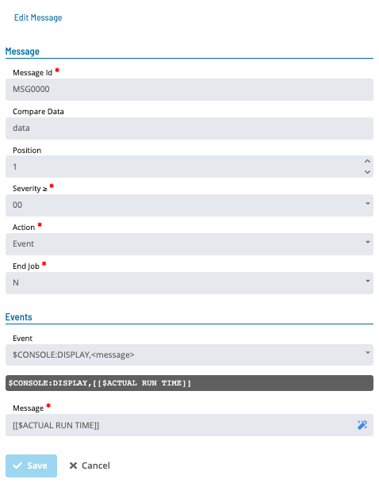
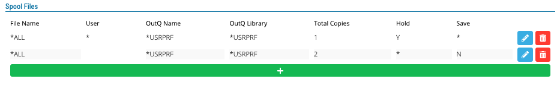
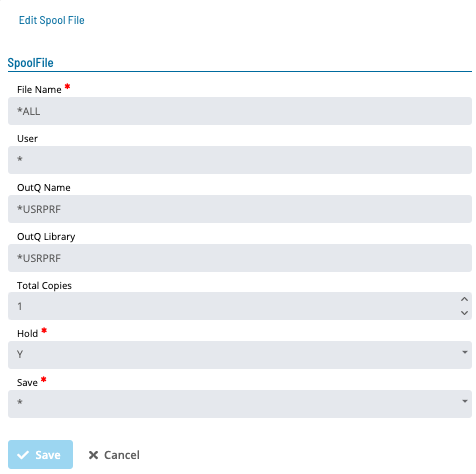
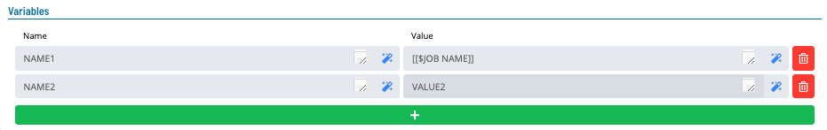

# Viewing and Adding IBMi Job Details

**Theme:** Configure  
**Who Is It For?** System Administrator, Automation Engineer

## What Is It?

Use this procedure to view and Adding IBMi Job Details in Solution Manager.

To view, add, or edit an IBMi job, you must have the required privileges as defined in [Required Privileges](../Accessing-Master-Jobs.md#required-privileges).

## Viewing IBMi Job Details

To view IBMi Job Details, complete the following steps:

1. Go to **Library** > **Master Jobs**
1. Select an IBMi job in the list
1. Select **Edit**
1. Expand the **Task Details** panel

---

## Adding IBMi Job Details

To add IBMi Job Details, complete the following steps:

1. Create the job and general info as described in [Adding a Job](../../Adding-Master-Jobs.md)
1. Expand the **Task Details** section. See [IBMi Job Details](#ibmi-job-details) for details

---

## Editing IBMi Details

To edit IBMi Details, complete the following steps:

1. Go to **Library** > **Master Jobs**
1. Select an IBMi job
1. Select **Edit**
1. Select the lock icon. The button appears gray and locked ()
   when in **Read-only** mode and appears green and unlocked ()
   when in **Admin** mode.
1. Expand the **Task Details** panel. See [IBMi Job Details](#ibmi-job-details) for details

---

## IBMi Job Details

- [Update Job Type: Batch Job](#updating-job-type-batch-job)
- [Update Job Type: Tracked Job](#updating-job-type-tracked-job)
- [Update Job Type: Queued Job](#updating-job-type-queued-job)
- [Update Job Type: Operator Replay Job](#updating-job-type-operator-replay-job)
- [Update Job Type: Restricted Mode](#updating-job-type-restricted-mode)
- [Update Job Type: FTP](#updating-job-type-ftp)
- [Update Job Type: File Arrival](#updating-job-type-file-arrival)
- [Update Tables](#updating-tables)

:::note
All required fields are designated by a red asterisk.
:::

### Updating Job Type: Batch Job

**In the Job Information frame:**

- **User ID**: The IBM i user profile under which the job is submitted

**In the Job Description sub-frame:**

- **Name**: The simple name of the job description. Accepts an OpCon token
- **Library**: The library associated with the job description name. Accepts an OpCon token

**In the Library List Management sub-frame:**

- **Current**: The current library associated with the job being run. Accepts an OpCon token
- **Initial Library List**: The initial user part of the library list used to search for objects without a library

**In the Job Queue sub-frame:**

- **Name**: The job queue in which this job is placed
- **Library**: The library associated with the batch queue name

**In the Call Information sub-frame:**

- **Prerun**: The IBM i job to run immediately before the job specified in the Call/Script Name
- **Call**: For a Batch Job, enter the program name using the CALL command or enter a command name

**In the Additional Information frame:**

**In the Output Queue sub-frame:**

- **Name**: The output queue used for spooled files
- **Library**: The library associated with the Output Queue name

**In the Message Logging sub-frame:**

- **Level**: The number of messages for logging
- **Severity**: The lowest severity level that causes an error message to be logged
- **Text**: The detail of the text logged
- **Log CL Commands**: Whether commands run in a CL program are logged to the job log via the CL program's message queue

**In the Other Info sub-frame:**

- **Job Date**: The calendar date associated with the job
- **JobQ Priority**: The job queue scheduling priority
- **Accounting Code**: The accounting code used when logging system resource use
- **Inquiry Message Reply**: How predefined messages are answered when sent during the job

**In the Job Log Retention sub-frame:**

- **Number of Occurrences**: The number of occurrences to save when the same job name runs more than once
- **Number of Days**: The number of days to retain job logs

### Updating Job Type: Tracked Job

**In the Job Information frame:**

- **Job Type**: The type of job to schedule on the IBM i LSAM

**In the Job Log Retention sub-frame:**

- **Number of Occurrences**: The number of occurrences to save when the same job name runs more than once
- **Number of Days**: The number of days to retain job logs

### Updating Job Type: Queued Job

**In the Job Information frame:**

- **User ID**: The IBM i user profile under which the job is submitted

**In the Job Description sub-frame:**

- **Name**: The simple name of the job description. Accepts an OpCon token
- **Library**: The library associated with the job description name. Accepts an OpCon token

**In the Library List Management sub-frame:**

- **Current**: The current library associated with the job being run. Accepts an OpCon token
- **Initial Library List**: The initial user part of the library list used to search for objects without a library

**In the Job Queue sub-frame:**

- **Name**: The job queue in which this job is placed
- **Library**: The library associated with the batch queue name

**In the Call Information sub-frame:**

- **Prerun**: The IBM i job to run immediately before the job specified in the Call/Script Name

**In the Additional Information frame:**

**In the Output Queue sub-frame:**

- **Name**: The output queue used for spooled files
- **Library**: The library associated with the Output Queue name

**In the Message Logging sub-frame:**

- **Level**: The number of messages for logging
- **Severity**: The lowest severity level that causes an error message to be logged
- **Text**: The detail of the text logged
- **Log CL Commands**: Whether commands run in a CL program are logged to the job log via the CL program's message queue

**In the Other Info sub-frame:**

- **Job Date**: The calendar date associated with the job
- **JobQ Priority**: The job queue scheduling priority
- **Accounting Code**: The accounting code used when logging system resource use
- **Inquiry Message Reply**: How predefined messages are answered when sent during the job

**In the Job Log Retention sub-frame:**

- **Number of Occurrences**: The number of occurrences to save when the same job name runs more than once
- **Number of Days**: The number of days to retain job logs

### Updating Job Type: Operator Replay Job

**In the Job Information frame:**

- **User ID**: The IBM i user profile under which the job is submitted

**In the Job Description sub-frame:**

- **Name**: The simple name of the job description. Accepts an OpCon token
- **Library**: The library associated with the job description name. Accepts an OpCon token

**In the Library List Management sub-frame:**

- **Current**: The current library associated with the job being run. Accepts an OpCon token
- **Initial Library List**: The initial user part of the library list used to search for objects without a library

**In the Job Queue sub-frame:**

- **Name**: The job queue in which this job is placed
- **Library**: The library associated with the batch queue name

**In the Call Information sub-frame:**

- **Prerun**: The IBM i job to run immediately before the job specified in the Call/Script Name
- **Script Name**: For an Operator Replay Job or Restricted Mode Job, enter the script name. Must not exceed 2000 characters

**In the Additional Information frame:**

**In the Output Queue sub-frame:**

- **Name**: The output queue used for spooled files
- **Library**: The library associated with the Output Queue name

**In the Message Logging sub-frame:**

- **Level**: The number of messages for logging
- **Severity**: The lowest severity level that causes an error message to be logged
- **Text**: The detail of the text logged
- **Log CL Commands**: Whether commands run in a CL program are logged to the job log via the CL program's message queue

**In the Other Info sub-frame:**

- **Job Date**: The calendar date associated with the job
- **JobQ Priority**: The job queue scheduling priority
- **Accounting Code**: The accounting code used when logging system resource use
- **Inquiry Message Reply**: How predefined messages are answered when sent during the job

**In the Job Log Retention sub-frame:**

- **Number of Occurrences**: The number of occurrences to save when the same job name runs more than once
- **Number of Days**: The number of days to retain job logs

### Updating Job Type: Restricted Mode

**In the Job Information frame:**

- **User ID**: The IBM i user profile under which the job is submitted

**In the Job Description sub-frame:**

- **Name**: The simple name of the job description. Accepts an OpCon token
- **Library**: The library associated with the job description name. Accepts an OpCon token

**In the Library List Management sub-frame:**

- **Current**: The current library associated with the job being run. Accepts an OpCon token
- **Initial Library List**: The initial user part of the library list used to search for objects without a library

**In the Job Queue sub-frame:**

- **Name**: The job queue in which this job is placed
- **Library**: The library associated with the batch queue name

**In the Call Information sub-frame:**

- **Prerun**: The IBM i job to run immediately before the job specified in the Call/Script Name
- **Script Name**: For an Operator Replay Job or Restricted Mode Job, enter the script name. Must not exceed 2000 characters

**In the Additional Information frame:**

**In the Output Queue sub-frame:**

- **Name**: The output queue used for spooled files
- **Library**: The library associated with the Output Queue name

**In the Message Logging sub-frame:**

- **Level**: The number of messages for logging
- **Severity**: The lowest severity level that causes an error message to be logged
- **Text**: The detail of the text logged
- **Log CL Commands**: Whether commands run in a CL program are logged to the job log via the CL program's message queue

**In the Other Info sub-frame:**

- **Job Date**: The calendar date associated with the job
- **JobQ Priority**: The job queue scheduling priority
- **Accounting Code**: The accounting code used when logging system resource use
- **Inquiry Message Reply**: How predefined messages are answered when sent during the job

**In the Job Log Retention sub-frame:**

- **Number of Occurrences**: The number of occurrences to save when the same job name runs more than once
- **Number of Days**: The number of days to retain job logs

:::note
This job type does not have access to:
:::

- **Messages**
- **Spool Files**

### Updating Job Type: FTP

**In the Job Information frame:**

- **User ID**: The IBM i user profile under which the job is submitted

**In the Job Description sub-frame:**

- **Name**: The simple name of the job description. Accepts an OpCon token
- **Library**: The library associated with the job description name. Accepts an OpCon token

**In the Library List Management sub-frame:**

- **Current**: The current library associated with the job being run. Accepts an OpCon token
- **Initial Library List**: The initial user part of the library list used to search for objects without a library

**In the Job Queue sub-frame:**

- **Name**: The job queue in which this job is placed
- **Library**: The library associated with the batch queue name

**In the Call Information sub-frame:**

- **Prerun**: The IBM i job to run immediately before the job specified in the Call/Script Name

**In the Transfer Information sub-frame:**

- **Action Type** (Required): The FTP command to use
- **Transfer Type** (Required): The type of transfer for binary or ASCII
- **User**: The FTP user for connecting to the remote system

**In the Remote Information sub-frame:**

- **Remote System**: The name of the remote system
- **Remote File Name**: The file name once it reaches the remote machine
- **Remote Library or Directory**: The library or directory to receive the file on the remote machine

**In the Local Information sub-frame:**

- **Local File Name**: The file name on the IBM i machine to transfer to the remote machine
- **Local Library or Directory**: The library or directory containing the file on the IBM i machine

**In the Additional Information frame:**

**In the Output Queue sub-frame:**

- **Name**: The output queue used for spooled files
- **Library**: The library associated with the Output Queue name

**In the Message Logging sub-frame:**

- **Level**: The number of messages for logging
- **Severity**: The lowest severity level that causes an error message to be logged
- **Text**: The detail of the text logged
- **Log CL Commands**: Whether commands run in a CL program are logged to the job log via the CL program's message queue

**In the Other Info sub-frame:**

- **Job Date**: The calendar date associated with the job
- **JobQ Priority**: The job queue scheduling priority
- **Accounting Code**: The accounting code used when logging system resource use
- **Inquiry Message Reply**: How predefined messages are answered when sent during the job

**In the Job Log Retention sub-frame:**

- **Number of Occurrences**: The number of occurrences to save when the same job name runs more than once
- **Number of Days**: The number of days to retain job logs

### Updating Job Type: File Arrival

**In the Job Queue sub-frame:**

- **Name**: The job queue in which this job is placed
- **Library**: The library associated with the batch queue name

**In the File Arrival sub-frame:**

- **User ID**: The IBM i user profile under which the job is submitted
- **File Name**: The file path and name of the file to detect

**In the Check File Authority sub-frame:**

- **Read/Write/Execute**: The type of object authority to verify for the named User ID
- **Check Lock on DB2 File**: Whether to verify that there are no in-use locks on any DB2 database files
- **Failure Condition**: The action to take based on the job failure or success status

**In the File Creation Window sub-frame:**

**In the Start Time sub-frame:**

- **Start Days/Start Time**: The File Arrival job will not start looking for a file until the Start Time has passed

:::note
You may use a token instead of the Start Day/Start Time input field.
:::

**In the End Time sub-frame:**

- **End Days/End Time**: When a Job End Time is specified, the File Creation End time is used only for validating when the file was created, not for determining job end time

:::note
You may use a token instead of the End Day/End Time input field.
:::

**In the File Stable Duration sub-frame:**

- **Seconds**: The amount of time the file size must remain stable to indicate the file has finished arriving

:::note
You may use a token instead of the seconds input field.
:::

:::note
The following fields (Job End Time) are for machines with "fileWatcher.v3" capabilities.
:::

**In the Job End Time sub-frame:**

- **Re Check Frequency**: Enables a continuous loop of checking until a matching file is found, used in combination with the Job End Time or Create End Time. A value of zero performs a one-time check and ignores the Job End Time
- **Time**: The job's end time for looped file arrival checks

**In the agent Dynamics Variable sub-frame:**

- **\*File Variable Name**: The root name of the file (including extension for IFS stream files), stored similarly to the OpCon system property $ARRIVED FILE SHORT NAME
- **Record Count Variable**: The number of records (for DB2 files/tables) or data bytes (for IFS non-DB2 file systems) stored when a file is found

:::note
The following fields (Failure Code to agent Dynamic Variable & OpCon Properties) are for machines with "fileWatcher.v3" capabilities.
:::

- **Failure Code to agent Dynamic Variable**: When a variable name is provided, the IBM i Agent stores a job failure code to the agent local Dynamic Variables table. The Agent also sends the code and interim status information to the OpCon Detailed Job Messages table and sends agent Feedback codes for optional Event processing. See [Job Completion Codes](https://help.smatechnologies.com/opcon/agents/ibm-i/commands-utilities/file-arrival#command-feedback-methods) for failure codes

**In the OpCon Properties sub-frame:**

- **File Size to Property**: Sends the number of records (DB2 tables) or total bytes (IBM i file systems outside DB2) to an OpCon property. Defaults to zero for file not found or empty file
- **Failure Code to Property**: Sends a failure code to OpCon when the File Arrival job detects an expected exception or unexpected program failure. The code can be stored in an OpCon property for end-of-job Event processing

**In the Additional Information frame:**

**In the Output Queue sub-frame:**

- **Name**: The output queue used for spooled files
- **Library**: The library associated with the Output Queue name

**In the Message Logging sub-frame:**

- **Level**: The number of messages for logging
- **Severity**: The lowest severity level that causes an error message to be logged
- **Text**: The detail of the text logged
- **Log CL Commands**: Whether commands run in a CL program are logged to the job log via the CL program's message queue

**In the Other Info sub-frame:**

- **Job Date**: The calendar date associated with the job
- **JobQ Priority**: The job queue scheduling priority
- **Accounting Code**: The accounting code used when logging system resource use
- **Inquiry Message Reply**: How predefined messages are answered when sent during the job

**In the Job Log Retention sub-frame:**

- **Number of Occurrences**: The number of occurrences to save when the same job name runs more than once
- **Number of Days**: The number of days to retain job logs

### Updating Tables

:::note
The following sections are available for most job types:

- **Messages**
- **Spool Files**
- **Variables**
:::

**In the Message frame:**

To edit a row, select the edit button next to it. To add a value, select the **green plus** button at the bottom of the grid. To delete a row, select the **red trash icon** next to it.

**Inside the Message dialog:**

- **Message ID**: The 7-character Message ID. Required if Severity is set to 00
- **Compare Data**: The characters to find in the message defined by the Message ID. Must not exceed 30 characters
- **Position**: The position to start looking for the Compare Data word in the message defined by the Msg ID
- **Severity**: The severity level of messages to look for
- **Action**: What the agent does when a message meets the defined criteria
- **Reply**: The response the agent sends when Action is set to Reply or Both and the message meets the search criteria
- **End Job**: Whether to end the OpCon job after the message meets the criteria or allow it to continue running
- **Event**: The OpCon event to send to the SAM-SS when the message meets the search criteria

:::note
Messages can be defined for all job types except Restricted Mode.
:::

**In the Spool Files frame:**

To edit a row, select the edit button next to it. To add a value, select the **green plus icon** at the bottom of the grid. To delete a row, select the **red trash icon** next to it.

- **File Name**: The name of the file containing job output
- **User**: The user name
- **OutQ Name**: The output queue name
- **OutQ Library**: The library containing the output queue
- **Total Copies**: The number of spool file copies to create
- **Hold**: Whether to hold the spool file before printing
- **Save**: Whether to save the spool file after printing

:::note
Spool Files can be defined for all job types except Restricted Mode and File Arrival.
:::

**In the Variables frame:**

To edit a value, select the cell to edit. To add a value, select the **green plus icon** at the bottom of the grid. To delete a row, select the **red trash icon** next to it.

- **Variable Name**: The name of the IBM i LSAM Dynamic Variable that stores the value
- **Value**: The character string to store in the IBM i LSAM Dynamic Variables table

:::note
Select the **Undo** button to discard your changes.
:::

Select the **Save** button to save changes.

## Configuration Options

| Setting | What It Does | Default | Notes |
|---|---|---|---|
| User ID | The IBM i user profile under which the job is submitted | — | — |
| Name | The simple name of the job description. | — | — |
| Library | The library associated with the job description name. | — | — |
| Current | The current library associated with the job being run. | — | — |
| Initial Library List | The initial user part of the library list used to search for objects without a library | — | — |
| Prerun | The IBM i job to run immediately before the job specified in the Call/Script Name | — | — |
| Call | For a Batch Job, enter the program name using the CALL command or enter a command name | — | — |
| Level | The number of messages for logging | — | — |
| Severity | The lowest severity level that causes an error message to be logged | — | — |
| Text | The detail of the text logged | — | — |
| Log CL Commands | Whether commands run in a CL program are logged to the job log via the CL program's message queue | — | — |
| Job Date | The calendar date associated with the job | — | — |
| JobQ Priority | The job queue scheduling priority | — | — |
| Accounting Code | The accounting code used when logging system resource use | — | — |
| Inquiry Message Reply | How predefined messages are answered when sent during the job | — | — |
| Number of Occurrences | The number of occurrences to save when the same job name runs more than once | — | — |
| Number of Days | The number of days to retain job logs | — | — |
| Job Type | The type of job to schedule on the IBM i LSAM | — | — |
| Script Name | For an Operator Replay Job or Restricted Mode Job, enter the script name. | — | — |
| User | The FTP user for connecting to the remote system | — | — |
| Remote System | The name of the remote system | — | — |
| Remote File Name | The file name once it reaches the remote machine | — | — |
| Remote Library or Directory | The library or directory to receive the file on the remote machine | — | — |
| Local File Name | The file name on the IBM i machine to transfer to the remote machine | — | — |
| Local Library or Directory | The library or directory containing the file on the IBM i machine | — | — |

## FAQs

**Q: How many steps does the Viewing and Adding IBMi Job Details procedure involve?**

The Viewing and Adding IBMi Job Details procedure involves 11 steps. Complete all steps in order and save your changes.

**Q: What does Viewing and Adding IBMi Job Details cover?**

This page covers Viewing IBMi Job Details, Adding IBMi Job Details, Editing IBMi Details.

## Glossary

**SAM-SS (SAM and Supporting Services)**: The collective term for the OpCon server-side processing programs: SAM, SMANetCom, SMA Notify Handler, SMA Request Router, and SMA Start Time Calculator.

**SAM (Schedule Activity Monitor)**: The logical processor for OpCon workflow automation. SAM monitors schedule and job start times, dependencies, and user commands to determine job execution timing, and processes OpCon events.

**LSAM (Local Schedule Activity Monitor)**: An agent installed on a target platform that runs jobs in the native language of that platform and communicates results back to SAM via SMANetCom over TCP/IP.

**Frequency**: A set of rules that defines when a job or schedule is eligible to run, based on calendar rules, day-of-week settings, period offsets, and other timing criteria.

**OpCon Event**: A command sent to OpCon that triggers an automated action, such as adding a job to a schedule, updating a property value, sending a notification, or changing a job or schedule status.

**Token (Global Property)**: A named value stored in the OpCon database, referenced in job definitions and events using [[PropertyName]] syntax. Tokens pass dynamic values — such as dates, file paths, or counts — into automation workflows.

**Calendar**: A named collection of dates in OpCon used by schedules and frequencies to determine when automation runs or is excluded. Calendars can represent holidays, working days, or any custom date set.

**Resource**: A numeric variable in OpCon representing a finite pool. Jobs can be configured to require a set number of resource units to run, limiting concurrent executions and preventing resource contention.
