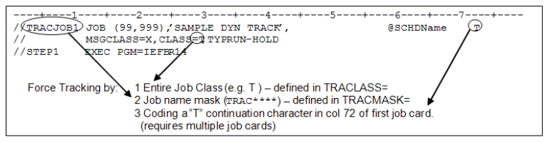
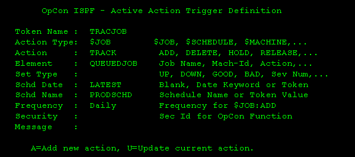

# Viewing, Adding, and Editing z/OS Job Details

**Theme:** Configure  
**Who Is It For?** System Administrator, Automation Engineer

## What Is It?

z/OS job details define how OpCon submits a job to a z/OS environment, including job card details, step parameters, data set definitions, and output handling. These details are configured in the Task Details panel of a z/OS master job in Solution Manager.

To view a z/OS job, you must have the required privileges as defined in [Required Privileges](../Accessing-Master-Jobs.md#required-privileges).

## When Would You Use It?

- To view a z/OS job, you must have the required privileges as defined in [Required Privileges](../Accessing-Master-Jobs.md#required-privileges)

## Why Would You Use It?

- **Viewing, Adding,**: To view a z/OS job, you must have the required privileges as defined in [Required Privileges](../Accessing-Master-Jobs.md#required-privileges)

## Viewing z/OS Job Details

1. Go to **Library** > **Master Jobs**
1. Select a z/OS job in the list
1. Select **Edit**
1. Expand the **Task Details** panel

## Adding z/OS Job Details

To add z/OS Job Details, complete the following steps:

1. Create the job and general info as described in [Adding a Job](../../Adding-Master-Jobs.md)
1. Expand the **Task Details** section
1. From the **Machines or Machine Group** list, select the **machine** where the agent is installed. To use a machine group instead, toggle the **Machines** switch to _Machine Group_ and select the group. The switch appears green when toggled to Machine Group
1. Select a **Job Type**

Available z/OS job types:

- [BATCH](#batch)
- [STARTED TASK](#started-task)
- [COMMAND](#command)
- [REXX](#rexx)
- [TRACKED OR QUEUED](#tracked-or-queued)

---

## Editing z/OS Job Details

To edit z/OS Job Details, complete the following steps:

1. Go to **Library** > **Master Jobs**
1. Select a z/OS job
1. Select **Edit**
1. Select the lock icon. The button appears gray and locked () in **Read-only** mode and green and unlocked () in **Admin** mode
1. Expand the **Task Details** panel
1. From the **Machines or Machine Group** list, select the **machine** where the agent is installed. To use a machine group, toggle the **Machines** switch to _Machine Group_ and select the group. The button appears green  when toggled

### BATCH

The Batch Job is the primary event type for z/OS scheduling. JCL for the scheduled job must reside in a library allocated to the OPCONxx agent task for the MachineID on which it is submitted. This is the only event type that may run on a system other than the one on which it is submitted.

- **Member Name:** Name of the library member containing the batch JCL. If blank, the job name is used
  - Maximum 8 characters; may contain letters, numbers, and @#$; first character cannot be a number

:::note
Continuous recommends leaving the Member Name blank in production definitions. Use the Event Name to identify the JCL member name, and reserve the Member Name for overrides.
:::

- **Temporary Member:** Overrides the Member Name. Can be defined in the Job Master, but is primarily used in the daily schedule to load a different JCL member for a specific instance. If the user edits the JCL and saves it to the override library, the agent generates a temporary member name so it is only used for that instance
  - Maximum 8 characters; may contain letters, numbers, and @#$; first character cannot be a number

- **Batch User:** z/OS security ID assigned to the job. Defaults to the user ID in the job card or the USERID from XPSPARMS

- **DDNAME:** DD Name in the agent task pointing to the library containing the job's JCL. Defaults to XPSJCL, or the agent JCLDD parameter in XPSPARMS. May contain alphabetic, national, and numeric characters
  - Maximum 8 characters; may contain letters, numbers, and @#$; first character cannot be a number

:::note
If DDNAME is set to `$DUMMY`, no batch job is submitted. Once all pre-runs are satisfied, the job is marked complete. This creates a "Pre-run only" job, similar to the File Watcher job type on other platforms.
:::

- **Override DDNAME:** DD Name in the agent task to search for JCL before the batch DD NAME
  - Maximum 8 characters; may contain letters, numbers, and @#$; first character cannot be a number

:::note
If the override DD name begins with `TEMP` and the Override Member name is blank, the job is eligible for temporary JCL processing. If JCL is found in the override library at job start, the member is renamed with a unique name and the schedule record is updated. This prevents the JCL from being reused when the job is scheduled again. Temporary JCL processing is bypassed for DDs that concatenate datasets.
:::

### Started Task

Started Task events require no batch JES initiator. Jobs such as CICS or IMS regions are common uses of this event type. Like Batch Jobs, these events are tracked at the step level.

- **Started Task Name:** Name of the started task defined in a system procedure library. Must be defined to the SAF security product
- **Execution Parms:** Appended to the started task name after a comma to complete the start command (e.g., `TYPE=WARM`). May contain any properties allowed in a Started Task EXEC parameter

### Command

Console Commands can be scheduled to run on the machine defined in the Primary Machine ID entry. Console Command Executions have no completion or exit codes. Each command is run as-is without verification of the result.

- **Host Job Name:** The command is issued from a dynamic started task using the job name
- **Operator Command:** Text of the command to be run

:::note
The z/OS LSAM has no method for verifying whether a command is correct or achieved the desired result. The command is always run as defined, and a Finished OK status is always returned to the SAM.
:::

### Rexx

REXX procedures require no JCL and can be used for a variety of automation interfaces. The REXX Event functions like a Console Command. The z/OS LSAM dynamically allocates a print file and runs the program from the designated DD.

- **Exec Name:** Taken from the job name
- **Execution Parms:** Input parameters required for the REXX procedure
- **Submit DDName:** DD Name in the OPCONxx PROC pointing to the library containing the REXX program. Defaults to SYSEXEC
  - Maximum 8 characters; may contain letters, numbers, and @#$; first character cannot be a number

### Tracked or Queued

:::note
Tracked and Queued jobs are identical in terms of job definition and scheduling. Choosing either documents how the job is expected to be submitted; it does not change how the job is scheduled or runs.
:::

- **Tracked Job:** JCL is submitted to the JES queue from an external source and tracked dynamically by the agent. Should be defined on an OpCon Schedule with no dependencies
- **Queued Job:** JCL is submitted to the JES queue from an external source and tracked dynamically by the agent. May have dependencies on other jobs or pre-runs; must arrive in a JES "held" queue or as a `TYPRUN=HOLD` job
- Tracked Jobs should not be restarted from OpCon. Restarting only reports the original completion status. To restart a Tracked or Queued job, resubmit it from the original source

### Sysplex

A coupled group of z/OS systems. When a job is scheduled on a machine in a sysplex, its pre-runs or the job itself may run on any system in the sysplex.

- **Pre-run System:** Select one system for pre-runs or ANY system
- **Submit on any system:** Determines whether the job starts on the system where pre-runs were satisfied. If not selected, the job starts on the assigned machine name

### Failure Criteria

Defines a range of successful condition codes for the job. Default is blank (no job-level condition code checks).

- **Min CC:** Minimum tolerated condition code. Any code below this value is a failure. Must be 0–4095 and less than Max CC
- **Max CC:** Maximum tolerated condition code. Any code above this value is a failure. Must be 0–4095 and greater than Min CC

### JCL/SYSOUT Access

Provides access to z/OS JCL and job output listings.

- **Member Name:** Name of the PDS or PDS/E member containing the JCL
- **View JCL DD:** DD name of the library containing the JCL member
- **Save JCL DD:** Name of the library to contain the saved JCL (Override DD). Defaults to TEMPJCL
- **View JCL:** Fetches JCL from the member identified by View JCL DD and member name, and loads it in a text editor. Selecting OK enables the Save JCL button
- **Save JCL:** Uploads JCL from the edit buffer to the host and saves it in the member identified by Save JCL DD and member name, using the current OpCon User ID. The upload fails if the user is not known to the z/OS security system or lacks permission to update the Save JCL library. On success, ISPF member statistics are updated

:::note
Setting the Member Name to the JES JobID and View JCL DD to JESJCLIN fetches JCL from the spool, similar to the SDSF SJ option.
:::

### Step Control

Step Control allows up to 80 step condition codes or ranges. Special schedule or execution handling can be defined based on the condition code at step completion, or Step Control can override Job Min/Max condition codes. Only the first matching definition is used at the end of each step; define them in priority order. Step Control is not available for Console Command or REXX Event types.

- **Step Name:** Fully qualified step name in the format `JOBSTEP` or `JOBSTEP.PROCSTEP`. JOBSTEP is the name on a job-level EXEC statement; PROCSTEP is the name on the EXEC PGM statement in a JCL procedure
  - Entering only JOBSTEP matches any step in an invoked procedure. To match a specific step, include PROCSTEP
  - `?` matches any single non-blank character; `*` at the end matches all remaining characters or blank spaces
- **Min CC and Max CC:** Return code range this step control definition checks. Both values must be 0–4095; Min CC must be less than or equal to Max CC
- **Step Action:** Action taken when the step's return code falls within the defined range
  - **Abend Job At Step Termination:** Immediately terminates the job. Remaining steps are flushed, but `COND=EVEN/ONLY` steps run. OpCon shows the job as Failed
  - **Send Job Completed To SAM:** Marks the job complete regardless of remaining steps; success or failure is determined by steps up to and including this one
  - **Send Trigger Message To SAM:** Sends the Trigger Message only
  - **Post Error, But Allow Job To Continue:** Posts a job failure condition. Subsequent steps run, but job dependencies are not resolved
  - **OK To Continue:** Overrides job-level failure criteria for this step at this return code range
  - **Set Restart Step:** Overrides the automatic restart step assignment when a job fails. Enter the failed step name in Step Name and the desired restart step in Trigger Message
- **Trigger Message:** Required for Send Trigger Message to SAM, but usable with any Step Action. Up to 20 characters; posted to Schedule Operations and recorded in User Messages agent Feedback
  - Special message formats:
    - `$EVENT=eventname` — triggers the named action from the z/OS event trigger table. If the name is not found, the message changes to `JEVENT=eventname`
    - `$JOB:GOOD` — sets the job to Finished OK immediately
    - `$JOB:BAD` — sets the job to Failed immediately
    - `$S=jobstep[.procstep]` — sets the job's restart step
  - agent Feedback codes can trigger job events and are the preferred method for defining step triggers, because all event types are supported and events can contain instance properties. Multiple trigger events can be defined for the same message
  - Step completion status is written to the Step Completion agent Feedback table in a fixed format:
    - A five-character status code: **Cnnnn** (condition code), **FLUSH** (step did not run), **Unnnn** (decimal abend code), or **S-xxx** (hexadecimal abend code)
    - A space
    - The step name in `execstep` or `jobstep.execstep` format
  - Automatic restart step selection can be enabled or disabled by prefixing the restart step name:
    - `+` — enables auto step flag, then sets restart step from the remainder of the message
    - `-` — disables auto step flag, then sets restart step from the remainder of the message
    - ` ` (blank) — does not change the flag; sets restart step from the remainder of the message
    - Any other character — sets the restart step from the first character of the message field
    - If the restart step name is blank, this action is a no-op

### z/OS Pre-run Definitions

The z/OS LSAM supports five pre-run types: File Resource, Message Trigger, Job/Task Resource, Tape Devices, and REXX Procedure.

#### File Resource

Allows up to 80 pre-run definitions for dataset resources.

- **Dataset:** Up to 44 characters of DSN trigger information. Wildcards are supported:
  - `%` matches any single character
  - A final `*` matches any remaining characters
  - A dataset ending in `.G0000V00` is treated like `.G%%%%V%%` but must be a member of a GDG
- **Generations:** Number of times the condition must be met before releasing the job. Useful for starting jobs after several GDG datasets have been received
- **Condition:** Type of data access condition to trigger: Exists, Created, Updated, Deleted, Referenced, Cataloged, or Uncataloged
  :::note
  Wildcards and generations cannot be used with File Exists conditions.
  :::
- **When:** Whether the trigger remains in effect after the associated event fires
  - **While/As Scheduled Only:** Deletes the trigger entry once triggered. On the next scheduled run, the trigger is refreshed and waits for new conditions
  - **Continuous Monitoring:** Resets the generation count and continues monitoring. On the next scheduled run, the trigger may fire immediately if conditions were satisfied again
- **Job Name:** Job that must satisfy the condition before a trigger occurs. Prevents reruns or external creations from triggering events intended for a specific job
  :::note
  Job Name does not apply to File Exists conditions.
  :::

#### Message Trigger

Allows up to 80 pre-run definitions for Console Message requirements. Useful for capturing error and threshold indicators and taking automated actions. All message trigger keys must contain a fixed positional keyword and may also contain a second value to scan for in the remaining message text.

- **Key:** Trigger text to match. The first characters define the fixed text; Offset and Length must be defined to match the key
  - A variable key may follow as a second argument enclosed in brackets (`{}`). A preceding hyphen (`-`) indicates exclusion
  - The offset is variable; the length of the text within brackets determines the length
  - If the fixed text is found, OpCon scans for the bracketed text in the remainder. With the exclusion operator, the message matches only if the enclosed text is not found
  - If the fixed text ends with a hyphen, the variable key must be separated from it by a space
  - A space is always required between the fixed key and the opening bracket or hyphen
- **Generations:** Number of matching messages that must be issued before triggering the event
- **When:** Whether the trigger remains in effect after firing
  - **While/As Scheduled Only:** Deletes the trigger once triggered; refreshed on the next scheduled run
  - **Continuous Monitoring:** Resets the generation count and continues monitoring; may fire immediately on the next scheduled run if conditions were satisfied again
- **Job Name:** Job that must issue this message before triggering. Prevents unintended triggers from reruns or external sources
  - Maximum 8 characters; may contain letters, numbers, and @#$; first character cannot be a number
- **Offset:** Number of leading characters (0–120) to skip when matching the key
- **Limit:** Number of characters in the key. Maximum 44 characters

#### Job/Task Resource

Allows up to 80 pre-run definitions to check for the existence of an running job or task.

- **Job/Task Name:** Eight-character name of a batch job, system task, or TSO User ID
  - Maximum 8 characters; may contain letters, numbers, and @#$; first character cannot be a number
- **Job/Task Must Be:** Whether the named task should be Running or Not Running for the event to submit

#### Tape Device

Allows a pre-run requiring availability of a specific number and type of tape unit(s).

- **Device:** Generic or esoteric tape unit as defined by IBM unit standards. Up to 8 alphanumeric characters
- **Units:** Number of units that must be available for the job to submit

#### REXX Procedure

Allows a REXX event as a pre-run. Unlike the REXX event type, the return code from this procedure must be zero, or the associated job is not submitted.

- **REXX Name:** Name of the procedure to run. Maximum 8 characters; may contain letters, numbers, and @#$; first character cannot be a number
- **REXX DD:** DD Name in the OPCONxx PROC pointing to the library containing the REXX executable code. Defaults to SYSEXEC. Maximum 8 characters; may contain letters, numbers, and @#$; first character cannot be a number
- **REXX PARAM:** Input parameters required for the REXX procedure

### z/OS Restart Definitions

OpCon automates job restarts. agent defaults are used unless overridden at the job level. Restart controls how XPR handles dataset (DSN) cleanup during a Normal Run and a Restart.

- **Duplicate Dataset Actions:**
  - **Normal Run:**
    - **&lt;blank&gt;:** agent defaults are used
    - **None:** Disables XPR DSN cleanup
    - **Scratch:** Prevents NOT CATLGD 2 errors by scratching pre-existing datasets
    - **Reuse:** Prevents NOT CATLGD 2 errors by converting DISP=NEW to DISP=OLD
  - **Restart:**
    - **&lt;blank&gt;:** agent defaults are used
    - **None:** Disables XPR DSN cleanup
    - **Scratch:** Prevents NOT CATLGD 2 errors by scratching pre-existing datasets
    - **Reuse:** Prevents NOT CATLGD 2 errors by converting DISP=NEW to DISP=OLD
  - **GDG Option:** Controls how XPR determines GDG base generations during a restart
    - **&lt;blank&gt;:** agent defaults are used
    - **None:** Disables GDG adjustment
    - **Absolute:** Resets the base generation to the value it had during the first run
    - **Relative:** Examines positive relative generations in the steps to be run to determine the correct base
    - **Catalog Resync:** Examines bypassed steps to find the highest relative generation already created and sets the base to resolve to the current generation
      :::note
      The GDGBIAS=STEP JCL option is not compatible with the Absolute GDG restart option. If used on a restart, GDG bias resolution is not attempted.
      :::

### JCL Substitution

Defines the JCL parameter symbol or OpCon token, separated by double backslashes, to use in this run.

- Use carriage returns to separate lines for readability. Maximum total characters: 3400
- Each override (`@`) or symbolic (`&`) definition is separated by two backslashes (`\\`)
- When the z/OS LSAM encounters an `&name=` symbolic, it scans each JCL statement for an operand match
- `&` symbolics change operands only. To qualify, an operand must be preceded by a comma or blank and include an `=` sign (e.g., all instances of `UNIT=xxxxx` are substituted using `&UNIT=SYSDA`)
- `@` overrides are placeholders for data; `&` symbolics replace specific operand data. Symbolics reference operands only
- Overrides can be embedded anywhere in JCL or SYSIN data and can define an entire 80-byte JCL record. They have no restrictions on content or delimiters except they cannot contain double backslashes (e.g., `@TODAY=October 12, 2005`)
- Internal OpCon tokens use `[[…]]` notation and may be used as data components of either symbolics or overrides (e.g., `@TODAY=[[$DATE]]`)

### Additional Information for z/OS Job Details

#### z/OS Job Information

OpCon supports several scheduled event types for z/OS: Batch Jobs, Started Tasks, Dynamic REXX, Operator Command, Tracked Job, and Queued Job.

**Batch Jobs**

*Supported Scheduled Events: Batch Jobs*

| Function  | Description|
| --------- | ---------- |
| Execution | JES initiated batch from JCL in a specific library already defined (by DDName) to agent. |
| Security  | <ul><li>Security ID from the SAM schedule record is inserted or replaces USER= on the Job Card.</li><li>If no Security ID is defined, USER= on the Job Card remains.</li><li>If no USER= can be built or found, the default USERID from XPSPRMxx is inserted as USER=.</li><li>If USERID=NONE is set in XPSPRMxx and no USER= can be built or found, the USER= keyword is omitted, giving the job the SAF authority of the agent.</li></ul> |
| Event Control | <ul><li>Provided by JCL statements in a member of a predefined JCL library allocated to the agent task. No practical limit on libraries or DDNAMEs.</li><li>If no DDNAME is defined on the SAM schedule record, the default JCLDD= from XPSPRMxx is used (XPSJCL is the installation default).</li></ul> |

**Started Tasks**

*Supported Scheduled Events: Started Tasks*

| Function  | Description|
| --------- | ---------- |
| Execution | agent initiated address space requiring a JCL Proc. |
| Security | Single level: Proc Member Name and its access authority must be defined to the SAF product. |
| Event Control | Provided by JCL statements in a predefined member in the system PROCLIB concatenation and PARMS passed to Proc. |

**Dynamic REXX**

*Supported Scheduled Events: Dynamic REXX*

| Function  | Description|
| --------- | ---------- |
| Execution | agent initiated address space. |
| Security | Single level: REXX Exec Name and its access authority must be defined to the SAF product. The userid is assigned by STARTED class resource `jobname.jobname`. |
| Event Control | Provided by dynamic allocation of SYSEXEC, SYSTSPRT, SYSTSIN, and PARMS passed to REXX Routine. |

**Operator Command**

*Supported Scheduled Events: Operator Command*

| Function  | Description|
| --------- | ---------- |
| Execution | agent initiated address space via IEESYSAS. |
| Security | Single level: Command authority must be defined to the SAF product for STARTED class resource `jobname.jobname`. |
| Event Control | None |

**Tracked Job**

*Supported Scheduled Events: Tracked Jobs*

| Function  | Description|
| --------- | ---------- |
| Execution | JES initiated batch from JCL. |
| Security | Assigned by normal rules during job submission. Not under agent control. |
| Event Control | Provided by JCL submitted from a source external to the agent. |

**Queued Job**

*Supported Scheduled Events: Queued Job*

| Function  | Description|
| --------- | ---------- |
| Execution | JES initiated batch from JCL submitted on hold and released by agent when all scheduled requirements are met. |
| Security | Assigned by normal rules during job submission. Not under agent control. |
| Event Control | Provided by JCL submitted from a source external to the agent. |

#### REXX Execution in OpCon

**REXX as a Batch Job**
This method is transparent to OpCon. Use Batch TSO or the REXX batch utility (IRXJCL). JCL for execution is contained in a JCL member like any production Batch Job. Parameters are hard-coded in the EXEC statement PARM= keyword. Security is provided by the USERID= keyword on the job card. Parms may be altered via OpCon `@`.

**REXX as a Started Task**
For long-running routines that provide control interfaces or monitoring, a started task (STC) is preferable to a batch job. An STC does not tie up a JES initiator, is more isolated from performance problems, and can remain active with minimal resource consumption. Running REXX as an STC is transparent to OpCon. Use TSO Batch or IRXJCL. Execution parameters can be coded in the SAM schedule record "Params" field. Security is provided by the Proc name.

**REXX as a Dynamic Task**
The Dynamic REXX task is initiated by the agent with no JCL or Procs. A separate address space is created and SYSEXEC, SYSTSPRT, and SYSTSIN DDNAMEs are dynamically allocated. The return code is captured and returned to the SAM. Condition code actions can be set. Rules:

- Only a single step runs
- The SYSEXEC DDNAME concatenation is copied from the running agent task
- Define any DDNAME in the agent task as a SYSEXEC concatenation
- SYSTSPRT allocation is assigned to the MSGCLASS defined in XPSPRMxx (default MSGCLASS=A)
- SYSTSIN DD is always dummied
- All parameters come from "EXEC Params" in the job definition
- Dynamic REXX events share the advantages of started tasks and require no JCL

**REXX as a Dynamic Pre-run Event**
A Dynamic REXX routine can be defined to run before a Batch Job or other event. It runs the same as a standalone Dynamic REXX, but the return code immediately triggers (or withholds) a subsequent event in the agent rather than returning to SAM. This enables faster response than SAM dependency processing when immediate action is required.

**Tracking Externally Submitted Batch Job Events in OpCon**
Within the z/OS LSAM, externally submitted events can be trapped and tracked using three approaches:

1. Define a single job name "mask" always trapped by the z/OS LSAM
2. Define one to eight single-character JES execution classes to monitor and trap for tracking
3. Insert a tracking indicator (`T` or `Q`) as the continuation character of the first Job card

:::note
A `C` continuation character bypasses the TRACLASS and TRACMASK runtime tracking options.
:::


4. Add a job step running XPSTRACK

All approaches can be combined. Define a job mask or JES tracking classes in the XPSPRMxx member of the OpCon Parmlib (XPSPARMS DD in the agent task). The following job illustrates all three setup methods:




1. Job Name mask as defined in XPSPRMxx (e.g., TRACMASK=TRAC****)
2. A special held class or class list as defined in XPSPRMxx (e.g., TRACLASS=TQA)
3. A `T` in continuation column 72 of the first job card (requires multiple continued job cards)

Dynamically tracked jobs may or may not have dependency capabilities. Because their arrival on the schedule may be arbitrary, using them as dependent triggers should be avoided as standard practice.

Every dynamically tracked job must be predefined on the OpCon schedule. If it has no dependencies or resource requirements, it is released immediately. Otherwise, it is released as dependencies or resources are satisfied.

A schedule name token (e.g., `@SCHDName`) starting in column 59 overrides the AdHoc schedule name default, allowing scheduling through any schedule on OpCon.

:::note
The `@` character is an indicator flag, not part of the schedule name.

The requested schedule must exist on the current day, or dynamic tracking fails. The "AdHoc" schedule always exists or is added automatically.

When the `Q` continuation character is used and a schedule name is on the job card, the job is added to the LATEST date with that schedule, helping to link jobs across the midnight boundary.

The default schedule name can be changed from AdHoc using the TRACSCHD parameter in XPSPARMS.
:::

#### Assigning a Date, Schedule, Job and Frequency to a Job

To assign a Date, Schedule name, Job name, and Frequency, create an event in the ISPF Event table:



- The token name must match the name on the job card
- The Action Type must be `$JOB`
- The Action must be `TRACK`
- Only the following fields are used: Element (OpCon job name), Schd Date, Schd Name, and Frequency. Element and Schd Name are required

In the sample above, a job named TRACJOB is added to the OpCon PRODSCHD schedule on the LATEST date as job name QUEUEDJOB with Frequency Daily.

If a job has both an Event table entry and a job card frequency definition, the job card definition overrides the event table entry.

#### Prerun Conditions

Pre-run conditions are resource management and triggering functions for scheduled events. When SAM sends the agent a "Start Job" request, that request may include pre-run conditions (e.g., a file is needed, a tape drive must be available, or a non-scheduled task must be down). If pre-run resources are available, the agent immediately submits or initiates the associated job, task, or command.

- **File Resource:** Checks for existence, creation, modification, deletion, reference, or catalog status change of a specific dataset. Can require the condition to be met multiple times before triggering. Can be restricted to the scheduled date of the associated job. The `Delete` option functions only when JCL contains `DISP=(,DELETE,[DELETE])`. `Reference` applies to any reference including Open and Close processing; each I/O function counts as one reference. Condition choices: Exists, Created, Updated, Deleted, Referenced, Cataloged, Uncataloged
- **Message Trigger:** Any message issued to the system log can trigger a scheduled event. `When` choices: Continuous Monitoring, While/As Scheduled Only
- **Job/Task Resource:** Checks for the presence or absence of a job or task by name. `Job/Task Must Be` choices: Running, Not Running
- **Tape Units:** Checks availability of tape class units by esoteric name or device type. If the check fails, OpCon schedules a retry. Device choices: &lt;User-defined&gt;, 3420, 3423, 3480, 3490, 3590
- **REXX Procedure:** Runs a REXX program. A return code of zero allows the job to run. A non-zero return code delays the start

#### Pre-run Conditions — How They Work

Pre-run conditions are either Immediate or Monitored. Most File Resource and all Message Trigger events are monitored; criteria are stored in continuously monitored tables. All other pre-runs are Immediate — essentially a true/false test.

**Immediate Events**

- **File Resource "EXISTS":** Only the Exists option is an immediate event. An MVS catalog Locate is issued; the dataset name must be fully qualified with no wildcards
- **Job/Task Resource:** Checks for the presence or absence of a non-scheduled task. If the required state is found, the job is submitted immediately. Otherwise, the test repeats throughout the scheduled day
- **Tape Units:** Checks for a fixed number of unallocated tape unit devices. If available, the job is submitted immediately. Otherwise, the test continues every few minutes throughout the scheduled day
- **REXX Procedure:** The named REXX routine runs. A return code of zero submits the associated job immediately. A non-zero code repeats the test throughout the scheduled day. A REXX Pre-run runs as a started task in its own address space and may run for hours or days, enabling custom monitors for complex events

**Monitored Events**

Monitored pre-runs become part of a continuously monitored event stream. An independent set of programs maintains tables recording when events are triggered. The two types are PASSIVE and ACTIVE trigger events.

**Active Event Triggers**
Active triggers represent scheduled events waiting to happen. Always active regardless of daily schedule contents. Defined on the z/OS system only, with an action to take when activated. Once activated and the assigned task is performed, the trigger returns to the active state and the process repeats.

**Passive Event Triggers**
Passive triggers represent a trigger waiting on a scheduled event, activated by a scheduled job. Defined in the JOB DETAIL for the job requiring the trigger. After the trigger is recognized and the target job starts, the trigger resets to await the next occurrence (Continuous) or is deleted (As Scheduled).

**Continuous Monitoring**
Once a scheduled event sets a PASSIVE trigger, it can request the trigger stay active after the associated job starts. On the next scheduled run, the trigger is tested to see if it fired again since the last execution. If so, the job runs immediately and the trigger resets to monitor continuously.

**As Scheduled Monitoring**
The trigger is deleted as soon as it fires. Only events within the scheduled time window of the associated job are considered triggers.

**Implied Pre-run Conditions**

| Prerun Message | Meaning | Job Status |
| -------------- | ------- | ---------- |
| Awaiting Execution | On JES2 Input Queue, JES3 CI, or awaiting MAIN | Runs as soon as JES assigns an available initiator. |
| SSSS Not in SYSPLEX | System ID SSSS is not available to the OpCon agent | Job is resubmitted when system SSSS returns or is adopted by another system. |

#### Defining File Resource (DSN) Triggers

Life cycle of a passive monitored event:

1. A new job is scheduled requiring a pre-run File Resource:
   - DSName: `PROD.BANK.DRAFT.G*`
   - Generations: 3
   - Condition: Created
   - Creating Job: Any
   - Created on SysID: ANY
   - Type: As Scheduled Only

2. When the associated job is ready to start (all other SAM dependencies met), the z/OS LSAM adds the DSN trigger criteria to the internal DSN Trigger Table on all LSAMs in the SYSPLEX
3. SAM sets the job to "Waiting Start Time — DSN(s) Not Available."
4. At a user-defined interval, SAM checks for trigger hits. If none, the "Waiting Start Time" message persists
5. On each z/OS machine, File Tracking components check every File Close event against the DSN Table. In this example, three GDG creations are required for a trigger
6. Once all three generations are created, the job runs. The DSN trigger entry is deleted because the type is "While/As Scheduled."
7. With Continuous Monitoring, the trigger resets to look for three more generations. On the next scheduled run, if three or more generations have been created since the last run, the job is submitted immediately

Wildcard characters can be used in DSN Trigger definitions. For example, `PROD.????.DRAFT.*` triggers on a match regardless of the `????` content. Valid wildcard characters are any non-valid DSN character except blank and asterisk: `?+_&!~%`. Any number or combination of wildcards may be used.

#### Message Triggers

WTO table (Console Message) triggering is handled by program XPSWTOEX. Triggering supports two keys: one FIXED and one VARIABLE. The Msg Off column defines the number of character positions from the start of the message text to the FIXED key. The Msg Len column defines the FIXED key length. All WTO triggers must have a FIXED key. The variable portion is optional and defined within brackets `{}`. Once the fixed key is located, the variable key is scanned for after the end of the fixed key.

Console Message Triggers operate the same as DSN Triggers. The first time a job with a Message Trigger pre-run is requested, the WTO Table is updated and subsequent start requests verify that table until the trigger is satisfied or the job is removed. "While/AS" and "Continuous" triggers behave the same as with DSN Triggers.

WTO and DSN table cleanup is automatic. Triggers unreferenced for 45 days are removed. The XPSPF001 ISPF Table Administration Application can also perform maintenance on storage tables.

#### Resource Requirements

Resources at the agent level are controlled by resource tabs in the Job Information display. Multiple resources can be requested but are honored in tab sequence — File Resources are checked first, then each subsequent resource, with the REXX script procedure last.

| Resource Requirement | Description |
| -------------------- | ----------- |
| File Resource | The most commonly used resource definition. A "scheduled trigger" that is self-documenting in the job awaiting it. |
| Message Trigger | A "scheduled trigger" using WTO Message Triggering features; self-documenting in the job awaiting it. |
| Job/Task Resource | A "must be" / "can't be" running test that checks a task or job state before a scheduled event runs. |
| Tape Units | Checks for a defined number of unallocated tape units by esoteric or generic unit type. Messages indicate available and required units at a user-defined interval until satisfied. If resources are available, the job is submitted within one second. |
| REXX Procedure | Runs a REXX program from a procedure library and tests its return code. If non-zero, the job waits for a user-defined interval and the routine runs again, repeating until return code zero is received or the job is removed from the schedule. |

All pre-runs are tested at a user-defined interval once all other schedule dependencies are met. SAM shows "Start Attempted." If the test fails, status returns to "Wait Start Time" with the specific pre-run listed.

#### Restart

An MVS job controlled by JCL may contain multiple steps. An error in a late step may not require re-execution of earlier steps. IBM provides a RESTART keyword on the JOB card to designate a starting step.

**Restart Solutions in OpCon**

OpCon automates the restart process with capabilities beyond the JOB card RESTART:

- Start and end the job at any step, even if step names are not unique
- Optionally place the restart step on the job card so resource managers such as JES3 skip resources for bypassed steps
- Restore completion codes for steps that do not run during the restart so conditional processing evaluates correctly
- Uncatalog and scratch pre-existing DASD datasets to avoid processing errors
- Suppress dataset cleanup for patterns such as database journal files using defined name tables
- Restore generation numbers from the first run so correct data is used
- Additional options reset base generations to avoid JCL errors and skipped generations based on the current catalog and restart JCL

**GDG Regression Options**

A Generation Data Group (GDG) is a set of related datasets referenced by generation. A Generation Data Set (GDS) is a member with a specific generation, referenced by base name and a relative generation (`0` for current, or a signed number such as `-1`, `+1`, `+2`).

:::note
**Example**

GDG A.B.C has generations 7, 8, 9, and 10 cataloged.
- A.B.C(0) resolves to generation 10: A.B.C.G0010V00
- A.B.C(-1) resolves to generation 9: A.B.C.G0009V00
- A.B.C(+1) resolves to generation 11: A.B.C.G0011V00
:::

The base generation is determined when the group is first referenced in the job. If the previous run created new generations, the base differs on restart, making relative generations resolve to different absolute generations. Correct restart typically requires uncataloging new generations or changing relative generations in the JCL.

:::note
**Example**

Given JCL:
```
//STEP1 ....
//DD1 DD DSN=A.B.C(+1),DISP=(NEW,CATLG)
...
//STEP3 ...
//DD2 DD DSN=A.B.C(+1),DISP=SHR
```
Both statements refer to generation 11 on a normal run. During a restart, the new base is 11, so both statements refer to generation 12. Restarting in STEP3 causes an error because generation 12 does not exist.
:::

OpCon offers four GDG regression options. OpCon takes no action for GDS references by explicit absolute generation.

- **None:** No action taken. The user takes full responsibility
- **Absolute:** XPR resets the base generation to the value from the first run. All relative generations resolve to the same absolute generations during the restart
- **Relative and Catalog Resync:** Related options that allow new generations created by other jobs between the first run and the restart. The goal is to avoid scratching valid datasets and prevent JCL errors from positive relative generations without creating gaps in cataloged generations. OpCon associates the highest cataloged generation with a particular relative generation in the JCL

*Sample JCL: Undesirable GDG Resolution*

| JCL | First run base generation 7 | Restart in step 3 base generation 10 |
| --- | --------------------------- | ------------------------------------ |
| //STEP1 ... | | |
| //DD DD DSN=A.B.C(+1),DISP=(NEW,CATLG) | G0008V00 | n/a |
| //STEP2 ... | | |
| //DD DD DSN=A.B.C(+2),DISP=(NEW,CATLG) | G0009V00 | n/a |
| //STEP3 ... | | |
| //DD DD DSN=A.B.C(+3),DISP=(NEW,CATLG) | G0010V00 | G0013V00 |
| //STEP4 ... | | |
| //DD DD DSN=A.B.C(+4),DISP=(NEW,CATLG) | G0011V00 | G0014V00 |

This JCL normally creates four new generations. A restart in STEP3 runs correctly but skips generations 11 and 12 (creating 13 and 14 instead). Not an error, but not desirable.

*Sample JCL: Undesirable GDG Resolution*

| JCL | First run base generation 7 | Restart in step 3 base generation 10 |
| --- | --------------------------- | ------------------------------------ |
| //STEP1 ... | | |
| //DDI DD DSN=A.B.C(0),DISP=SHR | G0007V00 | n/a |
| //DDO DD DSN=A.B.C(+1),DISP=(NEW,CATLG) | G0008V00 | n/a |
| //STEP2 ... | | |
| //DDI DD DSN=A.B.C(+1),DISP=SHR | G0008V00 | n/a |
| //DDO DD DSN=A.B.C(+2),DISP=(NEW,CATLG) | G0009V00 | n/a |
| //STEP3 ... | | |
| //DDI DD DSN=A.B.C(+2),DISP=SHR | G0009V00 | G0012V00 |
| //DDO DD DSN=A.B.C(+3),DISP=(NEW,CATLG) | G0010V00 | G0013V00 |
| //STEP4 ... | | |
| //DDI DD DSN=A.B.C(+3),DISP=SHR | G0010V00 | G0013V00 |
| //DDO DD DSN=A.B.C(+4),DISP=(NEW,CATLG) | G0011V00 | G0014V00 |

In this case, a restart in STEP3 causes a JCL error because STEP3.DDI refers to generation 12, which does not exist.

- **Relative:** Examines positive relative generations in the steps to run to determine the correct base. If positive references to NEW datasets exist, the base is set so the lowest positive NEW dataset is `+1` relative to the current catalog. If no positive NEW references exist, the base is set so the highest relative generation is the current generation. If JCL contains no positive generations, the base is not reset

In the example, only STEP3 and STEP4 are examined. `+3` is the lowest positive NEW generation, so `+2` is associated with the current catalog generation. If the current generation is 10, the base is set to 8 (10-2).

*Sample JCL: GDG Relative Option*

| JCL | Positive | Positive NEW | Restart in step 3 generation used | Equivalent generation relative to current |
| --- | -------- | ------------ | --------------------------------- | ----------------------------------------- |
| //STEP1 ... | | | | |
| //DDI DD DSN=A.B.C(0),DISP=SHR | | | n/a | |
| //DDI DD DSN=A.B.C(0),DISP=SHR | | | n/a | |
| //STEP2 ... | | | | |
| //DDI DD DSN=A.B.C(+1),DISP=SHR | | | n/a | |
| //DDO DD DSN=A.B.C(+2),DISP=(NEW,CATLG) | | | n/a | |
| //STEP3 ... | | | | |
| //DDI DD DSN=A.B.C(+2),DISP=SHR | +2 | | n/a | +0 |
| //DDO DD DSN=A.B.C(+3),DISP=(NEW,CATLG) | +3 | +3 | n/a | +1 |
| //STEP4 ... | | | | |
| //DDI DD DSN=A.B.C(+3),DISP=SHR | +3 | | G0011V00 | +1 |
| //DDI DD DSN=A.B.C(0),DISP=SHR | +4 | +4 | G0012V00 | +2 |

- **Catalog Resync:** Examines bypassed steps to find the highest relative generation already created and sets the base to resolve to the current generation. In both examples, a restart in STEP3 requires `+2` to resolve to `10` (the highest generation from previous steps). The new base is `8`. If no positive generations are found, the base is not reset

In the example, only STEP1 and STEP2 are examined. `+2` is the highest positive reference, associated with the current catalog generation. If the current generation is 10, the base is set to 8 (10-2).

*Sample JCL: GDG Catalog Resync Option*

| JCL | Positive | Restart in step 3 generation used | Equivalent generation relative to current |
| --- | -------- | --------------------------------- | ----------------------------------------- |
| //STEP1 ... | | | |
| //DDI DD DSN=A.B.C(0),DISP=SHR | | n/a | |
| //DDO DD DSN=A.B.C(+1),DISP=(NEW,CATLG) | +1 | n/a | |
| //STEP2 ... | | | |
| //DDI DD DSN=A.B.C(+1),DISP=SHR | +1 | n/a | |
| //DDO DD DSN=A.B.C(+2),DISP=(NEW,CATLG) | +2 | n/a | |
| //STEP3 ... | | | |
| //DDI DD DSN=A.B.C(+2),DISP=SHR | n/a | G0010V00 | +0 |
| //DDO DD DSN=A.B.C(+3),DISP=(NEW,CATLG) | n/a | G0011V00 | +1 |
| //STEP4 ... | | | |
| //DDI DD DSN=A.B.C(+3),DISP=SHR | n/a | G0011V00 | +1 |
| //DDO DD DSN=A.B.C(+4),DISP=(NEW,CATLG) | n/a | G0012V00 | +2 |

#### Using z/OS JCL Symbolic Substitution (&)

OpCon JCL Symbolic replacement can reduce or eliminate manual JCL setup. Define each override or symbolic in the Batch Control Section of the Job Master Detail display, separated by two backslashes (`\\`).

When the z/OS LSAM encounters an `&name=` symbolic, it scans each JCL statement for an operand match. For example, changing a GDG reference from `(-0)` to `(-1)`: if the EXEC statement has `GDG=(-0)` and `&GDG=(-1)` is defined in the SAM schedule record, the GDG symbolic changes for that run only.

Only operands are changed by `&` substitution. An operand must be preceded by a comma or blank and followed by `=`. In the following example, JCL #1 is changed but JCL #2 is not when `&PARM=(YES)` is coded:

1. `//STEP1 EXEC LIB=SYS1.OKLIB,PARM=(NO),MBR=TEMPNAME`
2. `//MYDD DD DSN=SYS1.PARMLIB,DISP=SHR`

The z/OS LSAM runs exactly what is specified. If `&PARM=(YES` (missing closing parenthesis) is coded, the result is:

`//STEP1 EXEC LIB=SYS1.OKLIB,PARM=(YES,MBR=TEMPNAME`

This likely results in a JCL Error.

If the JCL syntax qualifies as an operand, replacement is forced. For example, `&UNIT=3420` matches both of these:


1. `//STEP1 EXEC LIB=SYS1.OKLIB,UNIT=3380,MBR=TEMPNAME`
2. `//MYDD DD DSN=SYS1.PARMLIB,DISP=SHR,UNIT=SYSDA`

Ensure symbolic operands do not duplicate JCL operands or statements unless substitutions are intended to be universal. This is a powerful feature but can produce unexpected results if not defined and tested carefully.

#### Using z/OS Data Overrides (@)

Overrides are useful for REXX Parms, date cards, or other dynamic JCL or data requirements — for example, when a step runs only at month-end or a control card is inserted on certain frequencies.

`@` overrides are placeholders for data; `&` symbolics replace specific operands. Overrides can be embedded anywhere in JCL or SYSIN data, can define an entire 80-byte JCL record, and have no restrictions on content or delimiters except they cannot contain double backslashes.

:::note
Override keys are matched against JCL in the order defined in the parameter string. If a key begins with the same characters as a previously defined key, the shorter key always matches first.
:::

Example:

`\\@MONTH=Jan\\@MONTH2=Mar\\`

`@MONTH` always matches before `@MONTH2`. To avoid this, define the longer key first or make the shorter key unique:

`\\@MONTH2=Mar\\@MONTH=Jan\\` — or — `\\@MONTH1=Jan\\@MONTH2=Mar\\`

:::caution
To avoid formatting errors, the token placeholder should be the same length as the substitution value, or appropriate padding must be provided.
:::

#### Using OpCon as Data Overrides

Internal OpCon tokens use `[[$…]]` notation and may be used as data components of either symbolics or overrides. Refer to Properties.

Example — the OpCon system variable token `$DATE` (MM/DD/YY) substituted for `@DATE`:

Before: `DATE CARD AB.224@DATE /* TODAYS DATE IN COL 17 — MM/DD/YY */`

After: `DATE CARD AB.22412/15/02 /* TODAYS DATE IN COL 17 — MM/DD/YY */`

Example of incorrect padding:

Before: `DATE CARD AB.224@DATE /* TODAYS DATE IN COL 17 - MM/DD/YY */`

After: `DATE CARD AB.22412/15/02 TODAYS DATE IN COL 17 - MM/DD/YY */`

#### Start Command

The `$START COMMAND` property resolves to the start command the agent attempted when submitting a job. The following table lists z/OS start commands by Job Sub-Type.

| Job Sub-Type | Start Command |
| ------------ | ------------- |
| Batch | `ddname(member)#programmer name` **Note:** "Programmer name" is taken from the JCL job statement. This 20-character field allows the user to describe the job beyond the member name. |
| Started Task | `S taskname[,params]` |
| Command | `C:command text` |
| Rexx | `R:rexxname [params]` |
| Queued | `Q:jobname JobID\|machineID#programmer name` |
| Tracked | `T:jobname JobID\|machineID#programmer name` |

## Configuration Options

| Setting | What It Does | Default | Notes |
|---|---|---|---|
## FAQs

**Q: How many steps does the Viewing, Adding, and Editing z/OS Job Details procedure involve?**

The Viewing, Adding, and Editing z/OS Job Details procedure involves 32 steps. Complete all steps in order and save your changes.

**Q: What does Viewing, Adding, and Editing z/OS Job Details cover?**

This page covers Viewing z/OS Job Details, Adding z/OS Job Details, Editing z/OS Job Details.

## Glossary

**DSN (Data Source Name)**: An ODBC connection identifier that stores database connection parameters. OpCon utilities use system DSNs to connect to the OpCon SQL Server database.

**SAM (Schedule Activity Monitor)**: The logical processor for OpCon workflow automation. SAM monitors schedule and job start times, dependencies, and user commands to determine job execution timing, and processes OpCon events.

**LSAM (Local Schedule Activity Monitor)**: An agent installed on a target platform that runs jobs in the native language of that platform and communicates results back to SAM via SMANetCom over TCP/IP.

**Frequency**: A set of rules that defines when a job or schedule is eligible to run, based on calendar rules, day-of-week settings, period offsets, and other timing criteria.

**Threshold**: A numeric variable stored in the OpCon database used to control job execution. Jobs can be made dependent on threshold values, and OpCon events can update threshold values at runtime.

**Token (Global Property)**: A named value stored in the OpCon database, referenced in job definitions and events using [[PropertyName]] syntax. Tokens pass dynamic values — such as dates, file paths, or counts — into automation workflows.

**Resource**: A numeric variable in OpCon representing a finite pool. Jobs can be configured to require a set number of resource units to run, limiting concurrent executions and preventing resource contention.

**Privilege**: A specific permission granted through an OpCon role that controls access to a feature, function, or object type. Privileges are organized into categories such as Function Privileges, Machine Privileges, Schedule Privileges, and Access Codes.
