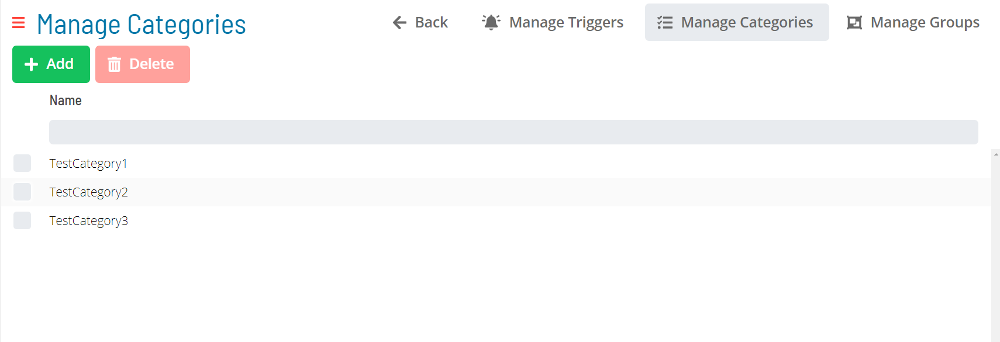
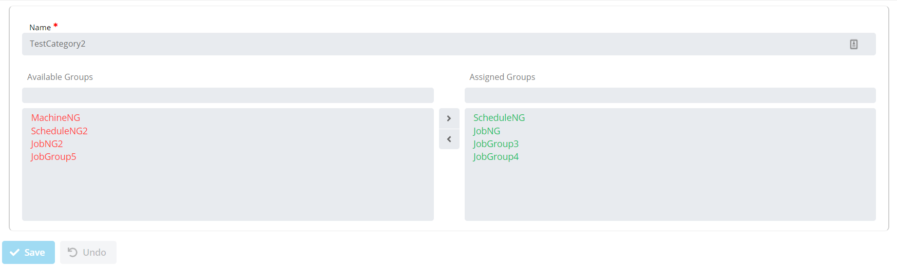

# Notification Categories

**Theme:** Configure  
**Who Is It For?** System Administrator, Automation Engineer

## What Is It?

Available Notification Categories in OpCon are shown in the grid under **Library > Notification Triggers > Manage Categories**.

Selecting **Add** or selecting a record in the grid enables the bottom panel:

:::note
The **Name** field must be unique when adding or editing a notification category.
:::

## When Would You Use It?

- You need to manage Categories** using Available Notification Categories in OpCon are shown in the grid under **Library > Notification Triggers >

## Why Would You Use It?

- **Operational value**: Enables the bottom panel:

## Configuration Options

| Setting | What It Does | Default | Notes |
|---|---|---|---|
## FAQs

**Q: What does Notification Categories do?**

title: Notification Categories

**Q: Where can you find Notification Categories in OpCon?**

Access Notification Categories through the appropriate section in the Enterprise Manager or Solution Manager navigation.

## Glossary

**Enterprise Manager (EM)**: OpCon's rich client graphical user interface for Windows and Linux, used to define schedules and jobs, manage automation data, and perform operational tasks.

**Solution Manager**: OpCon's browser-based graphical user interface for managing automation data, performing operational actions, and administering the system.

**Notification**: A message sent by the SMA Notify Handler when a Machine, Schedule, or Job changes to a specific status. Notifications can be delivered as emails, text messages, Windows Event Log entries, SNMP traps, or other formats.

**Resource**: A numeric variable in OpCon representing a finite pool. Jobs can be configured to require a set number of resource units to run, limiting concurrent executions and preventing resource contention.

**OpCon**: Continuous' workflow automation platform. The OpCon server includes the database, SAM and Supporting Services (SAM-SS), and graphical user interfaces. agents installed on target platforms run jobs and report results.
