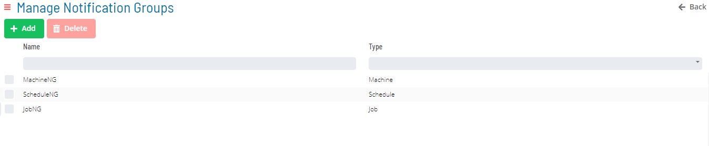
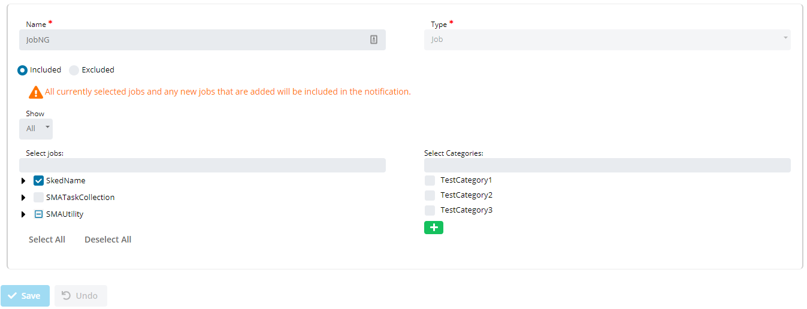
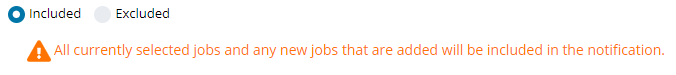
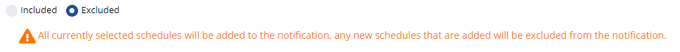
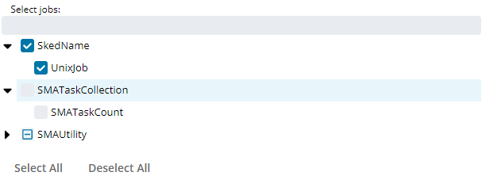
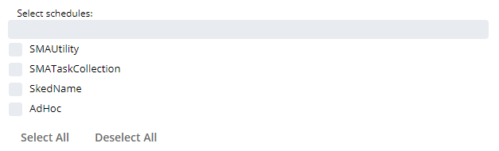
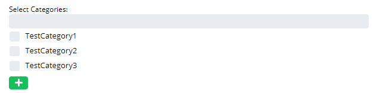
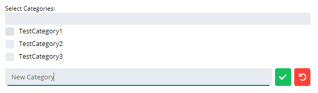

# Notification Groups

**Theme:** Configure  
**Who Is It For?** System Administrator, Automation Engineer

## What Is It?

Available Notification Groups in OpCon are shown in the grid under **Library > Triggers > Manage Notification Groups**.

Selecting **Add** or selecting a record in the grid enables the bottom panel:

:::note
The **Name** field must be unique when adding a notification group.
:::

When **Included** is selected, all items selected in the list — plus all new Jobs, Machines, and Schedules (depending on the group type) — are included in the notification.

When **Excluded** is selected, all items selected in the list are included, but all new Jobs, Machines, and Schedules (depending on the group type) are excluded from the notification.

- If the group type is **Job** or **Machine**, a tree view shows all available items

  

- If the group type is **Schedule**, a checklist shows all available schedules

  

The **Categories** checklist shows all categories available for the Notification Group.

Select the **Add** button to quickly add a new category to the list.

## When Would You Use It?

- Use this feature when Included is selected

## Why Would You Use It?

- **Operational value**: Enables the bottom panel: When Included is selected, all items selected in the list — pl

## Configuration Options

| Setting | What It Does | Default | Notes |
|---|---|---|---|
## FAQs

**Q: What does Notification Groups do?**

title: Notification Groups

**Q: Where can you find Notification Groups in OpCon?**

Access Notification Groups through the appropriate section in the Enterprise Manager or Solution Manager navigation.

## Glossary

**Enterprise Manager (EM)**: OpCon's rich client graphical user interface for Windows and Linux, used to define schedules and jobs, manage automation data, and perform operational tasks.

**Solution Manager**: OpCon's browser-based graphical user interface for managing automation data, performing operational actions, and administering the system.

**Notification**: A message sent by the SMA Notify Handler when a Machine, Schedule, or Job changes to a specific status. Notifications can be delivered as emails, text messages, Windows Event Log entries, SNMP traps, or other formats.

**Resource**: A numeric variable in OpCon representing a finite pool. Jobs can be configured to require a set number of resource units to run, limiting concurrent executions and preventing resource contention.

**Machine**: A platform defined in the OpCon database that has an agent installed. OpCon routes job execution requests to machines via SMANetCom, and machines report job completion status back to SAM.

**Schedule**: A named container for jobs in OpCon, built for a specific date to create that day's automation. Schedules define build settings, frequencies, and the jobs that run within them.

**Job**: The fundamental unit of work in OpCon. A job defines what to run, on which machine, when to start, and what conditions must be met. Job results are tracked and can trigger events and notifications.

**OpCon**: Continuous' workflow automation platform. The OpCon server includes the database, SAM and Supporting Services (SAM-SS), and graphical user interfaces. agents installed on target platforms run jobs and report results.
