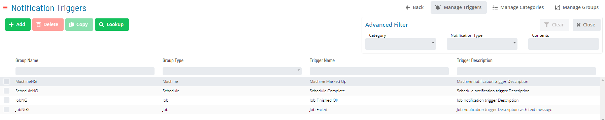
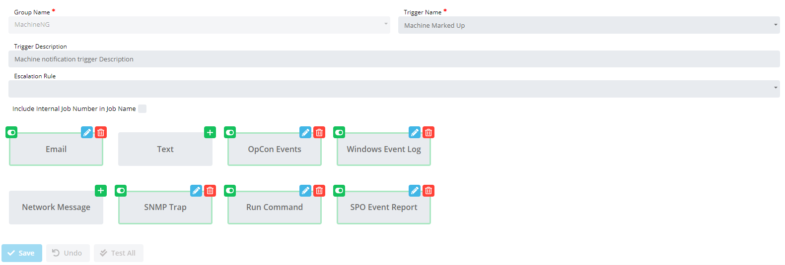
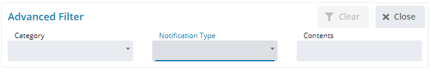
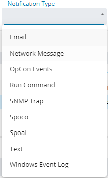
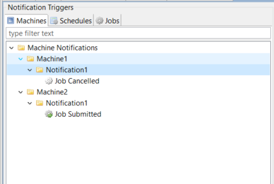
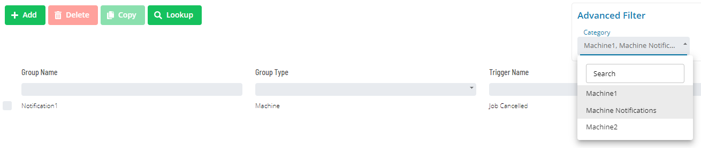

# Notification Triggers

**Theme:** Configure  
**Who Is It For?** System Administrator, Automation Engineer

## What Is It?

Available Notification Triggers in OpCon are shown in the grid under **Library > Notification Triggers**.

Selecting **Add** or selecting a record in the grid enables the bottom panel:

:::note
The **Group Name** - **Trigger Name** combination must be unique when adding a notification trigger.
:::

**Description**: Provides a description and purpose for the notification trigger.

**Include Internal Job Number in Job Name frame**: Determines whether the job name in the Prefix Information is unique each time a notification is processed. The unique job name combines the original job name with a SAM-generated job number.

**Escalation Rule**: Specifies an optional escalation rule for email notifications. The list and search function are hidden by default and appear only when an email notification option is selected.

The bottom panel provides options for configuring the following **Notification Types**: Email, Text Notification, OpCon Events, Windows Event Log, Network Notification, SNMP Trap, Run Command, and SPO Event Report.

- Select **Add** () to add a new notification for the selected trigger
- Select **Edit** () to edit an existing notification
- Select **Delete** () to remove an existing notification

**Active/Inactive Notification Status**: The toggle to the left of each notification type indicates *Active* () or *Inactive* () status. The toggle is hidden by default; select it to switch between states.

:::note
Modifications take effect only after selecting the **Save** button.
:::

Select a notification type to view its configuration instructions:

- [Send Email (SMTP)](./NotificationTypes/Email)
- [Send Short Text Message](./NotificationTypes/Text-Message)
- [Send OpCon Events](./NotificationTypes/OpCon-Events)
- [Send Windows Event Log](./NotificationTypes/Windows-Event-Log)
- [Send Network Message](./NotificationTypes/Network-Message)
- [Send SNMP Trap](./NotificationTypes/SNMP-Trap)
- [Send SPO Event Report](./NotificationTypes/SPO-Event-Report)
- [Run Command](./NotificationTypes/Run-Command)

**Lookup Dialog**: To reverse-look up an event, you need the Notification ID, which is available from a notification message or from the SMANotifyHandler.log. Select the  button to open the Lookup dialog.

- [Lookup Dialog](./NotificationTypes/Look-up-Notification-Sources)

Select the  button to open the copy dialog.

- [Copy Dialog](./NotificationTypes/Copy-Notification-Trigger)

**Advanced Filtering**: Use the Advanced Filters at the top right of the screen to filter notification triggers.

- **Contents**: Shows triggers containing the specified text in any notification
- **Notification Type**: Shows triggers that have all selected notification types configured

  

- **Categories**: Shows triggers associated with all selected categories

:::note
For customers who migrated from versions prior to 21.6: In Enterprise Manager, you reached a notification group by navigating through the parent group tree. In Solution Manager, use the Categories filter and select categories corresponding to the parent group name. This migration is backwards compatible — Notification Manager in EM remains available.
:::

**Using Enterprise Manager**

**Using Solution Manager**

## When Would You Use It?

- Available Notification Triggers in OpCon are shown in the grid under **Library > Notification Triggers**

## Why Would You Use It?

- **Operational value**: Enables the bottom panel: Description: Provides a description and purpose for the notifi

## Configuration Options

| Setting | What It Does | Default | Notes |
|---|---|---|---|
| Description | Provides a description and purpose for the notification trigger | — | — |
| Include Internal Job Number in Job Name frame | Determines whether the job name in the Prefix Information is unique each time a notification is processed. | — | — |
| Escalation Rule | Specifies an optional escalation rule for email notifications. | — | — |
| Active/Inactive Notification Status | The toggle to the left of each notification type indicates *Active* (!Active Notification) or *Inactive* (!Inactive Notification) status. | — | — |
| Lookup Dialog | To reverse-look up an event, you need the Notification ID, which is available from a notification message or from the SMANotifyHandler.log. | — | — |
| Advanced Filtering | Use the Advanced Filters at the top right of the screen to filter notification triggers | — | — |
| Contents | Shows triggers containing the specified text in any notification | — | — |
| Notification Type | Shows triggers that have all selected notification types configured | — | — |
| Categories | Shows triggers associated with all selected categories | — | — |
## FAQs

**Q: What does Notification Triggers do?**

title: Notification Triggers

**Q: Where can you find Notification Triggers in OpCon?**

Access Notification Triggers through the appropriate section in the Enterprise Manager or Solution Manager navigation.

## Glossary

**SAM (Schedule Activity Monitor)**: The logical processor for OpCon workflow automation. SAM monitors schedule and job start times, dependencies, and user commands to determine job execution timing, and processes OpCon events.

**Enterprise Manager (EM)**: OpCon's rich client graphical user interface for Windows and Linux, used to define schedules and jobs, manage automation data, and perform operational tasks.

**Solution Manager**: OpCon's browser-based graphical user interface for managing automation data, performing operational actions, and administering the system.

**OpCon Event**: A command sent to OpCon that triggers an automated action, such as adding a job to a schedule, updating a property value, sending a notification, or changing a job or schedule status.

**Notification**: A message sent by the SMA Notify Handler when a Machine, Schedule, or Job changes to a specific status. Notifications can be delivered as emails, text messages, Windows Event Log entries, SNMP traps, or other formats.

**Resource**: A numeric variable in OpCon representing a finite pool. Jobs can be configured to require a set number of resource units to run, limiting concurrent executions and preventing resource contention.

**Job**: The fundamental unit of work in OpCon. A job defines what to run, on which machine, when to start, and what conditions must be met. Job results are tracked and can trigger events and notifications.

**OpCon**: Continuous' workflow automation platform. The OpCon server includes the database, SAM and Supporting Services (SAM-SS), and graphical user interfaces. agents installed on target platforms run jobs and report results.
