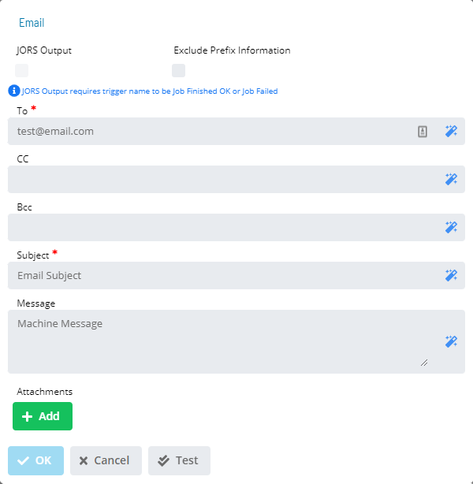

# Email (SMTP) dialog

**Theme:** Configure  
**Who Is It For?** System Administrator, Automation Engineer

## What Is It?

The **Email** dialog provides the following fields for defining an SMTP email notification:

- **To** (Required): SMTP email address(es) separated by semicolons (;). Maximum 3,000 characters
- **Cc** (Optional): Additional SMTP email address(es) for carbon copies, separated by semicolons (;). Maximum 3,000 characters
- **Bcc** (Optional): Additional SMTP email address(es) for blind carbon copies, separated by semicolons (;). Maximum 3,000 characters
- **Subject** (Optional): The message subject
- **JORS Output**: Select this option to include JORS output files as attachments for job triggers
- **Exclude Prefix Information**: Select this option to exclude prefix information from the email (e.g., Schedule Date, Machine Name, Schedule Name, Job Name \[and Internal Job Number\], trigger type, and triggering status change event)
- **Message**: A user-defined message
- **Attachments**: Files to include with the message. Wildcards are not allowed in filenames

## When Would You Use It?

- You need to provide the following fields for defining an SMTP email notification: using The **Email** dialog

## Why Would You Use It?

- **Operational value**: Provides the following fields for defining an SMTP email notification: - To (Required): S

## Configuration Options

| Setting | What It Does | Default | Notes |
|---|---|---|---|
| JORS Output | Select this option to include JORS output files as attachments for job triggers | — | — |
| Exclude Prefix Information | Select this option to exclude prefix information from the email (e.g., Schedule Date, Machine Name, Schedule Name, Job Name \[and Internal Job Number\... | — | — |
| Message | A user-defined message | — | — |
| Attachments | Files to include with the message. | — | — |
## FAQs

**Q: What does Email (SMTP) dialog do?**

The **Email** dialog provides the following fields for defining an SMTP email notification:

**Q: Where can you find Email (SMTP) dialog in OpCon?**

Access Email (SMTP) dialog through the appropriate section in the Enterprise Manager or Solution Manager navigation.

## Glossary

**JORS (Job Output Retrieval System)**: The system used to retrieve and display job output — logs and reports — from agent machines directly within the OpCon graphical interfaces.

**Enterprise Manager (EM)**: OpCon's rich client graphical user interface for Windows and Linux, used to define schedules and jobs, manage automation data, and perform operational tasks.

**Solution Manager**: OpCon's browser-based graphical user interface for managing automation data, performing operational actions, and administering the system.

**Notification**: A message sent by the SMA Notify Handler when a Machine, Schedule, or Job changes to a specific status. Notifications can be delivered as emails, text messages, Windows Event Log entries, SNMP traps, or other formats.

**Resource**: A numeric variable in OpCon representing a finite pool. Jobs can be configured to require a set number of resource units to run, limiting concurrent executions and preventing resource contention.

**Machine**: A platform defined in the OpCon database that has an agent installed. OpCon routes job execution requests to machines via SMANetCom, and machines report job completion status back to SAM.

**Schedule**: A named container for jobs in OpCon, built for a specific date to create that day's automation. Schedules define build settings, frequencies, and the jobs that run within them.

**Job**: The fundamental unit of work in OpCon. A job defines what to run, on which machine, when to start, and what conditions must be met. Job results are tracked and can trigger events and notifications.
