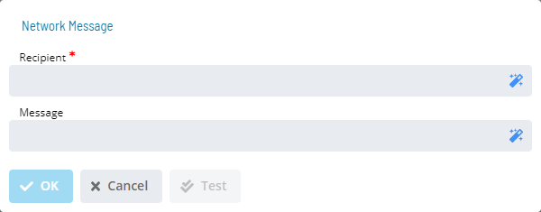

# Network Message

**Theme:** Configure  
**Who Is It For?** System Administrator, Automation Engineer

## What Is It?

The **Network** dialog provides the following fields for defining a Network Pop-up Message notification:

:::caution
The SMANotifyHandler always attempts to use **Msg.exe** first. For a successful message, Authentication User (UNC Access) and Authentication Password (UNC Access) must be defined in the Server Options. You must be an Administrator on the SAM application server and on every target machine. For more information, refer to **Authentication User (UNC Access)** and **Authentication Encrypted Password (UNC Access)** in [Server Options](../../../../../../administration/server-options.md#smtp-server-settings) in the **Concepts** online help.
:::

- **Recipient Name(s)** (Required): Machine host names, TCP/IP addresses, or Windows User Names separated by semicolons (;). Maximum 3,000 characters
- **Message**: A user-defined message up to 3,000 characters. The message also includes default trigger information: trigger type and triggering status change event

## When Would You Use It?

- You need to provide the following fields for defining a Network Pop-up Message notification: using The **Network** dialog

## Why Would You Use It?

- **Operational value**: Provides the following fields for defining a Network Pop-up Message notification: - Recip

## Configuration Options

| Setting | What It Does | Default | Notes |
|---|---|---|---|
| Message | A user-defined message up to 3,000 characters. | trigger information: trigger t | up to 3,000 characters. The message also includes default |
## FAQs

**Q: What does Network Message do?**

The **Network** dialog provides the following fields for defining a Network Pop-up Message notification:

**Q: Where can you find Network Message in OpCon?**

Access Network Message through the appropriate section in the Enterprise Manager or Solution Manager navigation.

## Glossary

**SAM (Schedule Activity Monitor)**: The logical processor for OpCon workflow automation. SAM monitors schedule and job start times, dependencies, and user commands to determine job execution timing, and processes OpCon events.

**Enterprise Manager (EM)**: OpCon's rich client graphical user interface for Windows and Linux, used to define schedules and jobs, manage automation data, and perform operational tasks.

**Solution Manager**: OpCon's browser-based graphical user interface for managing automation data, performing operational actions, and administering the system.

**TCP/IP**: The network communication protocol used for all data exchange between SMANetCom on the OpCon server and agents on target machines.

**Notification**: A message sent by the SMA Notify Handler when a Machine, Schedule, or Job changes to a specific status. Notifications can be delivered as emails, text messages, Windows Event Log entries, SNMP traps, or other formats.

**Resource**: A numeric variable in OpCon representing a finite pool. Jobs can be configured to require a set number of resource units to run, limiting concurrent executions and preventing resource contention.

**Machine**: A platform defined in the OpCon database that has an agent installed. OpCon routes job execution requests to machines via SMANetCom, and machines report job completion status back to SAM.

**OpCon**: Continuous' workflow automation platform. The OpCon server includes the database, SAM and Supporting Services (SAM-SS), and graphical user interfaces. agents installed on target platforms run jobs and report results.
