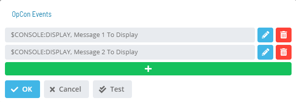
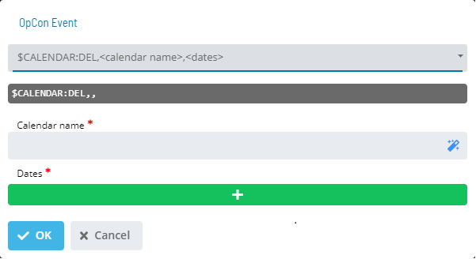

# OpCon Events

**Theme:** Configure  
**Who Is It For?** System Administrator, Automation Engineer

## What Is It?

The **OpCon Events** dialog lists existing events and provides options to add, edit, or delete them.

- **Test**: Sends a test for the activated notification of the trigger

The **OpCon Event** dialog provides fields for defining an event. Select an **Event Template** from the list to begin.

Once you choose a template, the screen dynamically updates to assist with filling out event details.

Insert variables into any part of the Event using the notation **${variable}**. The same variable can be used multiple times in the same Event or across Events for the same Service Request; it appears as a single User Input, and the value supplied applies to every instance.

The following system variables are available in Solution Manager:

- **${SM.USER.LOGIN}** - Name of the OpCon user who selected the Service Request button
- **${SM.USER.NAME}** - Full User Name of the OpCon user who selected the Service Request button
- **${SM.USER.EMAIL}** - Email Address of the OpCon user who selected the Service Request button
- **${SM.USER.COMMENTS}** - Comments of the OpCon user who selected the Service Request button

Variables are resolved before the Event is sent to OpCon. A preview of the defined Event displays below the **Event Template** list.

Complete the Event definition, then select **OK** to apply changes and return to the **OpCon Events** page, or select **Cancel** to discard changes.

## When Would You Use It?

- You need to provide options to add, edit, or delete them using The **OpCon Events** dialog lists existing events and

## Why Would You Use It?

- **Operational value**: Provides options to add, edit, or delete them

## Configuration Options

| Setting | What It Does | Default | Notes |
|---|---|---|---|
## FAQs

**Q: What does OpCon Events do?**

The **OpCon Events** dialog lists existing events and provides options to add, edit, or delete them.

**Q: Where can you find OpCon Events in OpCon?**

Access OpCon Events through the appropriate section in the Enterprise Manager or Solution Manager navigation.

## Glossary

**Enterprise Manager (EM)**: OpCon's rich client graphical user interface for Windows and Linux, used to define schedules and jobs, manage automation data, and perform operational tasks.

**Solution Manager**: OpCon's browser-based graphical user interface for managing automation data, performing operational actions, and administering the system.

**OpCon Event**: A command sent to OpCon that triggers an automated action, such as adding a job to a schedule, updating a property value, sending a notification, or changing a job or schedule status.

**Notification**: A message sent by the SMA Notify Handler when a Machine, Schedule, or Job changes to a specific status. Notifications can be delivered as emails, text messages, Windows Event Log entries, SNMP traps, or other formats.

**Service Request**: A Solution Manager feature that lets operators trigger predefined automation workflows using a simple form. Service Requests encapsulate schedule builds, job submissions, or events without requiring direct access to schedule definitions.

**Resource**: A numeric variable in OpCon representing a finite pool. Jobs can be configured to require a set number of resource units to run, limiting concurrent executions and preventing resource contention.

**OpCon**: Continuous' workflow automation platform. The OpCon server includes the database, SAM and Supporting Services (SAM-SS), and graphical user interfaces. agents installed on target platforms run jobs and report results.
