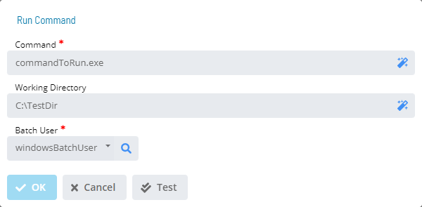

# Run Command

**Theme:** Configure  
**Who Is It For?** System Administrator, Automation Engineer

## What Is It?

The **Run Command** dialog provides the following fields for defining a command to run for the selected trigger:

- **Command** (Required): Defines the full path and name of the program to run. The maximum for this field is 4000 characters
- **Working Directory** (Optional): Defines the working directory used by the program. The maximum for this field is 255 characters
- **Batch User** (Required): Defines the user with permissions to run the program

## Configuration Options

| Setting | What It Does | Default | Notes |
|---|---|---|---|
## FAQs

**Q: What does Run Command do?**

The **Run Command** dialog provides the following fields for defining a command to run for the selected trigger:

**Q: Where can you find Run Command in OpCon?**

Access Run Command through the appropriate section in the Enterprise Manager or Solution Manager navigation.

## Glossary

**Enterprise Manager (EM)**: OpCon's rich client graphical user interface for Windows and Linux, used to define schedules and jobs, manage automation data, and perform operational tasks.

**Solution Manager**: OpCon's browser-based graphical user interface for managing automation data, performing operational actions, and administering the system.

**Resource**: A numeric variable in OpCon representing a finite pool. Jobs can be configured to require a set number of resource units to run, limiting concurrent executions and preventing resource contention.

**OpCon**: Continuous' workflow automation platform. The OpCon server includes the database, SAM and Supporting Services (SAM-SS), and graphical user interfaces. agents installed on target platforms run jobs and report results.
