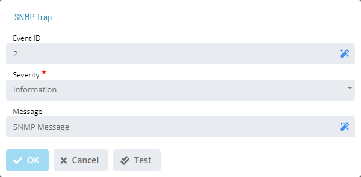

# SNMP Trap

**Theme:** Configure  
**Who Is It For?** System Administrator, Automation Engineer

## What Is It?

The **SNMP Trap** dialog provides the following fields for defining an SNMP trap notification:

- **Event ID** (Optional): Defines a user-defined ID usable as search criteria in a third-party notification filter. The maximum for this field is 64 characters
  - The SMA Notify Handler places this ID in the message as: `EventID= XXXXXX`
  - The following characters are not allowed: ~ # % ! @ $ ^
- **Severity**: Defines the message's severity level. Choices are: Information, Warning, or Error
- **Message**: Defines a user-defined message up to 3,000 characters. The message also includes default trigger information: Event ID, trigger type, and triggering status change event

## Configuration Options

| Setting | What It Does | Default | Notes |
|---|---|---|---|
| Severity | Defines the message's severity level. | trigger information: Event ID | up to 3,000 characters. The message also includes default |
| Message | Defines a user-defined message up to 3,000 characters. | trigger information: Event ID | up to 3,000 characters. The message also includes default |
## FAQs

**Q: What does SNMP Trap do?**

The **SNMP Trap** dialog provides the following fields for defining an SNMP trap notification:

**Q: Where can you find SNMP Trap in OpCon?**

Access SNMP Trap through the appropriate section in the Enterprise Manager or Solution Manager navigation.

## Glossary

**SMA Notify Handler**: Processes notifications triggered by Machine, Schedule, and Job status changes. Can send emails, text messages, Windows Event Log entries, SNMP traps, and SPO notifications.

**Enterprise Manager (EM)**: OpCon's rich client graphical user interface for Windows and Linux, used to define schedules and jobs, manage automation data, and perform operational tasks.

**Solution Manager**: OpCon's browser-based graphical user interface for managing automation data, performing operational actions, and administering the system.

**Notification**: A message sent by the SMA Notify Handler when a Machine, Schedule, or Job changes to a specific status. Notifications can be delivered as emails, text messages, Windows Event Log entries, SNMP traps, or other formats.

**Resource**: A numeric variable in OpCon representing a finite pool. Jobs can be configured to require a set number of resource units to run, limiting concurrent executions and preventing resource contention.

**OpCon**: Continuous' workflow automation platform. The OpCon server includes the database, SAM and Supporting Services (SAM-SS), and graphical user interfaces. agents installed on target platforms run jobs and report results.
