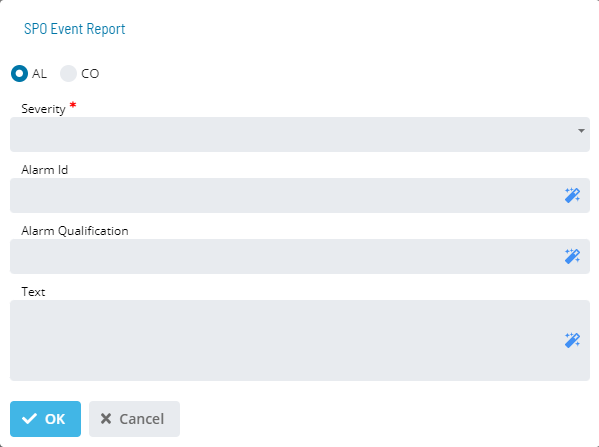
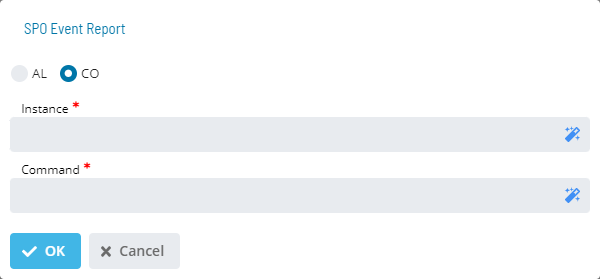

# SPO Event Report

**Theme:** Configure  
**Who Is It For?** System Administrator, Automation Engineer

## What Is It?

The **SPO** dialog lets you choose between an AL Report or CO Report notification:

- **AL**: Defines the AL report fields when enabled
- **Text** (Optional): User-defined message up to 250 characters
  - If no text is specified, the default `<lsam_mach_name> <schedule_date> <schedule_name><job_name>` is sent
  - If text is specified, the SPO message contains only the user-defined message
- **Severity**: Message severity level. Choices: Informational, Minor, Major, Warning, Critical, Indeterminate, or Unselect
- **Alarm Id** (Optional): Any valid AL alarmid attribute (max 250 characters). If not specified and the SPO Default Alarm ID is not set in Administration > Options, the agent Machine name is sent
- **Alarm Qualification** (Optional): Any valid AL alarmqual attribute (max 250 characters). If not specified, the Schedule and Job Name are sent

- **CO**: Presents the CO report fields when enabled
- **Instance** (Required): Any valid CO instance attribute. Case-sensitive. Maximum 250 characters
- **Command** (Optional): Any valid CO command attribute. Maximum 250 characters

## When Would You Use It?

- Use this feature when enabled. - Text (Optional): User-defined message up to 250 characters

## Why Would You Use It?

- **SPO Event**: The **SPO** dialog lets you choose between an AL Report or CO Report notification:

## Configuration Options

| Setting | What It Does | Default | Notes |
|---|---|---|---|
| AL | Defines the AL report fields when enabled | `<lsam_mach_name> <schedule_da | up to 250 characters.   - If no text is specified, the defa |
| Severity | Message severity level. | Alarm ID is not set in Adminis | Maximum 250 characters. - **Command** (Optional): Any valid C |
| CO | Presents the CO report fields when enabled | — | Maximum 250 characters. - **Command** (Optional): Any valid C |
## FAQs

**Q: What does SPO Event Report do?**

The **SPO** dialog lets you choose between an AL Report or CO Report notification:

**Q: Where can you find SPO Event Report in OpCon?**

Access SPO Event Report through the appropriate section in the Enterprise Manager or Solution Manager navigation.

## Glossary

**LSAM (Local Schedule Activity Monitor)**: An agent installed on a target platform that runs jobs in the native language of that platform and communicates results back to SAM via SMANetCom over TCP/IP.

**Enterprise Manager (EM)**: OpCon's rich client graphical user interface for Windows and Linux, used to define schedules and jobs, manage automation data, and perform operational tasks.

**Solution Manager**: OpCon's browser-based graphical user interface for managing automation data, performing operational actions, and administering the system.

**Notification**: A message sent by the SMA Notify Handler when a Machine, Schedule, or Job changes to a specific status. Notifications can be delivered as emails, text messages, Windows Event Log entries, SNMP traps, or other formats.

**Resource**: A numeric variable in OpCon representing a finite pool. Jobs can be configured to require a set number of resource units to run, limiting concurrent executions and preventing resource contention.

**Machine**: A platform defined in the OpCon database that has an agent installed. OpCon routes job execution requests to machines via SMANetCom, and machines report job completion status back to SAM.

**Schedule**: A named container for jobs in OpCon, built for a specific date to create that day's automation. Schedules define build settings, frequencies, and the jobs that run within them.

**Job**: The fundamental unit of work in OpCon. A job defines what to run, on which machine, when to start, and what conditions must be met. Job results are tracked and can trigger events and notifications.
