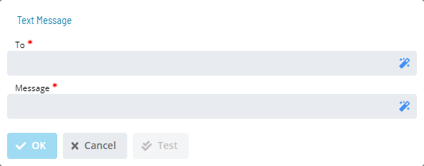

# Text Message

**Theme:** Configure  
**Who Is It For?** System Administrator, Automation Engineer

## What Is It?

The **Text Message** dialog provides the following fields for defining a notification to a pager, phone, or other SMS-capable device.

- **To** (Required): Defines the SMTP email address(es) or SMS-capable device address(es). Separate multiple addresses with semicolons (;). The maximum for this field is 3,000 characters. Examples:
  - AT&T Wireless: phonenumber@txt.att.net
  - T-Mobile: phonenumber@tmomail.net
  - Sprint: phonenumber@messaging.sprintpcs.com
  - Verizon: phonenumber@vtext.com
- **Message** (Required): Defines a user-defined message up to 160 characters

:::note
The SMA Notify Handler inserts a Notification ID in the format `ID=nnn` before any other message content. For more information, refer to [Looking up Notification Sources](Look-up-Notification-Sources).
:::

## When Would You Use It?

- You need to provide the following fields for defining a notification to a pager, phone, or other SMS-capable device using The **Text Message** dialog

## Why Would You Use It?

- **Operational value**: Provides the following fields for defining a notification to a pager, phone, or other SMS

## Configuration Options

| Setting | What It Does | Default | Notes |
|---|---|---|---|
## FAQs

**Q: What does Text Message do?**

The **Text Message** dialog provides the following fields for defining a notification to a pager, phone, or other SMS-capable device.

**Q: Where can you find Text Message in OpCon?**

Access Text Message through the appropriate section in the Enterprise Manager or Solution Manager navigation.

## Glossary

**SMA Notify Handler**: Processes notifications triggered by Machine, Schedule, and Job status changes. Can send emails, text messages, Windows Event Log entries, SNMP traps, and SPO notifications.

**Enterprise Manager (EM)**: OpCon's rich client graphical user interface for Windows and Linux, used to define schedules and jobs, manage automation data, and perform operational tasks.

**Solution Manager**: OpCon's browser-based graphical user interface for managing automation data, performing operational actions, and administering the system.

**Notification**: A message sent by the SMA Notify Handler when a Machine, Schedule, or Job changes to a specific status. Notifications can be delivered as emails, text messages, Windows Event Log entries, SNMP traps, or other formats.

**Resource**: A numeric variable in OpCon representing a finite pool. Jobs can be configured to require a set number of resource units to run, limiting concurrent executions and preventing resource contention.

**OpCon**: Continuous' workflow automation platform. The OpCon server includes the database, SAM and Supporting Services (SAM-SS), and graphical user interfaces. agents installed on target platforms run jobs and report results.
