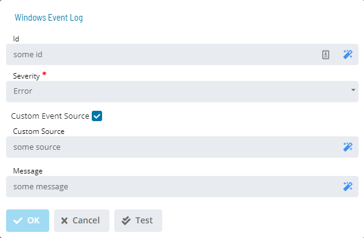

# Windows Event Log

**Theme:** Configure  
**Who Is It For?** System Administrator, Automation Engineer

## What Is It?

The **Windows Event Log** dialog provides the following fields for defining a Windows Event Log notification:

- **Event ID** (Optional): A user-defined ID usable as search criteria in third-party notification filters. Maximum 64 characters
  - SMA Notify Handler formats this as: `EventID= XXXXXX`
  - Disallowed characters: ~ \# % ! @ $ ^
- **Severity**: Message severity level. Choices: Information, Warning, or Error
- **Custom Event Source** (Optional): Enables the **Event Source** field, which defines a custom Source ID for OpCon when writing to the Windows Event Log. Maximum 64 characters
  - SMA Notify Handler prefixes the value with `OPCON:` to prevent conflicts
  - Allowed characters: a-Z, 0-9, - \_ space , . = ( )
- **Message**: User-defined message up to 3,000 characters. Also includes default trigger information: Event ID, trigger type, and triggering status change event

When the message appears in the Windows Event Log, any notification product that reads this log can send notifications.

## When Would You Use It?

- You need to provide the following fields for defining a Windows Event Log notification: using The **Windows Event Log** dialog

## Why Would You Use It?

- **Operational value**: Provides the following fields for defining a Windows Event Log notification: - Event ID (

## Configuration Options

| Setting | What It Does | Default | Notes |
|---|---|---|---|
| Severity | Message severity level. | trigger information: Event ID | Maximum 64 characters.   - SMA Notify Handler prefixes the v |
| Message | User-defined message up to 3,000 characters. | trigger information: Event ID | up to 3,000 characters. Also includes default trigger inf |
## FAQs

**Q: What does Windows Event Log do?**

The **Windows Event Log** dialog provides the following fields for defining a Windows Event Log notification:

**Q: Where can you find Windows Event Log in OpCon?**

Access Windows Event Log through the appropriate section in the Enterprise Manager or Solution Manager navigation.

## Glossary

**SMA Notify Handler**: Processes notifications triggered by Machine, Schedule, and Job status changes. Can send emails, text messages, Windows Event Log entries, SNMP traps, and SPO notifications.

**Enterprise Manager (EM)**: OpCon's rich client graphical user interface for Windows and Linux, used to define schedules and jobs, manage automation data, and perform operational tasks.

**Solution Manager**: OpCon's browser-based graphical user interface for managing automation data, performing operational actions, and administering the system.

**Notification**: A message sent by the SMA Notify Handler when a Machine, Schedule, or Job changes to a specific status. Notifications can be delivered as emails, text messages, Windows Event Log entries, SNMP traps, or other formats.

**Resource**: A numeric variable in OpCon representing a finite pool. Jobs can be configured to require a set number of resource units to run, limiting concurrent executions and preventing resource contention.

**OpCon**: Continuous' workflow automation platform. The OpCon server includes the database, SAM and Supporting Services (SAM-SS), and graphical user interfaces. agents installed on target platforms run jobs and report results.
