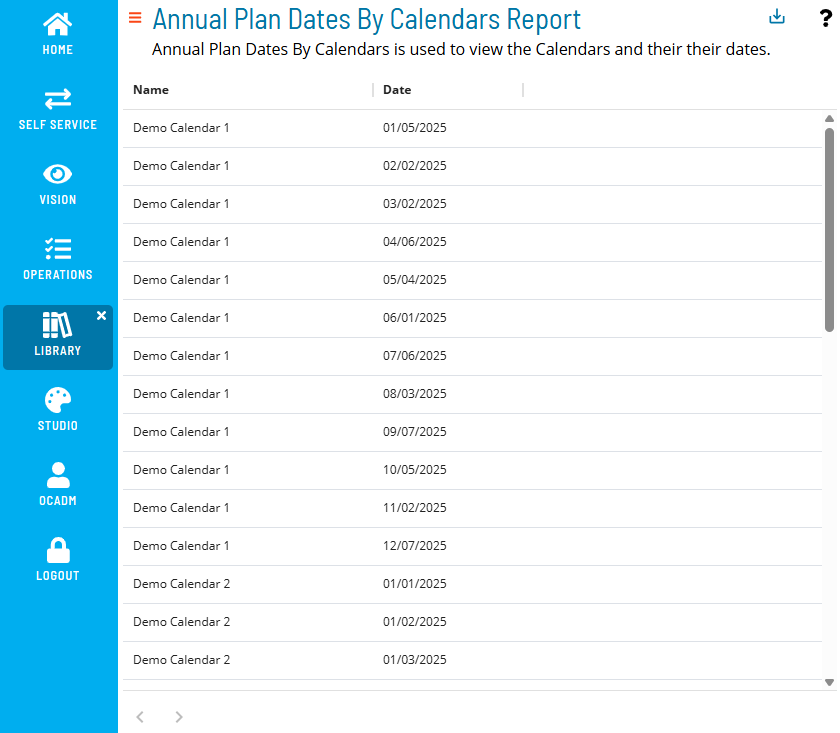

# Annual Plan By Calendar Dates Report

The **Annual Plan By Calendar Dates Report** shows all defined dates on user-defined Annual Plan calendars. Results are grouped by calendar name and display each date assigned to that calendar.

:::note
This report has a maximum return limit of 100,000 records.
:::

## Report columns

| Column | Description |
|---|---|
| **Calendar** | Name of the Annual Plan calendar. |
| **Dates** | Dates assigned to the calendar, formatted as M/dd/yyyy. |

## Filtering and sorting

By default, a schedule date filter is applied to show only dates on or after the current date. You can adjust this filter or add filters to other columns using the filters panel.

To open the filters panel, select the filter button in any column header, or select the menu button (three dots) in any column header and choose **Filter**.

_Filter panel showing the default schedule date filter_

_Column menu showing the Filter option_

## Exporting to CSV

Select the export  button to download the report as a CSV file. Any active filters are applied to the export.
