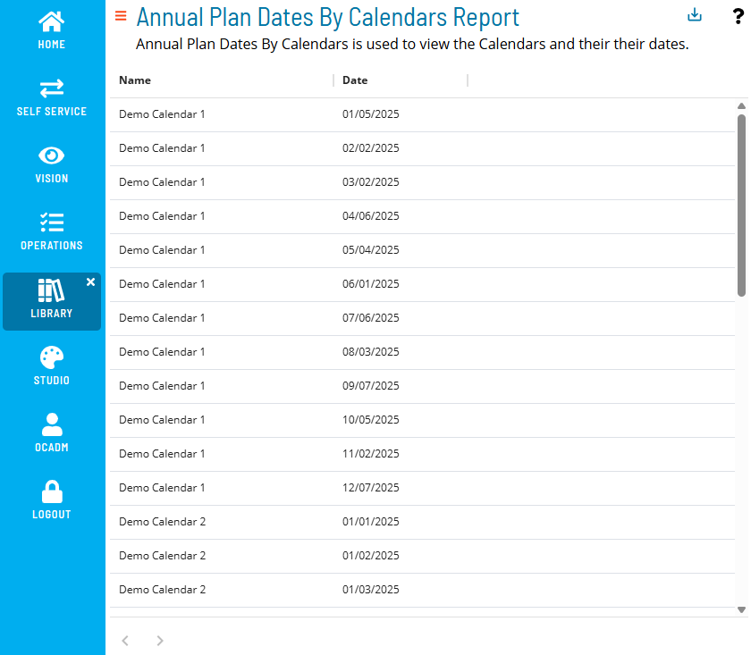

# Annual Plan By Calendar Dates Report

The **Annual Plan By Calendar Dates Report** shows all defined dates on user-defined calendars.

:::note
Report data is updated nightly at 2:00 AM.
:::

### Filtering & Sorting

This report provides two filters: name and date. You can open the filters panel by clicking on the menu (three dots) in the header of any column, and selecting 'Filter'.

 

Available filters include name and date:

 

### Exporting to CSV

Click the export  button to download the report as a CSV. Any active filters will be applied when exporting the report.
