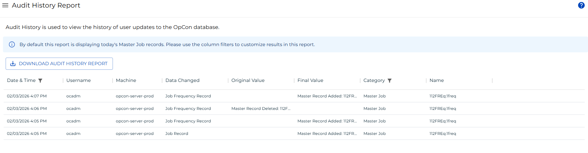
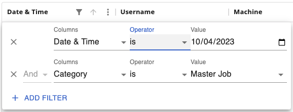

# Audit History Report

**Theme:** Configure  
**Who Is It For?** System Administrator, Automation Engineer

## What Is It?

The **Audit History Report** shows the history of user updates to the OpCon database.

### Filtering & Sorting

By default, two filters are applied: one limiting results to the current day, and one limiting the category to **Master Job** records. You can adjust these or add filters to other columns using the filters panel. Open the filters panel by selecting the filter icon in any column header or by selecting the menu (three dots) in any column header and choosing **Filter**.

_Filter Panel showing the default date and category filters_

_Column menu showing the Filter option_

Available categories for filtering:

- **Access Code**: Changes to Access Code definitions
- **Calendar**: Changes to Calendar definitions
- **Daily Job**: Changes to jobs in the Daily tables (status changes and job definitions)
- **Daily Schedule**: Changes to schedules in the Daily tables (status changes and schedule definitions)
- **Department**: Changes to Department definitions
- **Event Notification**: Changes to Event Notifications through the Notification Manager
- **Global Property**: Changes to Global Property definitions
- **Machine**: Changes to Machine definitions
- **Machine Group**: Changes to Machine Group definitions
- **Master Job**: Changes to Job definitions in the Master tables
- **Master Schedule**: Changes to Schedule definitions in Administration
- **Role**: Changes to Role definitions
- **Schedule Maintenance**: User-submitted requests for Schedule Build, Schedule Check, and Date-level Schedule Deletes
- **Threshold/Resource**: Changes to Threshold and Resource definitions
- **User Account**: Changes to User Account definitions, Last Login, Last Logout, and Enterprise Manager version used

### Exporting to CSV

Select the export  button to download the report as a CSV. Any active filters are applied to the export.

## Configuration Options

| Setting | What It Does | Default | Notes |
|---|---|---|---|
| Calendar | Changes to Calendar definitions | — | — |
| Daily Job | Changes to jobs in the Daily tables (status changes and job definitions) | — | — |
| Daily Schedule | Changes to schedules in the Daily tables (status changes and schedule definitions) | — | — |
| Event Notification | Changes to Event Notifications through the Notification Manager | — | — |
| Global Property | Changes to Global Property definitions | — | — |
| Machine | Changes to Machine definitions | — | — |
| Machine Group | Changes to Machine Group definitions | — | — |
| Master Job | Changes to Job definitions in the Master tables | — | — |
| Master Schedule | Changes to Schedule definitions in Administration | — | — |
| Role | Changes to Role definitions | — | — |
| Schedule Maintenance | User-submitted requests for Schedule Build, Schedule Check, and Date-level Schedule Deletes | — | — |
| Threshold/Resource | Changes to Threshold and Resource definitions | — | — |
| User Account | Changes to User Account definitions, Last Login, Last Logout, and Enterprise Manager version used | — | — |
## FAQs

**Q: What does Audit History Report do?**

The **Audit History Report** shows the history of user updates to the OpCon database.

**Q: Where can you find Audit History Report in OpCon?**

Access Audit History Report through the appropriate section in the Enterprise Manager or Solution Manager navigation.

## Glossary

**Enterprise Manager (EM)**: OpCon's rich client graphical user interface for Windows and Linux, used to define schedules and jobs, manage automation data, and perform operational tasks.

**Solution Manager**: OpCon's browser-based graphical user interface for managing automation data, performing operational actions, and administering the system.

**Daily Tables**: The OpCon database tables that hold the active, date-specific instances of schedules and jobs built for execution. Changes to daily tables affect only the current day's automation.

**Master Tables**: The OpCon database tables that hold the permanent definitions of schedules and jobs. Changes to master tables affect all future schedule builds.

**Threshold**: A numeric variable stored in the OpCon database used to control job execution. Jobs can be made dependent on threshold values, and OpCon events can update threshold values at runtime.

**Access Code**: A security label applied to jobs and schedules in OpCon. Users must have the matching access code privilege to view or manage items with that label.

**Department**: An organizational grouping in OpCon used to assign jobs to logical divisions. User roles can be scoped to specific departments, controlling which jobs a user can manage.

**Notification**: A message sent by the SMA Notify Handler when a Machine, Schedule, or Job changes to a specific status. Notifications can be delivered as emails, text messages, Windows Event Log entries, SNMP traps, or other formats.
