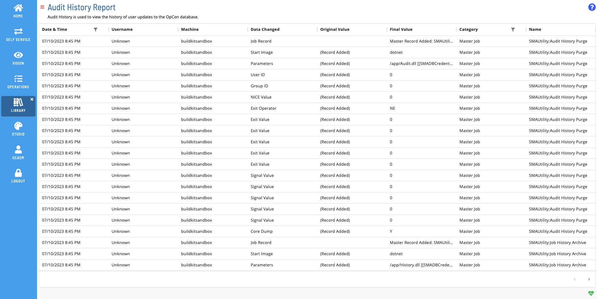

# Audit History Report

The **Audit History Report** is used to view the history of user
updates to the OpCon database.

### Filtering & Sorting

Because this report contains large amounts of data, 2 filters will be applied by default. The first filters the date to only the current day, and the second filters the category to only 'Master Job' records. You can adjust these or add filters to other columns in the filters panel (shown below). You can open the filters panel by either selecting the filter icon in the header or columns that have an active filter, or by clicking on the menu (three dots) in the header of any column, and selecting 'Filter' (also shown below). At least one date filter is required for this report.

  

We recommend filtering by a category, the categories available include:

- **Access Code**: Displays all changes to Access Code definitions.
- **Calendar**: Displays all changes to Calendar definitions.
- **Daily Job**: Displays all changes to jobs in the Daily tables (status changes and job definitions).
- **Daily Schedule**: Displays all changes to schedules in the Daily tables (status changes and schedule definitions).
- **Department**: Displays all changes made to Department definitions.
- **Event Notification**: Displays all changes made to Event Notifications through the Notification Manager.
- **Global Property**: Displays all changes made to Global Property definitions.
- **Machine**: Displays all changes made to Machine definitions.
- **Machine Group**: Displays all changes made to Machine Group definitions.
- **Master Job**: Displays all changes made to Job definitions in the Master tables.
- **Master Schedule**: Displays all changes made to Schedule definitions in Administration.
- **Role**: Displays all changes made to Role definitions.
- **Schedule Maintenance**: Displays all user-submitted requests for Schedule Build, Schedule Check, and Date level Schedule Deletes.
- **Threshold/Resource**: Displays all changes made to Threshold and Resource definitions.
- **User Account**: Displays all changes made to User Account definitions, Last Login, Last Log out, and the version of the Enterprise Manager used.

### Exporting to CSV

Click the export  button to download the report as a CSV. Any active filters will be applied when exporting the report.
