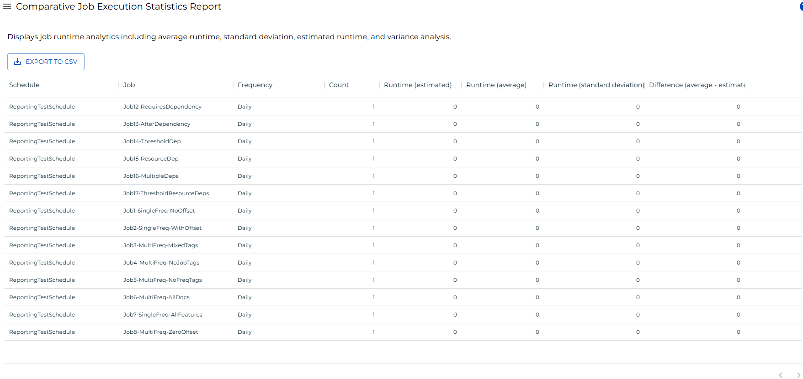

# Comparative Job Execution Statistics Report

The **Comparative Job Execution Statistics Report** shows runtime analytics for every job in the OpCon history, grouped by schedule, job, and frequency. Use this report to compare a job's estimated runtime against its actual average runtime and identify jobs whose estimates are significantly off.

:::note
This report returns a maximum of 100,000 records.
:::

## Access requirements

To view this report, your user account must meet one of the following conditions:

- Assigned the **ocadm** (administrator) role, or
- Granted all function privileges, or
- Granted all administrative privileges and the **View Reports** privilege.

## Report columns

The report displays the following columns for each job grouped by schedule and frequency.

| Column | Description |
|---|---|
| **Schedule** | Name of the schedule that contains the job. |
| **Job** | Name of the job. |
| **Frequency** | Name of the frequency under which the job ran. |
| **Count** | Number of times the job has run under this frequency. |
| **Runtime (estimated)** | Estimated runtime (in minutes) configured for the job. |
| **Runtime (average)** | Average actual runtime (in minutes) across all recorded runs. |
| **Runtime (standard deviation)** | Standard deviation of the actual runtime across all recorded runs. A value of 0 indicates only one run exists. |
| **Difference (average - estimated)** | Difference between the average actual runtime and the estimated runtime. A positive value means the job runs longer than estimated; a negative value means it runs shorter. |

Results are sorted by **Schedule** ascending, then **Job** ascending, then **Frequency** ascending by default.

## Filtering and sorting

You can filter and sort any column in the report. To open the filter options for a column, select the menu button (three dots) in that column header, then select **Filter**.

You can filter on both text columns (Schedule, Job, Frequency) and numeric columns (Count, Runtime (estimated), Runtime (average), Runtime (standard deviation), Difference (average - estimated)). Multiple filters combine with AND logic by default.

## Exporting to CSV

Select the export  button to download the report data as a CSV file. The export applies any active filters and includes up to 100,000 records. The CSV columns follow this order by default: Schedule, Job, Frequency, Count, Runtime (estimated), Runtime (average), Runtime (standard deviation), Difference (average - estimated).
