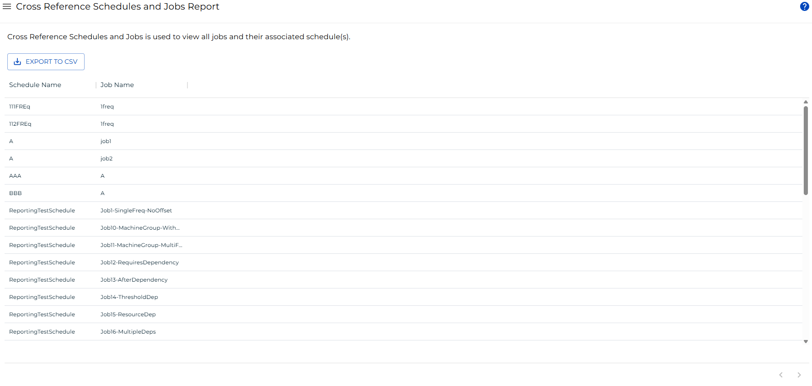
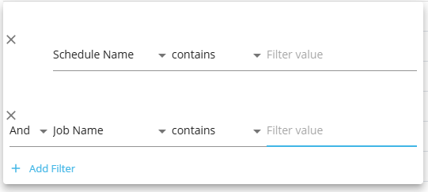

# Cross Reference Schedules and Jobs Report

**Theme:** Configure  
**Who Is It For?** System Administrator, Automation Engineer

## What Is It?

The **Cross Reference Schedules and Jobs Report** shows all jobs and their associated schedule(s).

:::note
Report data is updated nightly at 2:00 AM.
:::

:::note
This report has a maximum return limit of 100,000 records.
:::

### Filtering & Sorting

This report provides filters for schedule name and job name. Open the filters panel by selecting the menu (three dots) in any column header and choosing **Filter**.

 

 

### Exporting to CSV

Select the export  button to download the report as a CSV. Any active filters are applied to the export.

## When Would You Use It?

- The **Cross Reference Schedules and Jobs Report** shows all jobs and their associated schedule(s)

## Why Would You Use It?

- **Cross Reference**: The **Cross Reference Schedules and Jobs Report** shows all jobs and their associated schedule(s)

## Configuration Options

| Setting | What It Does | Default | Notes |
|---|---|---|---|
## FAQs

**Q: What does Cross Reference Schedules and Jobs Report do?**

The **Cross Reference Schedules and Jobs Report** shows all jobs and their associated schedule(s).

**Q: Where can you find Cross Reference Schedules and Jobs Report in OpCon?**

Access Cross Reference Schedules and Jobs Report through the appropriate section in the Enterprise Manager or Solution Manager navigation.

## Glossary

**Enterprise Manager (EM)**: OpCon's rich client graphical user interface for Windows and Linux, used to define schedules and jobs, manage automation data, and perform operational tasks.

**Solution Manager**: OpCon's browser-based graphical user interface for managing automation data, performing operational actions, and administering the system.

**Resource**: A numeric variable in OpCon representing a finite pool. Jobs can be configured to require a set number of resource units to run, limiting concurrent executions and preventing resource contention.

**Schedule**: A named container for jobs in OpCon, built for a specific date to create that day's automation. Schedules define build settings, frequencies, and the jobs that run within them.

**Job**: The fundamental unit of work in OpCon. A job defines what to run, on which machine, when to start, and what conditions must be met. Job results are tracked and can trigger events and notifications.

**OpCon**: Continuous' workflow automation platform. The OpCon server includes the database, SAM and Supporting Services (SAM-SS), and graphical user interfaces. agents installed on target platforms run jobs and report results.
