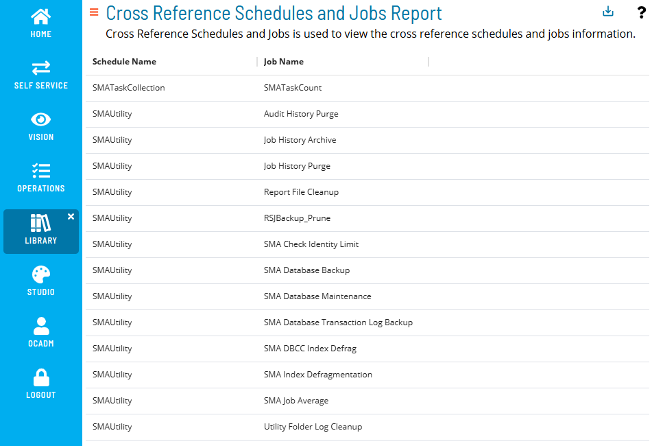

# Cross Reference Schedules and Jobs Report

The **Cross Reference Schedules and Jobs Report** shows all jobs and their associated schedule(s).

:::note
Report data is updated nightly at 2:00 AM.
:::

### Filtering & Sorting

This report provides two filters: schedule name and job name. You can open the filters panel by clicking on the menu (three dots) in the header of any column, and selecting 'Filter'.

 

Available filters include schedule name and job name:

 

### Exporting to CSV

Click the export  button to download the report as a CSV. Any active filters will be applied when exporting the report.
