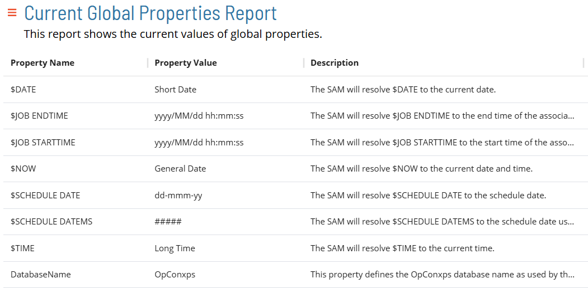

# Current Global Properties Report

**Theme:** Configure  
**Who Is It For?** System Administrator, Automation Engineer

## What Is It?

The **Current Global Properties Report** displays the currently defined global properties in OpCon.

:::note
This report has a maximum return limit of 100,000 records.
:::

### Filtering & Sorting

This report provides filters for property name, value, and description. Open the filters panel by selecting the menu (three dots) in any column header, then select **Filter**.

### Exporting to CSV

Select the export  button to download the report as a CSV. Active filters are applied to the export.

## Configuration Options

| Setting | What It Does | Default | Notes |
|---|---|---|---|
## FAQs

**Q: What does Current Global Properties Report do?**

The **Current Global Properties Report** displays the currently defined global properties in OpCon.

**Q: Where can you find Current Global Properties Report in OpCon?**

Access Current Global Properties Report through the appropriate section in the Enterprise Manager or Solution Manager navigation.

## Glossary

**Enterprise Manager (EM)**: OpCon's rich client graphical user interface for Windows and Linux, used to define schedules and jobs, manage automation data, and perform operational tasks.

**Solution Manager**: OpCon's browser-based graphical user interface for managing automation data, performing operational actions, and administering the system.

**Token (Global Property)**: A named value stored in the OpCon database, referenced in job definitions and events using [[PropertyName]] syntax. Tokens pass dynamic values — such as dates, file paths, or counts — into automation workflows.

**Resource**: A numeric variable in OpCon representing a finite pool. Jobs can be configured to require a set number of resource units to run, limiting concurrent executions and preventing resource contention.

**OpCon**: Continuous' workflow automation platform. The OpCon server includes the database, SAM and Supporting Services (SAM-SS), and graphical user interfaces. agents installed on target platforms run jobs and report results.
