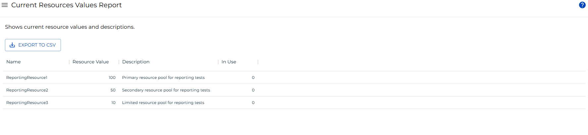

# Current Resource Values Report

The **Current Resource Values Report** displays the currently defined resources in OpCon. Use this report to review resource names, current values, descriptions, and in-use counts across your environment.

:::note
This report has a maximum return limit of 100,000 records.
:::

## Filtering

You can filter report results by resource name, value, description, and in use. To open the filters panel, select the menu button (three dots) in any column header, then select **Filter**.

## Exporting to CSV

Select the **Export** button to download the report as a CSV file. Active filters are applied to the export.

## Related Topics

- [Reports](./List-Reports.md)
- [Current Threshold Values Report](./Current-Threshold-Values-Report.md)
- [Current Global Properties Report](./Current-Global-Properties-Report.md)
