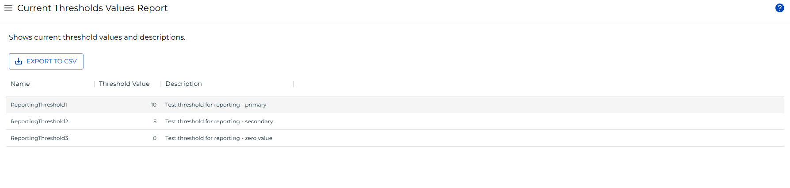

# Current Threshold Values Report

**Theme:** Configure  
**Who Is It For?** System Administrator, Automation Engineer

## What Is It?

The **Current Threshold Values Report** displays the currently defined thresholds in OpCon.

:::note
This report has a maximum return limit of 100,000 records.
:::

### Filtering & Sorting

Filter by threshold name, value, or description. To open the filters panel, select the menu (three dots) in any column header and select **Filter**.

 

### Exporting to CSV

Select the export  button to download the report as a CSV. Active filters are applied to the export.

## Configuration Options

| Setting | What It Does | Default | Notes |
|---|---|---|---|
## FAQs

**Q: What does Current Threshold Values Report do?**

The **Current Threshold Values Report** displays the currently defined thresholds in OpCon.

**Q: Where can you find Current Threshold Values Report in OpCon?**

Access Current Threshold Values Report through the appropriate section in the Enterprise Manager or Solution Manager navigation.

## Glossary

**Enterprise Manager (EM)**: OpCon's rich client graphical user interface for Windows and Linux, used to define schedules and jobs, manage automation data, and perform operational tasks.

**Solution Manager**: OpCon's browser-based graphical user interface for managing automation data, performing operational actions, and administering the system.

**Threshold**: A numeric variable stored in the OpCon database used to control job execution. Jobs can be made dependent on threshold values, and OpCon events can update threshold values at runtime.

**Resource**: A numeric variable in OpCon representing a finite pool. Jobs can be configured to require a set number of resource units to run, limiting concurrent executions and preventing resource contention.

**OpCon**: Continuous' workflow automation platform. The OpCon server includes the database, SAM and Supporting Services (SAM-SS), and graphical user interfaces. agents installed on target platforms run jobs and report results.
