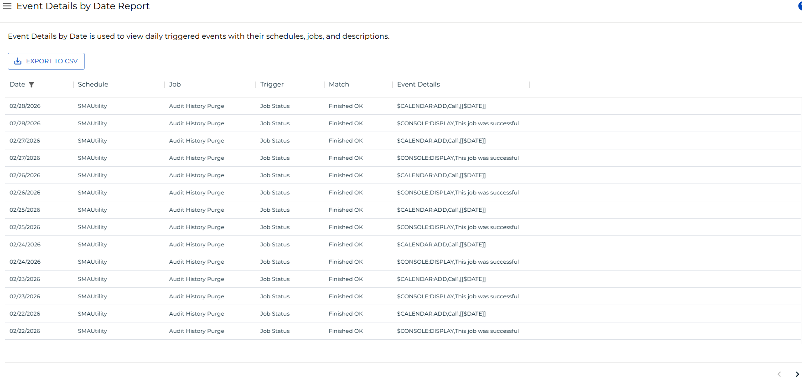

# Event Details by Date Report

The **Event Details by Date Report** shows all daily triggered events with their schedules, jobs, trigger, match, and event details.

:::note
Report data is updated nightly at 2:00 AM.
:::

### Filtering & Sorting

This report provides filters for date, schedule, job, trigger, match, and event details. You can open the filters panel by clicking on the menu (three dots) in the header of any column, and selecting 'Filter'.

 

### Exporting to CSV

Click the export  button to download the report as a CSV. Any active filters will be applied when exporting the report.

