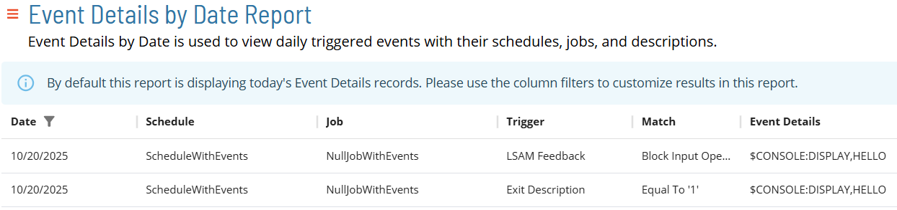
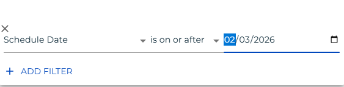
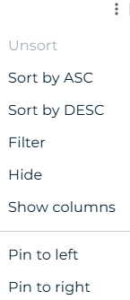

# Event Details by Date Report

**Theme:** Configure  
**Who Is It For?** System Administrator, Automation Engineer

## What Is It?

The **Event Details by Date Report** shows all daily triggered events with their schedules, jobs, trigger, match, and event details.

:::note
Report data is updated nightly at 2:00 AM.
:::

:::note
This report has a maximum return limit of 100,000 records.
:::

### Filtering & Sorting

A schedule date filter is applied by default to show only dates on or after the current date. You can adjust this or add filters to other columns using the filters panel. Open the filters panel by selecting the filter icon in the header, selecting any column with an active filter, or selecting the menu (three dots) in any column header and choosing **Filter**. The default filter can be adjusted.

_Filter Panel showing the default schedule date filter_

_Column menu showing the Filter option_

### Exporting to CSV

Select the export  button to download the report as a CSV. Any active filters are applied to the export.

## Configuration Options

| Setting | What It Does | Default | Notes |
|---|---|---|---|
## FAQs

**Q: What does Event Details by Date Report do?**

The **Event Details by Date Report** shows all daily triggered events with their schedules, jobs, trigger, match, and event details.

**Q: Where can you find Event Details by Date Report in OpCon?**

Access Event Details by Date Report through the appropriate section in the Enterprise Manager or Solution Manager navigation.

## Glossary

**Enterprise Manager (EM)**: OpCon's rich client graphical user interface for Windows and Linux, used to define schedules and jobs, manage automation data, and perform operational tasks.

**Solution Manager**: OpCon's browser-based graphical user interface for managing automation data, performing operational actions, and administering the system.

**Resource**: A numeric variable in OpCon representing a finite pool. Jobs can be configured to require a set number of resource units to run, limiting concurrent executions and preventing resource contention.

**Schedule**: A named container for jobs in OpCon, built for a specific date to create that day's automation. Schedules define build settings, frequencies, and the jobs that run within them.

**Job**: The fundamental unit of work in OpCon. A job defines what to run, on which machine, when to start, and what conditions must be met. Job results are tracked and can trigger events and notifications.

**OpCon**: Continuous' workflow automation platform. The OpCon server includes the database, SAM and Supporting Services (SAM-SS), and graphical user interfaces. agents installed on target platforms run jobs and report results.
