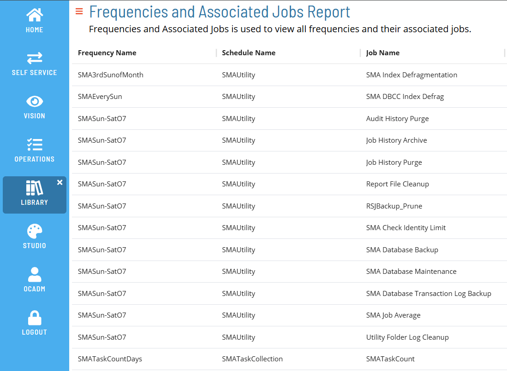
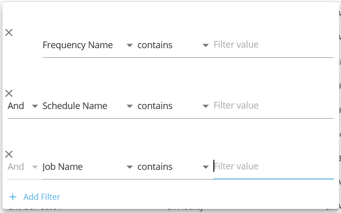

# Frequencies and Associated Jobs Report

The **Frequencies and Associated Jobs Report** shows all frequencies with their associated schedules and jobs, sorted by frequency name.

### Filtering & Sorting

This report provides filters for frequency name, schedule name, and job name. You can open the filters panel by clicking on the menu (three dots) in the header of any column, and selecting 'Filter'.

 

Available filters include frequency name, schedule name, and job name:

 

### Exporting to CSV

Click the export  button to download the report as a CSV. Any active filters will be applied when exporting the report.
