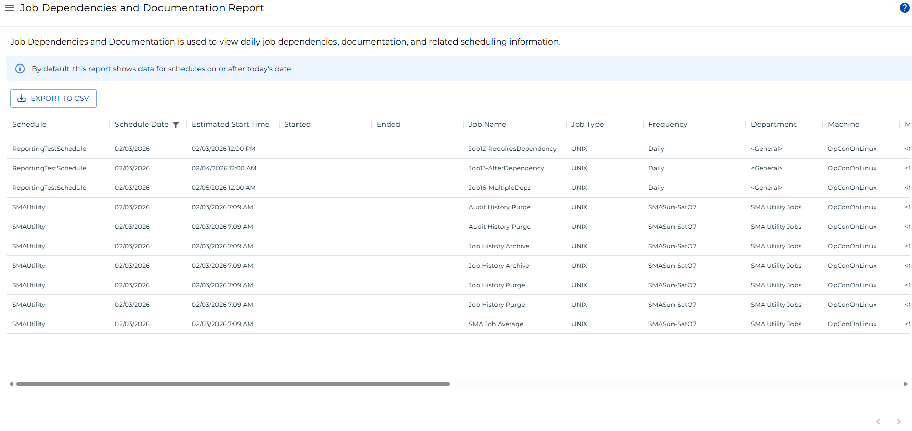

# Job Dependencies and Documentation Report

The **Job Dependencies and Documentation Report** displays daily job dependencies, documentation, and related scheduling information for jobs built in the daily schedule. Use this report to review job configurations, dependency chains, and scheduling details across one or more schedule dates.

:::info
By default, this report shows data for schedule dates on or after today's date.
:::

:::note
This report has a maximum return limit of 100,000 records.
:::

## Filtering and Sorting

A schedule date filter is applied by default to show only dates on or after the current date. You can adjust this filter or add filters to other columns using the filters panel.

To open the filters panel, use one of the following methods:

- Select the filter icon in the report header.
- Select any column that has an active filter.
- Select the menu (three dots) in any column header, then choose **Filter**.

_Filter Panel showing the default schedule date filter_

_Column menu showing the Filter option_

## Exporting to CSV

Select the export  button to download the report as a CSV file. Any active filters are applied to the export.
