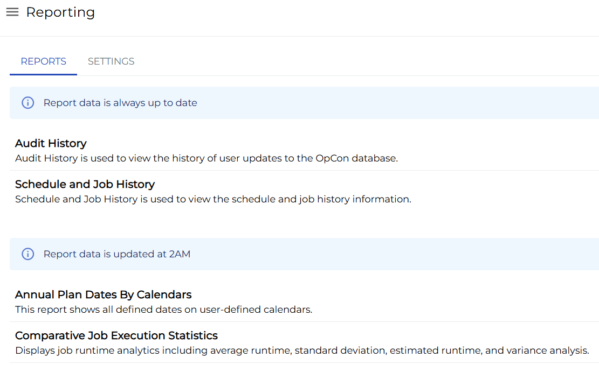
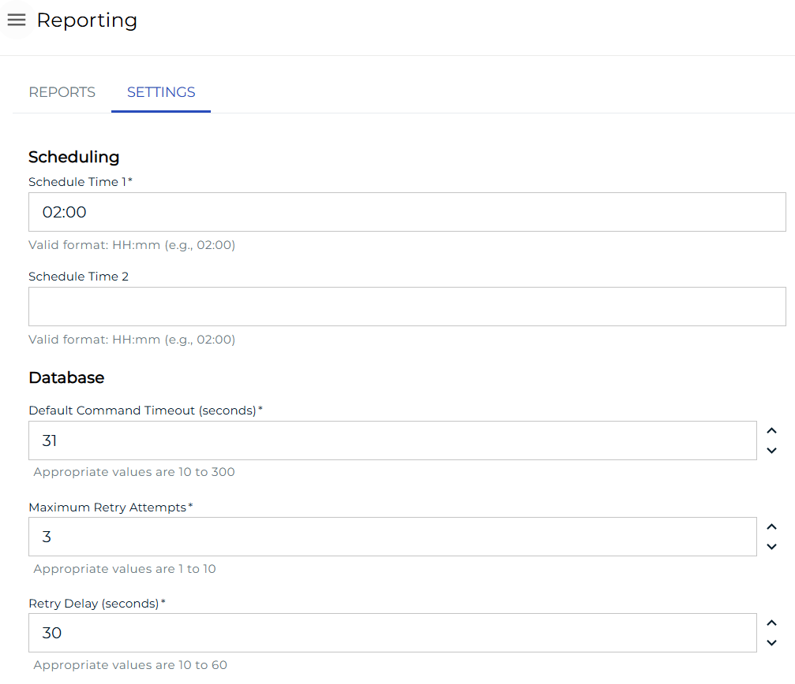
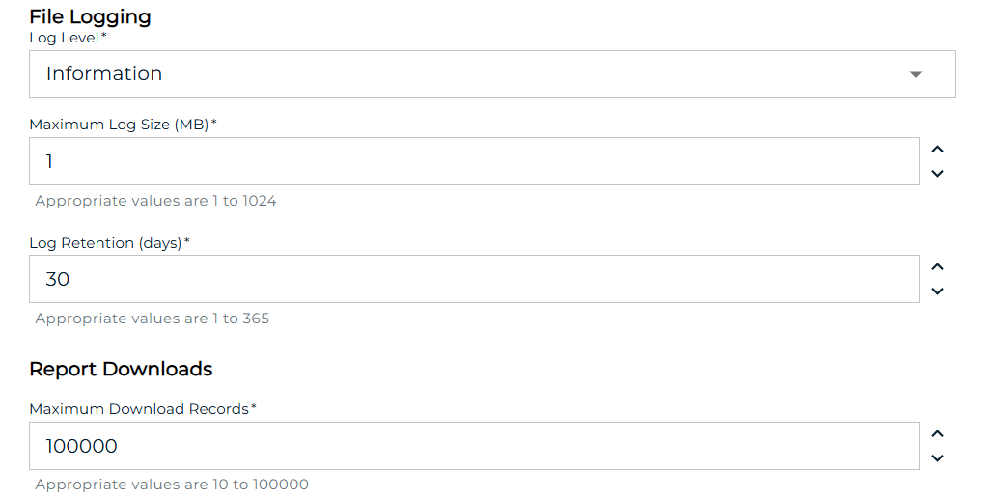

# Reports

**Theme:** Configure  
**Who Is It For?** System Administrator, Automation Engineer

## What Is It?

The **Reporting** page contains two tabs: **REPORTS** and **SETTINGS**.

## When Would You Use It?

- The **Reporting** page contains two tabs: **REPORTS** and **SETTINGS**

## Why Would You Use It?

- **Reports**: The **Reporting** page contains two tabs: **REPORTS** and **SETTINGS**

## REPORTS Tab

The **REPORTS** tab lists all available reports. Users only see reports they have permission to view.

### Report Details

Select a report to open it and view detailed information.

## SETTINGS Tab

The **SETTINGS** tab displays configuration settings related to standard report configuration values, including:

- Scheduling configuration for cloud users
- Database, file logging, and maximum download records configuration for all users

:::note
Users must have the [Maintain Reports](../../../../../administration/privileges.md) privilege or be in the ocadm role to view the SETTINGS tab.
:::

## Configuration Options

| Setting | What It Does | Default | Notes |
|---|---|---|---|
## FAQs

**Q: What does Reports cover?**

This page covers REPORTS Tab, SETTINGS Tab.

## Glossary

**Resource**: A numeric variable in OpCon representing a finite pool. Jobs can be configured to require a set number of resource units to run, limiting concurrent executions and preventing resource contention.

**Role**: A named security profile in OpCon that groups privileges together. Roles are assigned to user accounts to control which features, schedules, jobs, machines, and administrative functions a user can access.

**Privilege**: A specific permission granted through an OpCon role that controls access to a feature, function, or object type. Privileges are organized into categories such as Function Privileges, Machine Privileges, Schedule Privileges, and Access Codes.
