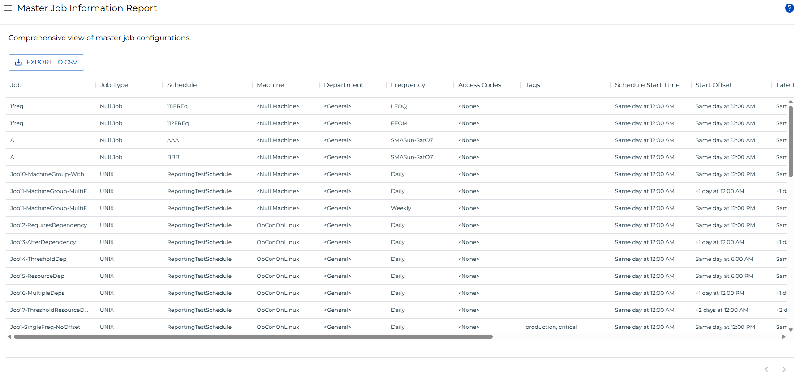

# Master Job Information Report

**Theme:** Configure  
**Who Is It For?** System Administrator, Automation Engineer

## What Is It?

The **Master Job Information Report** provides a comprehensive view of master job configurations in OpCon, including job details, schedules, machines, departments, frequencies, access codes, tags, timing information, and notes.

:::note
This report has a maximum return limit of 100,000 records.
:::

### Filtering & Sorting

This report provides filters for:

- Job name, job type, schedule, machine, department, frequency, access codes, and tags
- Schedule start time, start offset, late to start time, estimated run time, max run time, and notes

Open the filters panel by selecting the menu (three dots) in any column header and choosing **Filter**.

 

### Exporting to CSV

Select the export  button to download the report as a CSV. Any active filters are applied to the export.

## Configuration Options

| Setting | What It Does | Default | Notes |
|---|---|---|---|
## FAQs

**Q: What does Master Job Information Report do?**

The **Master Job Information Report** provides a comprehensive view of master job configurations in OpCon, including job details, schedules, machines, departments, frequencies, access codes, tags, tim

**Q: Where can you find Master Job Information Report in OpCon?**

Access Master Job Information Report through the appropriate section in the Enterprise Manager or Solution Manager navigation.

## Glossary

**Enterprise Manager (EM)**: OpCon's rich client graphical user interface for Windows and Linux, used to define schedules and jobs, manage automation data, and perform operational tasks.

**Solution Manager**: OpCon's browser-based graphical user interface for managing automation data, performing operational actions, and administering the system.

**Frequency**: A set of rules that defines when a job or schedule is eligible to run, based on calendar rules, day-of-week settings, period offsets, and other timing criteria.

**Department**: An organizational grouping in OpCon used to assign jobs to logical divisions. User roles can be scoped to specific departments, controlling which jobs a user can manage.

**Resource**: A numeric variable in OpCon representing a finite pool. Jobs can be configured to require a set number of resource units to run, limiting concurrent executions and preventing resource contention.

**Machine**: A platform defined in the OpCon database that has an agent installed. OpCon routes job execution requests to machines via SMANetCom, and machines report job completion status back to SAM.

**Schedule**: A named container for jobs in OpCon, built for a specific date to create that day's automation. Schedules define build settings, frequencies, and the jobs that run within them.

**Job**: The fundamental unit of work in OpCon. A job defines what to run, on which machine, when to start, and what conditions must be met. Job results are tracked and can trigger events and notifications.
