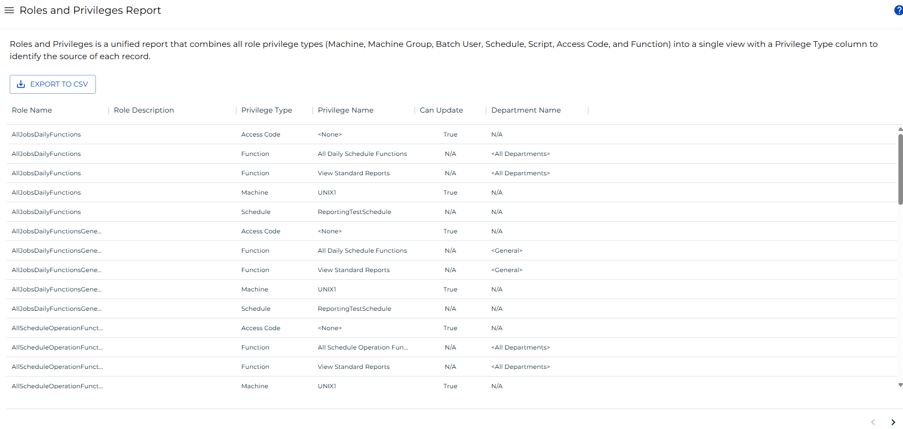

# Roles and Privileges Report

**Theme:** Configure  
**Who Is It For?** System Administrator, Automation Engineer

## What Is It?

The **Roles and Privileges Report** combines all role privilege types — Machine, Machine Group, Batch User, Schedule, Script, Access Code, and Function — into a single view with a Privilege Type column identifying the source of each record.

:::note
This report has a maximum return limit of 100,000 records.
:::

### Filtering & Sorting

This report provides filters for role name, role description, privilege type, privilege name, can update, and department name. Open the filters panel by selecting the menu (three dots) in any column header and choosing **Filter**.

### Exporting to CSV

Select the export  button to download the report as a CSV. Any active filters are applied to the export.

## When Would You Use It?

- The **Roles and Privileges Report** combines all role privilege types — Machine, Machine Group, Batch User, Schedule, Script, Access Code, and Function — into a single view with a Privilege Type column identifying the source of each record

## Why Would You Use It?

- **Streamlined workflow**: The **Roles and Privileges Report** combines all role privilege types — Machine, Machine Group, Batch User, Schedule, Script, Access Code, and Function — into a single view with a Privilege Type column identifying the source of each record

## Configuration Options

| Setting | What It Does | Default | Notes |
|---|---|---|---|
## FAQs

**Q: What does Roles and Privileges Report do?**

The **Roles and Privileges Report** combines all role privilege types — Machine, Machine Group, Batch User, Schedule, Script, Access Code, and Function — into a single view with a Privilege Type colum

**Q: Where can you find Roles and Privileges Report in OpCon?**

Access Roles and Privileges Report through the appropriate section in the Enterprise Manager or Solution Manager navigation.

## Glossary

**Enterprise Manager (EM)**: OpCon's rich client graphical user interface for Windows and Linux, used to define schedules and jobs, manage automation data, and perform operational tasks.

**Solution Manager**: OpCon's browser-based graphical user interface for managing automation data, performing operational actions, and administering the system.

**Access Code**: A security label applied to jobs and schedules in OpCon. Users must have the matching access code privilege to view or manage items with that label.

**Department**: An organizational grouping in OpCon used to assign jobs to logical divisions. User roles can be scoped to specific departments, controlling which jobs a user can manage.

**Resource**: A numeric variable in OpCon representing a finite pool. Jobs can be configured to require a set number of resource units to run, limiting concurrent executions and preventing resource contention.

**Role**: A named security profile in OpCon that groups privileges together. Roles are assigned to user accounts to control which features, schedules, jobs, machines, and administrative functions a user can access.

**Privilege**: A specific permission granted through an OpCon role that controls access to a feature, function, or object type. Privileges are organized into categories such as Function Privileges, Machine Privileges, Schedule Privileges, and Access Codes.

**Machine**: A platform defined in the OpCon database that has an agent installed. OpCon routes job execution requests to machines via SMANetCom, and machines report job completion status back to SAM.
