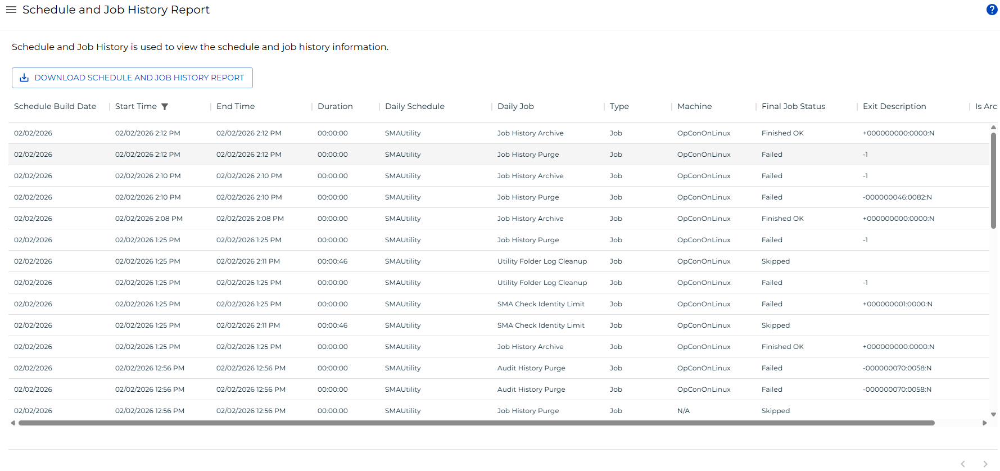
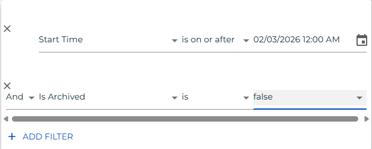

# Schedule and Job History Report

**Theme:** Configure  
**Who Is It For?** System Administrator, Automation Engineer

## What Is It?

The **Schedule and Job History Report** is used to view schedule and job history information.

### Filtering & Sorting

Two filters are applied by default: one limits start time to the current day, and the other pulls only non-archived records. You can adjust these or add filters to other columns using the filters panel. Open the filters panel by selecting the filter icon in the header, selecting any column with an active filter, or selecting the menu (three dots) in any column header and choosing **Filter**. Both default filters are required but can be adjusted.

_Filter Panel showing the default start time and is archived filters_

_Column menu showing the Filter option_

### Exporting to CSV

Select the export  button to download the report as a CSV. Any active filters are applied to the export.

## When Would You Use It?

- The **Schedule and Job History Report** is used to view schedule and job history information

## Why Would You Use It?

- **Streamlined workflow**: The **Schedule and Job History Report** is used to view schedule and job history information

## Configuration Options

| Setting | What It Does | Default | Notes |
|---|---|---|---|
## FAQs

**Q: What does Schedule and Job History Report do?**

The **Schedule and Job History Report** is used to view schedule and job history information.

**Q: Where can you find Schedule and Job History Report in OpCon?**

Access Schedule and Job History Report through the appropriate section in the Enterprise Manager or Solution Manager navigation.

## Glossary

**Enterprise Manager (EM)**: OpCon's rich client graphical user interface for Windows and Linux, used to define schedules and jobs, manage automation data, and perform operational tasks.

**Solution Manager**: OpCon's browser-based graphical user interface for managing automation data, performing operational actions, and administering the system.

**Resource**: A numeric variable in OpCon representing a finite pool. Jobs can be configured to require a set number of resource units to run, limiting concurrent executions and preventing resource contention.

**Schedule**: A named container for jobs in OpCon, built for a specific date to create that day's automation. Schedules define build settings, frequencies, and the jobs that run within them.

**Job**: The fundamental unit of work in OpCon. A job defines what to run, on which machine, when to start, and what conditions must be met. Job results are tracked and can trigger events and notifications.

**OpCon**: Continuous' workflow automation platform. The OpCon server includes the database, SAM and Supporting Services (SAM-SS), and graphical user interfaces. agents installed on target platforms run jobs and report results.
