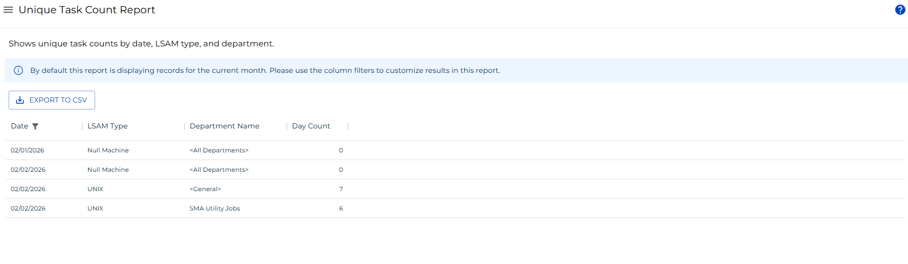

# Unique Task Count Report

**Theme:** Configure  
**Who Is It For?** System Administrator, Automation Engineer

## What Is It?

The **Unique Task Count Report** shows unique task counts by date, agent type, and department.

:::info
By default this report displays records for the current month. Use the column filters to customize results.
:::

:::note
This report has a maximum return limit of 100,000 records.
:::

### Filtering & Sorting

This report provides filters for date, agent type, department name, and day count. Open the filters panel by selecting the menu (three dots) in any column header and choosing **Filter**.

### Exporting to CSV

Select the export  button to download the report as a CSV. Any active filters are applied to the export.

## When Would You Use It?

- The **Unique Task Count Report** shows unique task counts by date, agent type, and department

## Why Would You Use It?

- **Unique Task**: The **Unique Task Count Report** shows unique task counts by date, agent type, and department

## Configuration Options

| Setting | What It Does | Default | Notes |
|---|---|---|---|
## FAQs

**Q: What does Unique Task Count Report do?**

The **Unique Task Count Report** shows unique task counts by date, agent type, and department.

**Q: Where can you find Unique Task Count Report in OpCon?**

Access Unique Task Count Report through the appropriate section in the Enterprise Manager or Solution Manager navigation.

## Glossary

**LSAM (Local Schedule Activity Monitor)**: An agent installed on a target platform that runs jobs in the native language of that platform and communicates results back to SAM via SMANetCom over TCP/IP.

**Enterprise Manager (EM)**: OpCon's rich client graphical user interface for Windows and Linux, used to define schedules and jobs, manage automation data, and perform operational tasks.

**Solution Manager**: OpCon's browser-based graphical user interface for managing automation data, performing operational actions, and administering the system.

**Department**: An organizational grouping in OpCon used to assign jobs to logical divisions. User roles can be scoped to specific departments, controlling which jobs a user can manage.

**Resource**: A numeric variable in OpCon representing a finite pool. Jobs can be configured to require a set number of resource units to run, limiting concurrent executions and preventing resource contention.

**OpCon**: Continuous' workflow automation platform. The OpCon server includes the database, SAM and Supporting Services (SAM-SS), and graphical user interfaces. agents installed on target platforms run jobs and report results.
