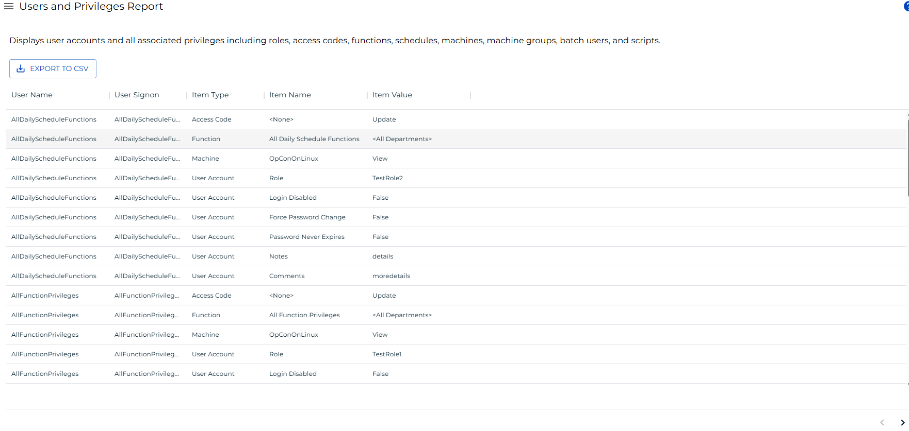

# Users and Privileges Report

**Theme:** Configure  
**Who Is It For?** System Administrator, Automation Engineer

## What Is It?

The **Users and Privileges Report** displays user accounts and all associated privileges including roles, access codes, functions, schedules, machines, machine groups, batch users, and scripts.

:::note
This report has a maximum return limit of 100,000 records.
:::

### Filtering and Sorting

This report provides filters for user name, user signon, item type, item name, and item value. Open the filters panel by selecting the menu (three dots) in any column header and choosing **Filter**.

### Exporting to CSV

To export the report, complete the following steps:

1. Apply any desired filters to limit the data set.
2. Select the export  button.

**Result:** The report downloads as a CSV file. Any active filters are applied to the export.

## FAQs

**Q: Where can I find the Users and Privileges Report in OpCon?**

Go to **Library > Reporting** in Solution Manager and select **Users and Privileges Report**.

**Q: What is the maximum number of records the report returns?**

The report returns a maximum of 100,000 records. Use the available filters to narrow results if needed.

## Glossary

**Solution Manager**: OpCon's browser-based graphical user interface for managing automation data, performing operational actions, and administering the system.

**Role**: A named security profile in OpCon that groups privileges together. Roles are assigned to user accounts to control which features, schedules, jobs, machines, and administrative functions a user can access.

**Privilege**: A specific permission granted through an OpCon role that controls access to a feature, function, or object type. Privileges are organized into categories such as Function Privileges, Machine Privileges, Schedule Privileges, and Access Codes.

**Machine**: A platform defined in the OpCon database that has an agent installed. OpCon routes job execution requests to machines via SMANetCom, and machines report job completion status back to SAM.

**Schedule**: A named container for jobs in OpCon, built for a specific date to create that day's automation. Schedules define build settings, frequencies, and the jobs that run within them.

**OpCon**: Continuous' workflow automation platform. The OpCon server includes the database, SAM and Supporting Services (SAM-SS), and graphical user interfaces. Agents installed on target platforms run jobs and report results.
