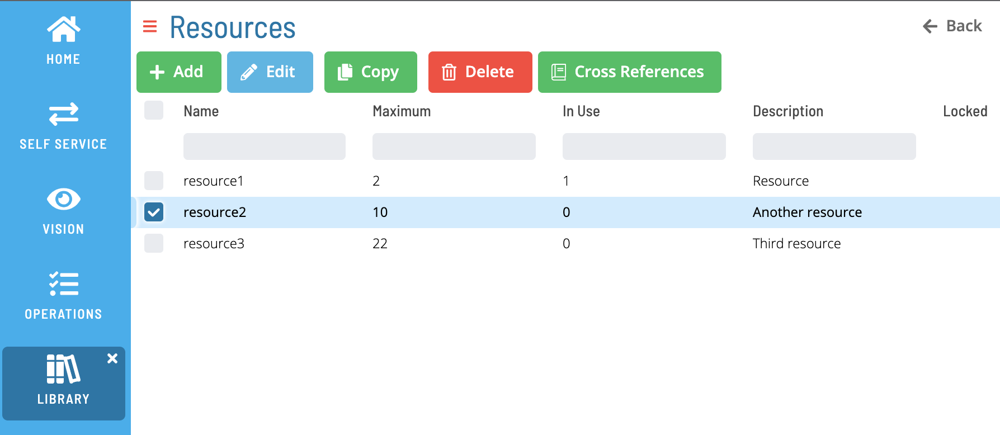
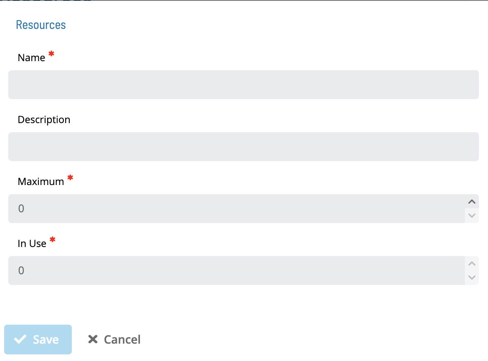
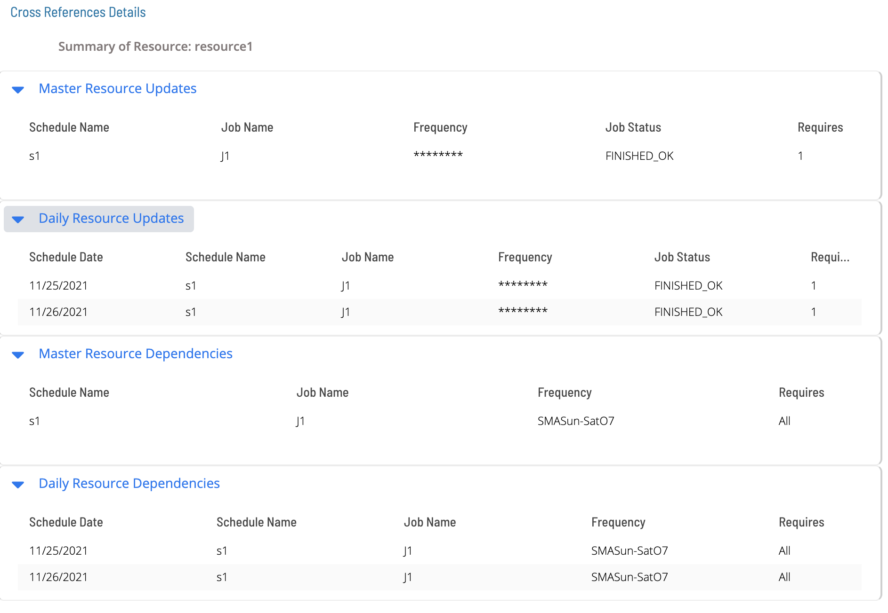

# Resources

**Theme:** Configure  
**Who Is It For?** System Administrator, Automation Engineer

## What Is It?

Available Resources in OpCon are shown in the following Grid under Library -> Resources.

Select **Add** or **Edit** to open the following screen:

:::note
The **Name** field is unique across Resources _and_ Thresholds
:::

Select **Cross References** to see the list of master and daily jobs that use a particular resource:

## When Would You Use It?

- Available Resources in OpCon are shown in the following Grid under Library -> Resources

## Why Would You Use It?

- **Resources**: Available Resources in OpCon are shown in the following Grid under Library -> Resources

## Configuration Options

| Setting | What It Does | Default | Notes |
|---|---|---|---|
## FAQs

**Q: What does Resources do?**

viewport: width=device-width, initial-scale=1.0

**Q: Where can you find Resources in OpCon?**

Access Resources through the appropriate section in the Enterprise Manager or Solution Manager navigation.

## Glossary

**Enterprise Manager (EM)**: OpCon's rich client graphical user interface for Windows and Linux, used to define schedules and jobs, manage automation data, and perform operational tasks.

**Solution Manager**: OpCon's browser-based graphical user interface for managing automation data, performing operational actions, and administering the system.

**Resource**: A numeric variable in OpCon representing a finite pool. Jobs can be configured to require a set number of resource units to run, limiting concurrent executions and preventing resource contention.

**Job**: The fundamental unit of work in OpCon. A job defines what to run, on which machine, when to start, and what conditions must be met. Job results are tracked and can trigger events and notifications.

**OpCon**: Continuous' workflow automation platform. The OpCon server includes the database, SAM and Supporting Services (SAM-SS), and graphical user interfaces. agents installed on target platforms run jobs and report results.
