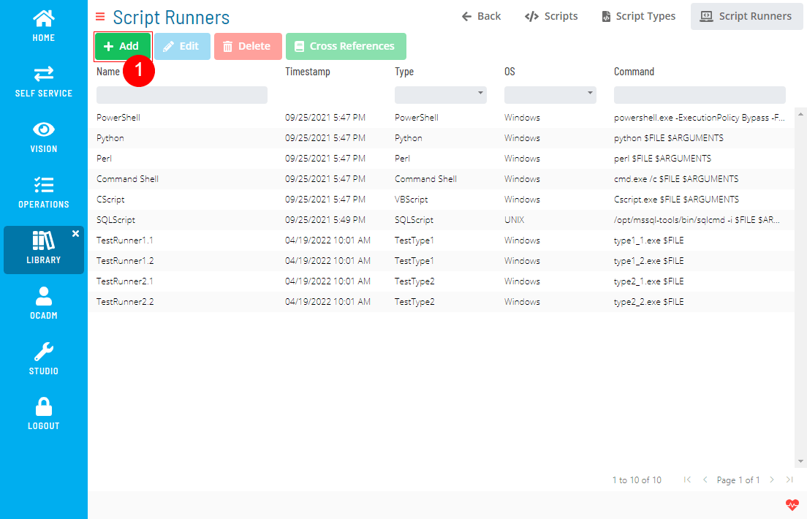
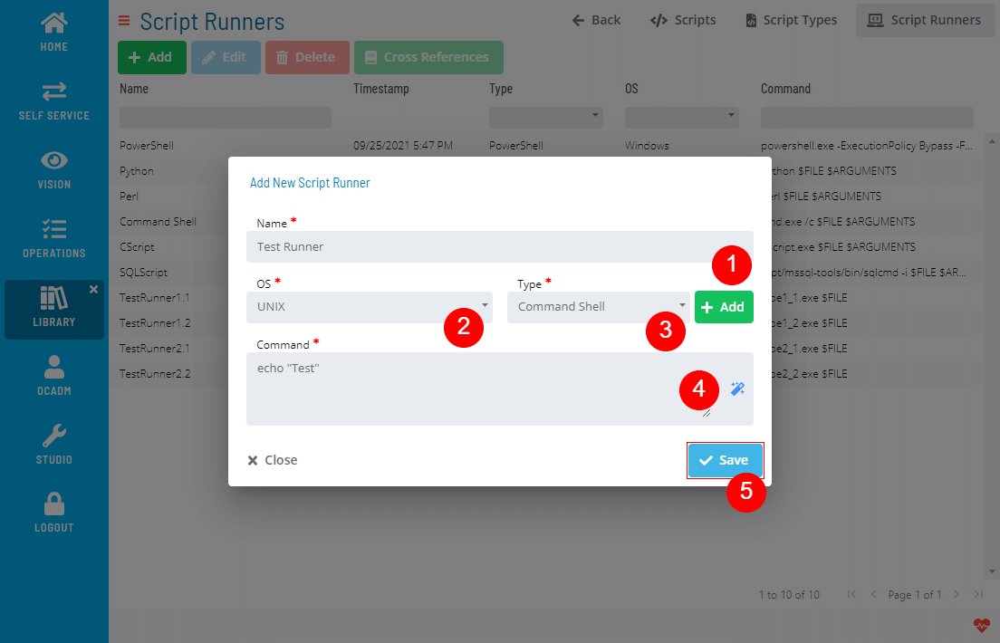
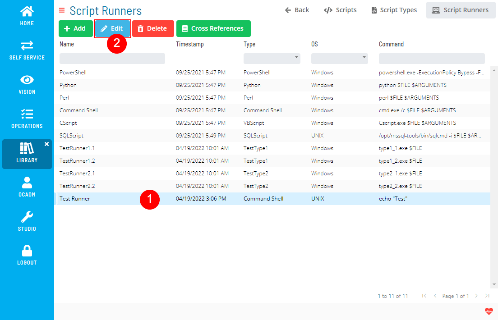
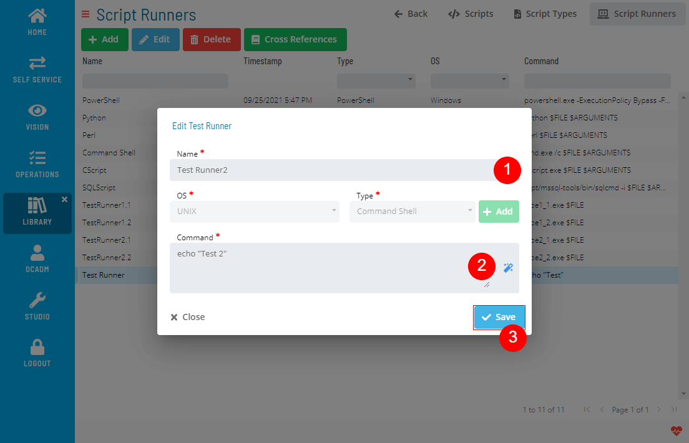
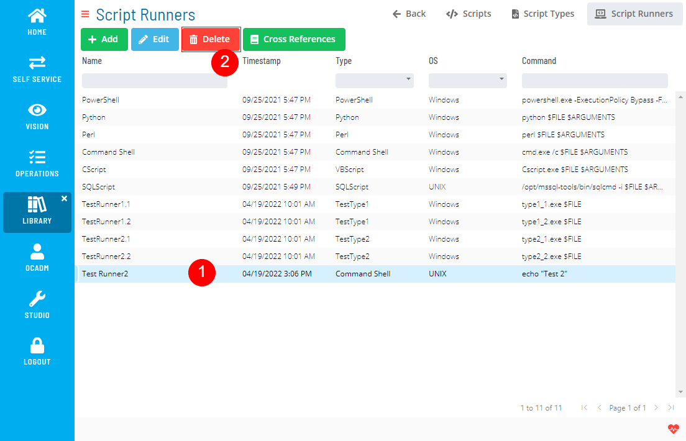
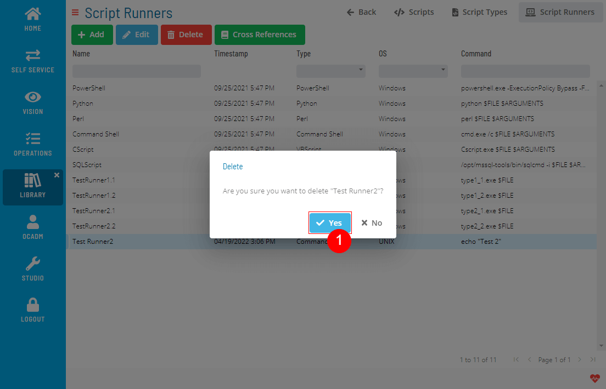
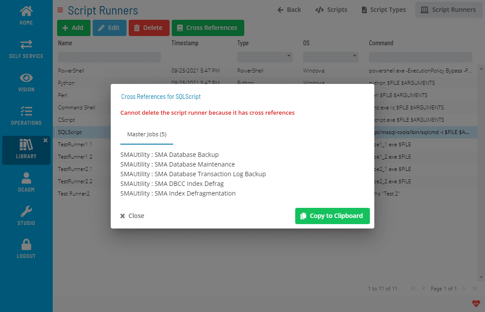
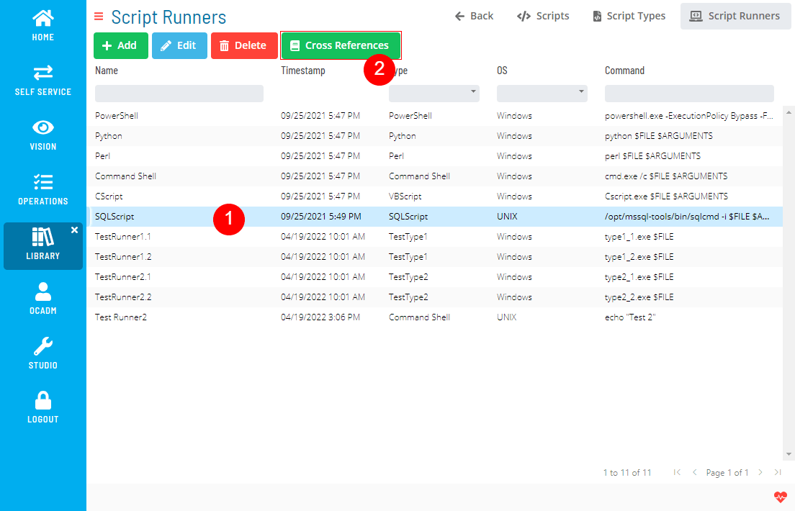
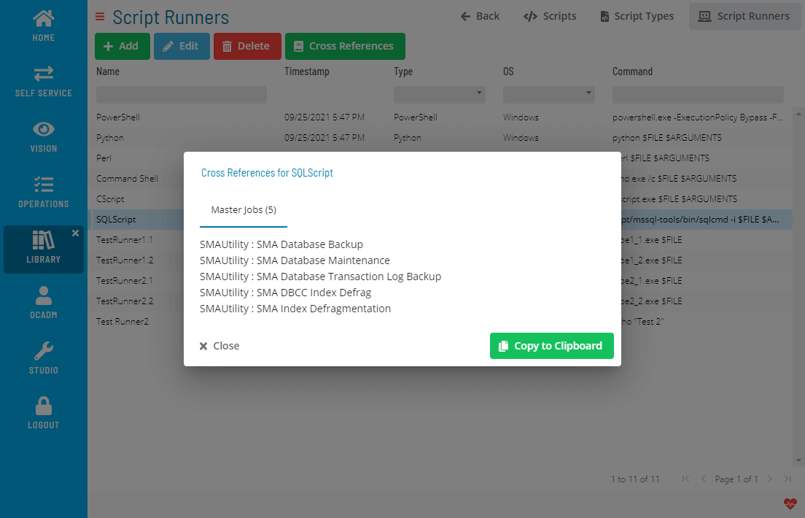

# Managing Script Runners

The **Script Runners** module allows you to add, edit, delete, and check cross-references for script runners.

### Creating Script Runners

1. Click the Add button above the list
   
2. Fill out the Script Runner form
   
   :::note
    You can create a new Script Type directly from this form by clicking the Add button next to Type field.
   :::

### Editing Script Runners

1. Select a Script Runner and click the Edit button above the list
   
2. Fill out the Script Runner form
   

### Deleting Script Runners

1. Select a Script Runner and click the Delete button above the list
   

2. Click Yes to confirm the delete operation
   

Delete operation is not allowed if Script Runner has any cross-references.

### Checking Cross References

1. Select a Script Runner and click the Cross References button above the list
   
2. A dialog will show the Cross References
   

.png "More Info icon")
Related Topics

- [Managing Scripts](Managing-Scripts.md)
- [Managing Script Versions](Managing-Script-Versions.md)
- [Managing Script Types](Managing-Script-Types.md)