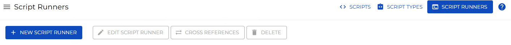
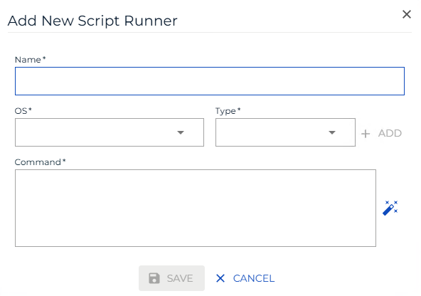
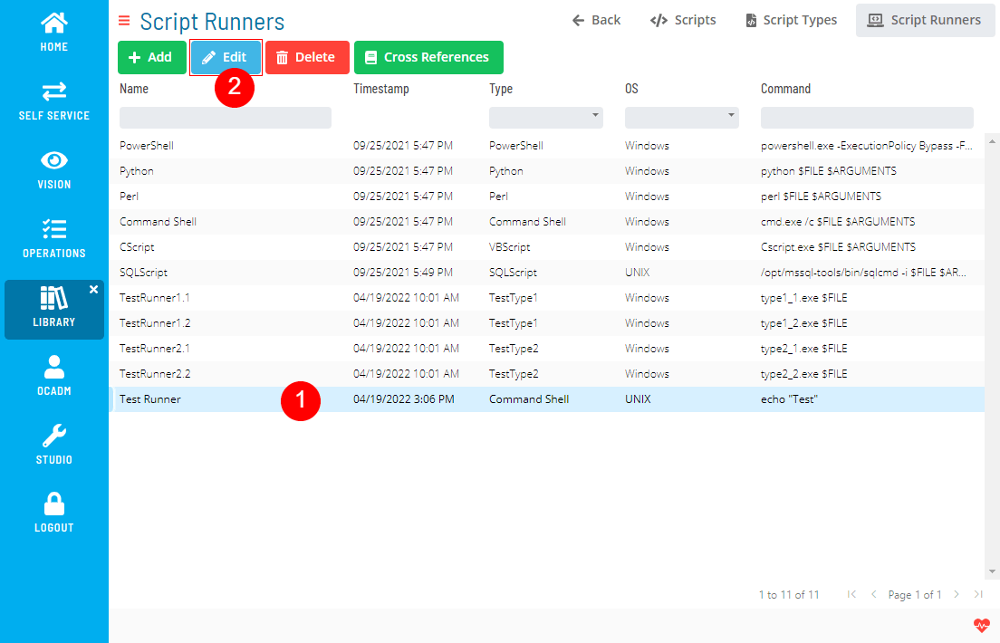
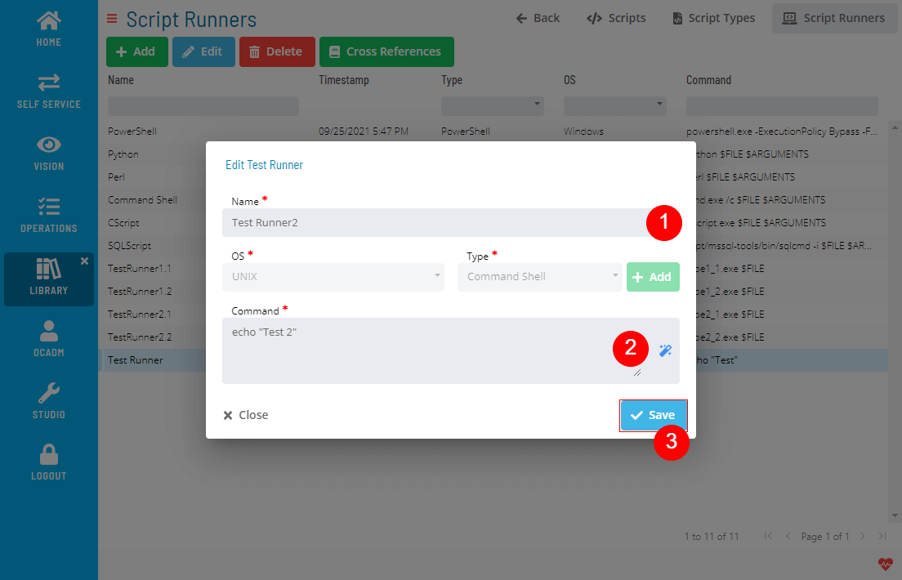
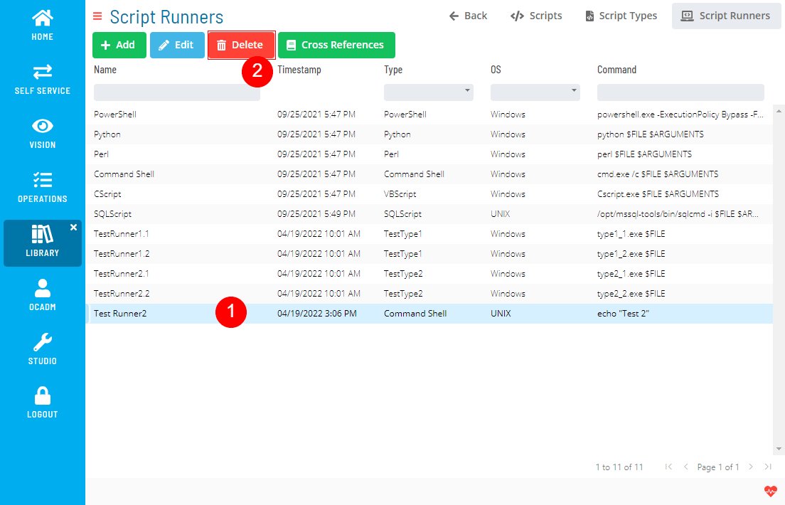
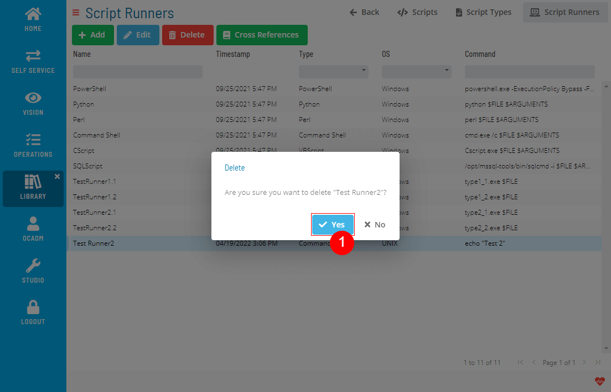
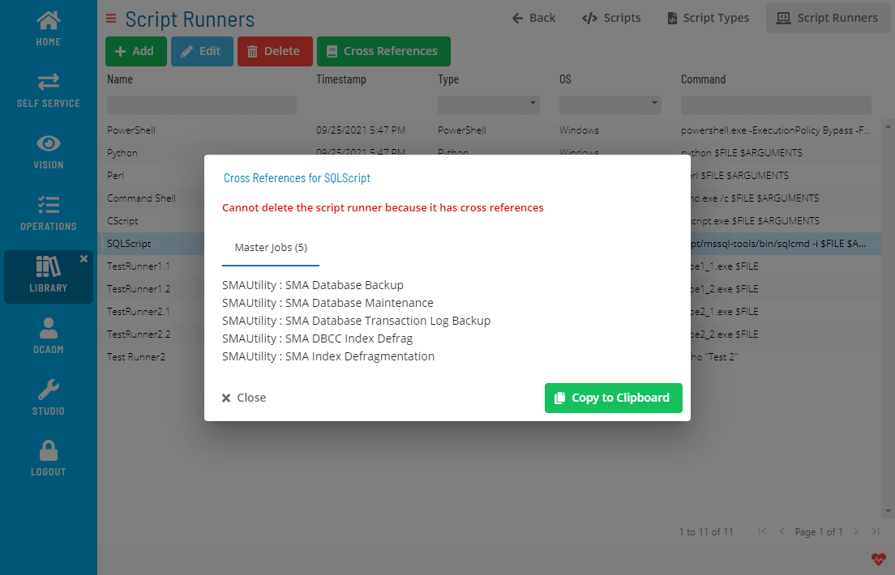
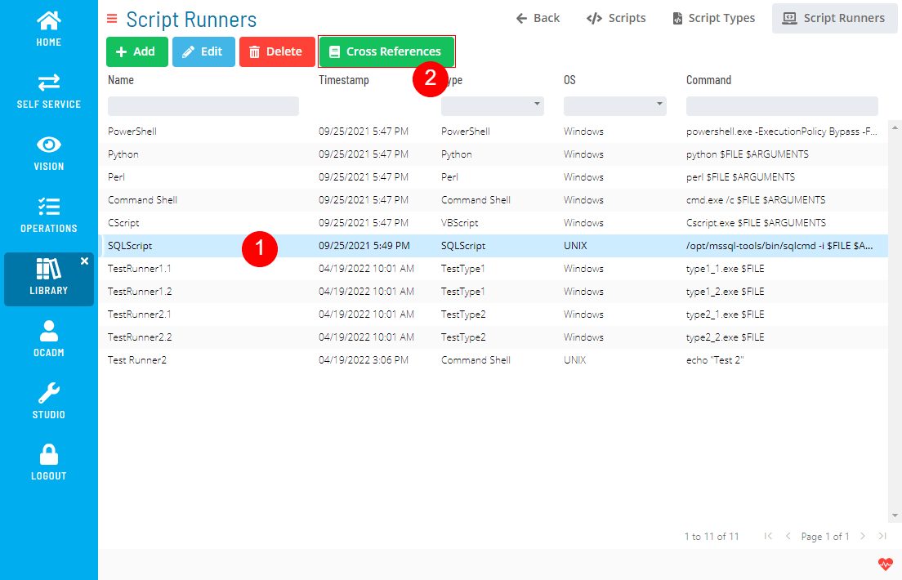
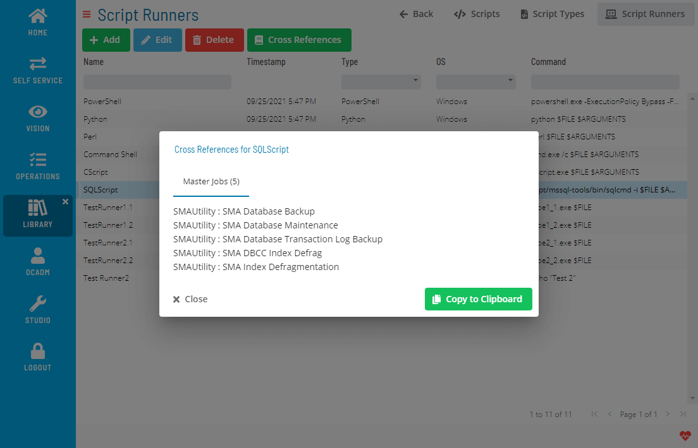

# Managing Script Runners

**Theme:** Configure  
**Who Is It For?** System Administrator, Automation Engineer

## What Is It?

The **Script Runners** module allows you to add, edit, delete, and check cross-references for script runners.

### Creating Script Runners

To create Script Runners, complete the following steps:

1. Select the Add button above the list
   
2. Fill out the Script Runner form
   
   :::note
    You can create a new Script Type directly from this form by selecting the Add button next to the Type field.
   :::

### Editing Script Runners

To edit Script Runners, complete the following steps:

1. Select a Script Runner and select the Edit button above the list
   
2. Fill out the Script Runner form
   

### Deleting Script Runners

To delete Script Runners, complete the following steps:

1. Select a Script Runner and select the Delete button above the list
   
2. Select **Yes** to confirm the deletion
   

Delete is not allowed if the Script Runner has cross-references.

### Checking Cross References

To check Cross References, complete the following steps:

1. Select a Script Runner and select the Cross References button above the list
   
2. A dialog will show the Cross References
   

.png "More Info icon")
Related Topics

- [Managing Scripts](Managing-Scripts.md)
- [Managing Script Versions](Managing-Script-Versions.md)
- [Managing Script Types](Managing-Script-Types.md)

## FAQs

**Q: What does managing script runners involve?**

Managing script runners includes adding, editing, and deleting records. Access script runners through the Enterprise Manager navigation pane.

**Q: Who can manage script runners in OpCon?**

Users with the appropriate privileges assigned through their role can manage script runners. Contact your OpCon system administrator if you do not have access.

## Glossary

**Enterprise Manager (EM)**: OpCon's rich client graphical user interface for Windows and Linux, used to define schedules and jobs, manage automation data, and perform operational tasks.

**Resource**: A numeric variable in OpCon representing a finite pool. Jobs can be configured to require a set number of resource units to run, limiting concurrent executions and preventing resource contention.

**Role**: A named security profile in OpCon that groups privileges together. Roles are assigned to user accounts to control which features, schedules, jobs, machines, and administrative functions a user can access.

**Privilege**: A specific permission granted through an OpCon role that controls access to a feature, function, or object type. Privileges are organized into categories such as Function Privileges, Machine Privileges, Schedule Privileges, and Access Codes.

**OpCon**: Continuous' workflow automation platform. The OpCon server includes the database, SAM and Supporting Services (SAM-SS), and graphical user interfaces. agents installed on target platforms run jobs and report results.
